- # 系统级线程池专门用于IPC通信，和程序的Thread不是一个东西
- # 一、线程池管理图解
	- 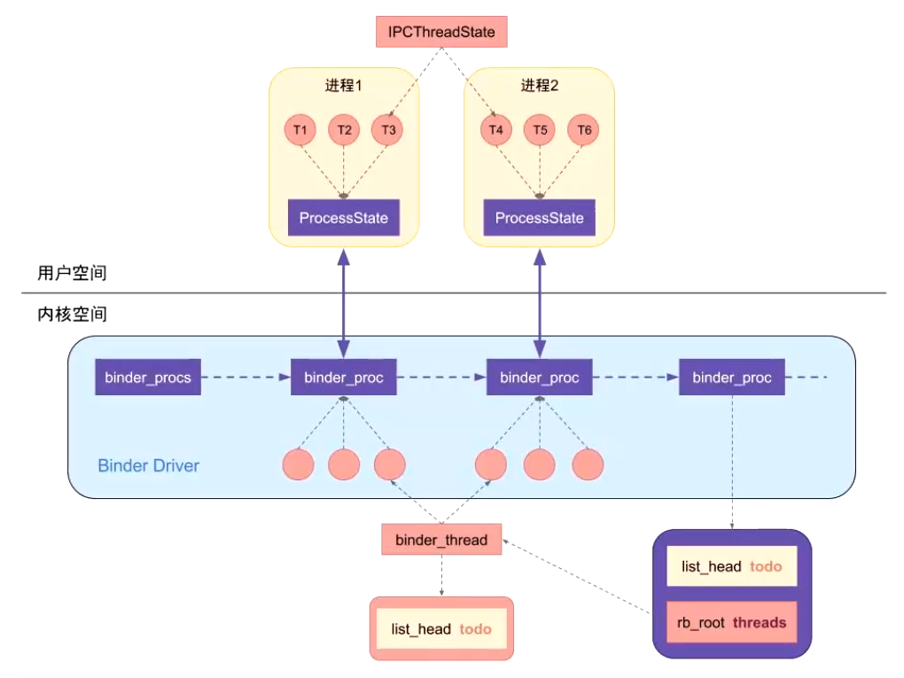
	- ## 名词解释
		- ProcessState，相当于一个进程
		- IPCThreadState,相当于一个线程
- # 二、线程的创建过程
	- app_main.cpp:
	- 进程创建的时候，创建线程池
		- 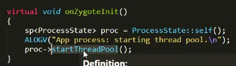
		- 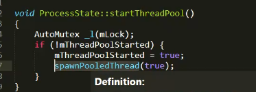
		- 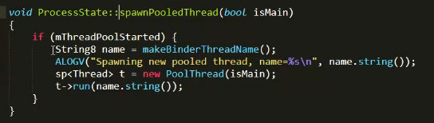
			- makeBinderThreadName()，创建线程的名字，8.0时是线程命名Binder_1
			  collapsed:: true
				- 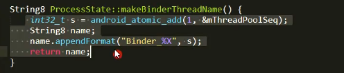
			- ## new poolThread()；传入了isMain，生成主线程
				- 其实就是个Thread
				- 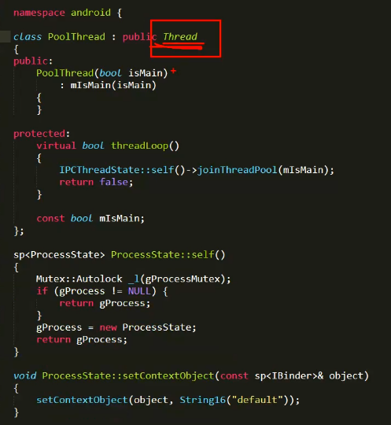
			- PoolThread.run()
				- 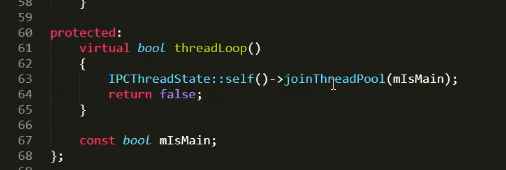
				- joinThreadPool
					- 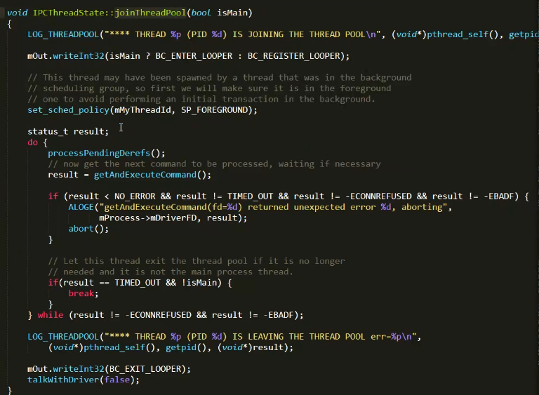
				- getAndExecuteCommand:处理BC_ENTER_LOOPER命令
					- 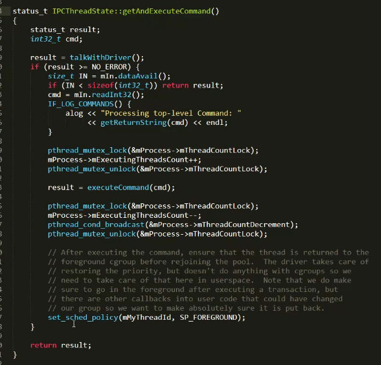
				- executeCommand（cmd）执行命令，传入false，生成子线程
					- 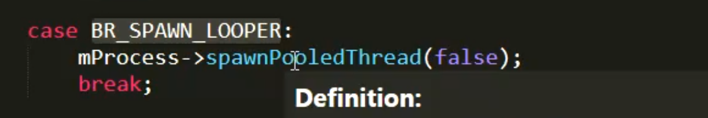
				- 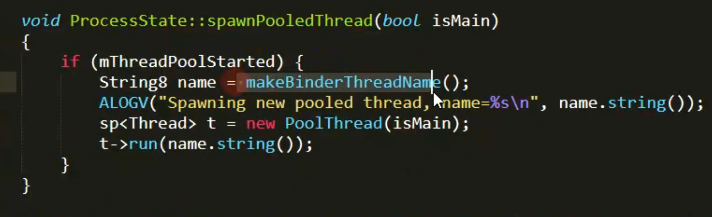
- # 三、线程管理
	- 创建线程的时候会区分是否是主线程
		- 主线程 -- 不会退出，
		- 非主线程
	- 创建线程的最大数，15个（子线程）
	- 主线程有一个---不算在这线程最大数里
	- 线程真正的最大数：15+1+其他线程