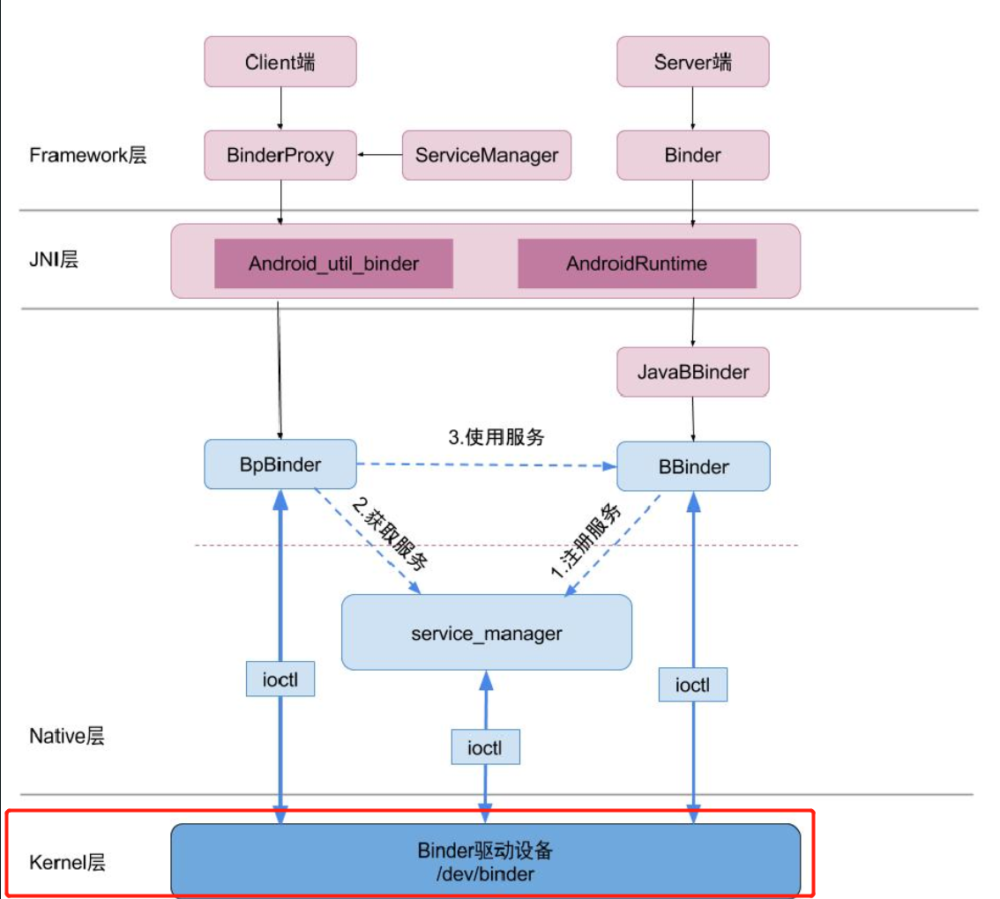
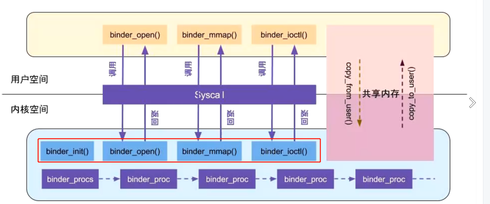
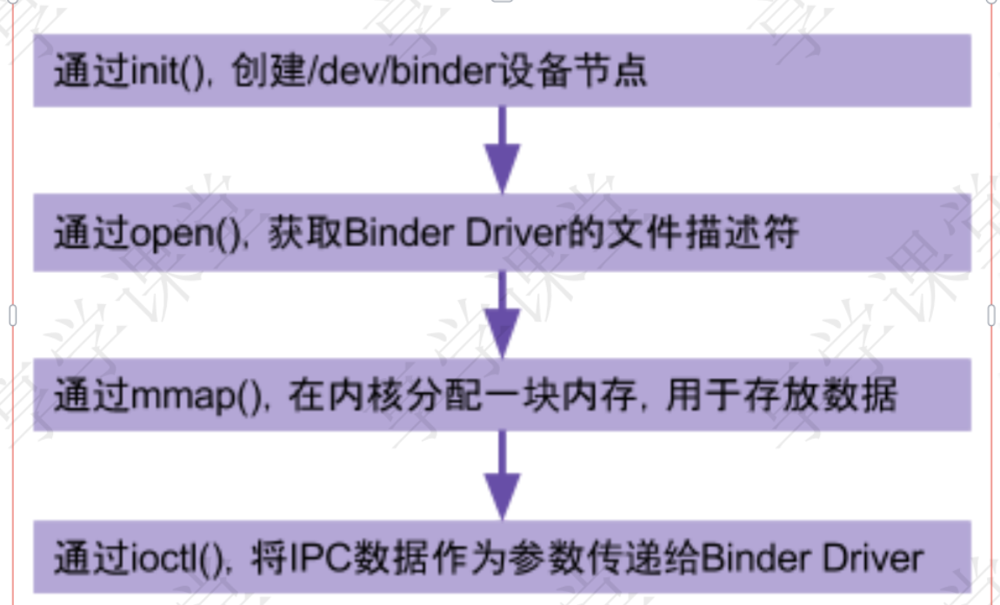

# 一、本文都为内核层的代码
collapsed:: true
	- 
- # binder驱动图
	- 
	- Binder是启动的misc设备(binder是没有硬件的，binder就相当于一块内存)
- # 内核空间启动Binder驱动
	- {:height 461, :width 749}
- ## 在linux中一切皆文件，binder驱动也是文件，都是可读写的
- # 一、通过init()，创建/dev/binder设备节点
  collapsed:: true
	- kernel/drivers/staging/android/binder.c
	- ```c
	  //4290设备驱动入口函数
	  device_initcall(binder_init);
	  
	  
	  
	  // 函数作用：
	  // 1、创建名为binder的单线程的工作队列
	  // 2、从配置文件读取binder devices 信息 到device_names
	  // 3、初始化binder设备
	  static int __init binder_init(void)
	  {
	  	//4220创建名为binder的单线程的工作队列
	  	binder_deferred_workqueue = create_singlethread_workqueue("binder");
	      
	    	// 读取binder devices 信息 到device_names
	      strcopy(device_names,binder_devices_param)
	      //4269 初始化binder设备
	  	ret = init_binder_device(device_name);
	  }	
	  
	  
	  //4186 具体怎么初始化binder 设备的方法，binder是一个内存 借助misc设备 为binder分配内存
	  
	  static int __init init_binder_device(const char *name){
	    	int ret;
	    	struct binder_device *binder_device;
	    	//4191 第一步、为binder设备分配内存
	    	binder_device = kzalloc(sizeof(*binder_device),GFP_KERNEL);
	      
	      //4195 第二部、拿到binder 设备后 初始化设备
	  	binder_device->miscdev.fops=&binder_fops;//设备的文件操作结构，这是file_operations结构
	      binder_device->miscdev.minor=MISC_DYNAMIC_MINOR;//次设备号动态分配
	      binder_device->miscdev.name=name;//设备名,"binder"
	      
	      binder_device->context.binder_context_mgr_uid=INVALID_UID;
	      binder_device->context.name=name;
	      
	      //4202 misc驱动注册
	  	ret = misc_register(&binder_device->miscdev);
	      
	      //4208  第三步、将binder设备 放到 设备链表里   将hlist节点添加到binder_devices为表头的设备链表
	  	hlist_add_head(&binder_device->hlist,&binder_devices);
	      return ret;
	  }
	  ```
	- ## 初始化总结
		- 第一步、为binder设备分配内存
		- 第二部、拿到binder 设备后 初始化设备
		- 第三步、将binder设备 放到 设备链表里
- # 二、通过open()获取Binder Driver的文件描述符
  collapsed:: true
	- kernel/drivers/staging/android/binder.c
	- ```c
	  //3454
	  static int binder_open(struct inode*nodp,struct file*filp)
	  {  
	      //3462 第一步：为binder_proc结构体在kernel分配内存空间 用来保存进程信息的
	      proc=kzalloc(sizeof(*proc),GFP_KERNEL); 
	      
	      
	      //3465 第二部：将当前线程的task保存到binder进程的task( 相当于给第一步的结构体进行初始化)
	      get_task_struct(current);
	      proc->tsk=current;
	      INIT_LIST_HEAD(&proc->todo);//初始化todo列表
	      init_waitqueue_head(&proc->wait);//初始化wait队列
	      proc->default_priority=task_nice(current);//将当前进程的nice值转换为进程优先级
	    
	      //3474同步锁，因为binder支持多线程访问
	      binder_lock(__func__);
	      binder_stats_created(BINDER_STAT_PROC);//binder_proc对象创建数加1
	      hlist_add_head(&proc->proc_node,&binder_procs);//将proc_node节点添加到binder_procs的队列头部
	      proc->pid=current->group_leader->pid;//进程pid
	      INIT_LIST_HEAD(&proc->delivered_death);//初始化已分发的死亡通知列表
	      filp->private_data=proc;//将这个binder_proc与filp关联起来，这样下次通过filp就能找到这个proc了
	      binder_unlock(__func__);//释放同步锁
	  }  
	  ```
	- ## 打开binder设备总结
		- 1、创建[[binder_proc]]对象
		- 2、当前client调用binder的进程，的信息保存到binder_proc
		- 3、添加到binder_proc链表中
		- 4、将这个binder_proc与filp关联起来，这样下次通过filp就能找到这个proc了
- # 三、通过mmap()，在内核分配一块内存，用于存放数据
  collapsed:: true
	- ## kernel/drivers/staging/android/binder.c
	  collapsed:: true
		- ```c
		  //3355
		  // vm_area_struct *vma    代表 进程想虚拟内存  （或者说虚拟机的虚拟内存）
		  // 下边的vm_struct *area  代表 内核的虚拟内存
		  static int binder_mmap(struct file *filp,struct vm_area_struct *vma)
		  {  
		  	struct vm_struct *area;// 内核的虚拟内存
		       //3366  vma保证映射内存大小不超过4M  驱动定的, 应用层 1M-8k  binder通信最大不超过1M
		  	if((vma->vm_end-vma->vm_start)>SZ_4M)
		    		vma->vm_end=vma->vm_start+SZ_4M;
		  
		  	//3382同步锁，保证一次只有一个进程分配内存，保证多进程间的并发访问
		  	mutex_lock(&binder_mmap_lock);
		  	//是否已经做过映射，执行过则进入if，goto跳转，释放同步锁后结束binder_mmap方法
		  	if(proc->buffer){
		      	gotoerr_already_mapped;
		  	}
		  
		  	//采用VM_IOREMAP方式，分配一个连续的内核虚拟内存，与进程虚拟内存大小一致（内核空间和接受线程 共享内存那块的内存空间大小需要一致）
		  	area=get_vm_area(vma->vm_end-vma->vm_start,VM_IOREMAP);
		  	//内存分配不成功直接报错
		  	if(area==NULL){  
		          ret=-ENOMEM;
		          failure_string="get_vm_area";
		          gotoerr_get_vm_area_failed;
		  	}
		      //将proc中的buffer指针指向这块内核的虚拟内存
		      proc->buffer=area->addr;
		      //计算出用户空间和内核空间的地址偏移量。地址偏移量=用户虚拟内存地址-内核虚拟内存地址
		      proc->user_buffer_offset=vma->vm_start-(uintptr_t)proc->buffer;
		      mutex_unlock(&binder_mmap_lock);//释放锁
		  
		      //3407分配物理页的指针数组，数组大小为vma的等效page个数
		      proc->pages=kzalloc(sizeof(proc->pages[0])*((vma->vm_end-vma->vm_start)/PAGE_SIZE),GFP_KERNEL);
		  
		      //3418分配物理页面，同时映射到内核空间和进程空间，先分配1个物理页。
		      if(binder_update_page_range(proc,1,proc->buffer,proc->buffer+PAGE_SIZE,vma)){
		      ]  
		      
		      // 下边还有   
		  }      
		        
		  // 跳出 分析 binder_update_page_range 这个方法 
		  // 把 内核 和 用户接受进程 都映射到同一块物理内存
		  static int binder_update_page_range(struct binder_proc*proc,int allocate,
		                                        void *start,void *end,struct vm_area_struct*vma)
		  {  
		      //609 allocate为1，代表分配内存过程。如果为0则代表释放内存过程
		      if(allocate==0)
		            goto free_range;
		    	//624 分配一个page的物理内存 1页 4kb
		  	*page=alloc_page(GFP_KERNEL|__GFP_HIGHMEM|__GFP_ZERO);
		    			
		      //630 物理空间映射到虚拟内核空间
		      ret=map_kernel_range_noflush((unsignedlong)page_addr,PAGE_SIZE,PAGE_KERNEL,page);
		      
		      //641 物理空间映射到虚拟进程空间
		      ret=vm_insert_page(vma,user_page_addr,page[0]);
		  
		  }      
		        
		  //继续分析这个 接上文
		  static int binder_mmap(structfile*filp,structvm_area_struct*vma)
		  {  
		      // 上边省略了
		    //3425
		      list_add(&buffer->entry,&proc->buffers);//将buffer连入buffers链表中
		      buffer->free=1;//此内存可用
		      //将buffer插入proc->free_buffers链表中proc->free_async_space=proc->buffer_size/2;//异步的可用空闲空间大小
		      binder_insert_free_buffer(proc,buffer);
		      barrier();
		      proc->files=get_files_struct(current);
		      proc->vma=vma;
		      proc->vma_vm_mm=vma->vm_mm;
		    
		  }  
		  ```
	- ## 3-1、**binder_insert_free_buffer**
		- kernel/drivers/staging/android/binder.c
		- ```c
		  //494
		  static void binder_insert_free_buffer(struct binder_proc *proc,struc tbinder_buffer *new_buffer)
		  {
		    //511
		  	while(*p){
		        parent=*p;
		  	  buffer=rb_entry(parent,structbinder_buffer,rb_node);
		        
		        //计算得出空闲内存的大小
		  	  buffer_size=binder_buffer_size(proc,buffer);
		        if(new_buffer_size<buffer_size)
		          	p=&parent->rb_left;
		        else
		            p=&parent->rb_right;
		      }
		                
		      rb_link_node(&new_buffer->rb_node,parent,p);
		      //将buffer插入proc->free_buffers链表中
		      rb_insert_color(&new_buffer->rb_node,&proc->free_buffers);   
		  }  
		  ```
	- ## ==总结==
		- 1、通过用户空间的虚拟内存大小 ——》分配一块内核的虚拟内存  【保证内核虚拟内存 和 用户空间的虚拟内存大小一致】
		- 2、分配了一块物理内存 4kb
			- 4k够用吗，为啥只分配4kb?
				- 因为现在还没开始通信，等实际使用的时候再添加
		- 3、把这块物理内存分别映射到  用户空间的虚拟内存和内核的虚拟内存
- # 四、通过ioctl()，将IPC数据作为参数传递给Binder Driver
	- ## kernel/drivers/staging/android/binder.c
		- ```c
		  //主要做读写操作的
		  static long binder_ioctl(struct file *filp,unsigned int cmd,unsigned long arg)
		  {
		      //3254进入休眠状态，直到中断唤醒
		  	ret=wait_event_interruptible(binder_user_error_wait,binder_stop_on_user_error <2);
		      //3259根据当前进程的pid，从binder_proc中查找binder_thread,
		      //如果当前线程已经加入到proc的线程队列则直接返回，如果不存在则创建binder_thread，并将当前线程添加到当前的proc
		      thread=binder_get_thread(proc);
		      //3265进行binder的读写操作
		      switch(cmd){
		          case BINDER_WRITE_READ: // 读写操作
		            ret= binder_ioctl_write_read(filp,cmd,arg,thread);
		            if(ret)
		  ```
	- ## 4-1、**binder_ioctl_write_read**
		- kernel/drivers/staging/android/binder.c
		- ```c
		  //3136
		  // 把用户空间数据ubuf拷贝到内核空间 bwr  其实是数据头
		  // //当写缓存中有数据，则执行binder写操作
		  //当读缓存中有数据，则执行binder读操作
		  static int binder_ioctl_write_read(struct file *filp,unsigned int cmd,unsigned long arg,struct binder_thread *thread)
		  {
		      //3150 把用户空间数据ubuf拷贝到内核空间 bwr  其实是数据头
		      if(copy_from_user(&bwr,ubuf,sizeof(bwr))){  
		  
		      //3160
		      if(bwr.write_size>0){//当写缓存中有数据，则执行binder写操作
		          ret=binder_thread_write(proc,thread,
		                                  bwr.write_buffer,
		                                  bwr.write_size,
		                                  &bwr.write_consumed);
		      }
		        
		        
		      if(bwr.read_size>0){//当读缓存中有数据，则执行binder读操作
		            ret=binder_thread_read(proc,thread,bwr.read_buffer,
		                                 bwr.read_size,&bwr.read_consumed,
		                                 filp->f_flags&O_NONBLOCK);
		            //进程todo队列不为空,则唤醒该队列中的线程
		            if(!list_empty(&proc->todo))
		                wake_up_interruptible(&proc->wait);
		        }  
		      //3192把内核空间数据bwr拷贝到用户空间 ubuf
		      if(copy_to_user(ubuf,&bwr,sizeof(bwr))){  }
		  }      
		  ```
- # **数据结构**
	- ## **file_operations**：这个是native 层怎么进入内核层的 方法映射关系
	  collapsed:: true
		- ```c
		  // 这个是native 层怎么进入内核层的 方法映射关系
		  static const struct file_operationsbinder_fops={
		    .owner=THIS_MODULE,
		    .poll=binder_poll,
		    .unlocked_ioctl=binder_ioctl,.compat_ioctl=binder_ioctl,
		    // 左边是native层的 mmap  右边是 驱动层的binder_mmap，当native 层调用 mmap时就会跑到驱动层的这个binder_map函数
		    .mmap=binder_mmap,
		    .open=binder_open,
		    .flush=binder_flush,
		    .release=binder_release,
		  };
		  ```
	- ## **[[binder_proc]]**:管理当前进程信息
	  collapsed:: true
		- 每个进程调用open()打开binder驱动都会创建该结构体，用于管理IPC所需的各种信息。
		- ```c
		  struct binder_proc{
		    	structhlist_nodeproc_node;//进程节点
		  	structrb_rootthreads;//binder_thread红黑树的根节点
		  	structrb_rootnodes;//binder_node红黑树的根节点
		  	structrb_rootrefs_by_desc;//binder_ref红黑树的根节点(以handle为key)structrb_rootrefs_by_node;//binder_ref红黑树的根节点（以ptr为key）
		      intpid;//相应进程id
		      structvm_area_struct*vma;//指向进程虚拟地址空间的指针
		      structmm_struct*vma_vm_mm;//相应进程的内存结构体
		    	structtask_struct*tsk;//相应进程的task结构体
		    	structfiles_struct*files;//相应进程的文件结构体
		      structhlist_nodedeferred_work_node;
		      intdeferred_work;
		      void*buffer;//内核空间的起始地址
		      ptrdiff_tuser_buffer_offset;//内核空间与用户空间的地址偏移量
		    	structlist_headbuffers;//所有的buffer
		      structrb_rootfree_buffers;//空闲的buffer
		      structrb_rootallocated_buffers;//已分配的
		      buffer size_tfree_async_space;//异步的可用空闲空间大小
		    	structpage**pages;//指向物理内存页指针的指针
		      size_tbuffer_size;//映射的内核空间大小
		      uint32_tbuffer_free;//可用内存总大小
		      structlist_headtodo;//进程将要做的事
		      wait_queue_head_twait;//等待队列
		      structbinder_statsstats;//binder统计信息
		      structlist_headdelivered_death;//已分发的死亡通知intmax_threads;//最大线程数
		      intrequested_threads;//请求的线程数
		      intrequested_threads_started;//已启动的请求线程数
		      intready_threads;//准备就绪的线程个数
		      longdefault_priority;//默认优先级
		      structdentry*debugfs_entry;
		      structbinder_context*context;
		  };  
		  ```
	- ## **[[binder_node]]**
	  collapsed:: true
		- ```c
		  struct binder_node{
		    	intdebug_id;//节点创建时分配，具有全局唯一性，用于调试使用
		    	structbinder_workwork;
		  	union{
		        	structrb_noderb_node;//binder节点正常使用，union
		  		structhlist_nodedead_node;//binder节点已销毁，union
		      };
		      structbinder_proc*proc;//binder所在的进程，见后面小节
		      structhlist_headrefs;//所有指向该节点的binder引用队列
		      intinternal_strong_refs;
		      intlocal_weak_refs;
		      intlocal_strong_refs;
		      binder_uintptr_tptr;//指向用户空间binder_node的指针,对应于flat_binder_object.binder
		    	binder_uintptr_tcookie;//指向用户空间binder_node的指针，附件数据,对应于flat_binder_object.cookie
		    	unsignedhas_strong_ref:1;//占位1bit
		      unsignedpending_strong_ref:1;//占位1bit
		      unsignedhas_weak_ref:1;//占位1bit
		      unsignedpending_weak_ref:1;//占位1bit
		      unsignedhas_async_transaction:1;//占位1bit
		      unsignedaccept_fds:1;//占位1bit
		      unsignedmin_priority:8;//占位8bit，最小优先级
		      structlist_headasync_todo;//异步todo队列
		  };
		  ```
	- ## **binder_buffer**
	  collapsed:: true
		- ```c
		  struct binder_buffer{
		    	structlist_headentry;//buffer实体的地址
		      structrb_noderb_node;//buffer实体的地址
		    		/*byaddress*/
		      unsignedfree:1;//标记是否是空闲buffer，占位1bit
		  	unsignedallow_user_free:1;//是否允许用户释放，占位1bit 
		      unsignedasync_transaction:1;//占位1bit
		      unsigneddebug_id:29;//占位29bit
		    	structbinder_transaction*transaction;//该缓存区的需要处理的事务
		    	structbinder_node*target_node;//该缓存区所需处理的Binder实体size_tdata_size;//数据大小
		      size_toffsets_size;//数据偏移量
		      size_textra_buffers_size;
		      uint8_tdata[0];//数据地址
		  };  
		  ```