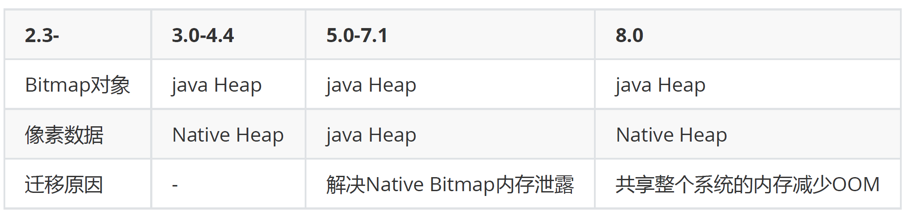
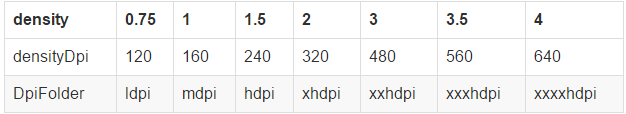

# Bitmap使用
	- # Bitmap相关方法总结
		- ## [[Bitmap相关方法]]
		- ## [[BitmapFactory工厂类]]
	- # [[单个像素的字节大小]]
	- # [[Bitmap加载方式]]
	- # [[Bitmap | Drawable | InputStream | Byte[ ] 之间进行转换]]
	- # [[Bitmap常用操作]]
- # Bitmap内存模型
	- 
- # Bitmap的内存回收
  collapsed:: true
	- ## 1. 在Android2.3.3之前推荐使用Bitmap.recycle()方法进行Bitmap的内存回收
		- >备注：只有当确定这个Bitmap不被引用的时候才能调用此方法，否则会有“Canvas: trying to use
		  a recycled bitmap”这个错误。
	- ## 2. Android3.0之后
		- Android3.0之后，并没有强调Bitmap.recycle()；而是强调Bitmap的复用
			- Save a bitmap for later use
		- 使用LruCache对Bitmap进行缓存**，当再次使用到这个Bitmap的时候直接获取，而不用重走编码
		  流程
			- Use an existing bitmap
			- >Android3.0(API 11之后)引入了BitmapFactory.Options.inBitmap字段，设置此字段之后解
			  码方法会尝试复用一张存在的Bitmap。这意味着Bitmap的内存被复用，避免了内存的回收
			  及申请过程，显然性能表现更佳。不过，使用这个字段有几点限制：
			- 声明可被复用的Bitmap必须设置inMutable为true；
			- Android4.4(API 19)之前只有格式为jpg、png，同等宽高（要求苛刻），inSampleSize为1的
			  Bitmap才可以复用；
			- Android4.4(API 19)之前被复用的Bitmap的inPreferredConfig会覆盖待分配内存的Bitmap设
			  置的inPreferredConfig；
			- Android4.4(API 19)之后被复用的Bitmap的内存必须大于需要申请内存的Bitmap的内存；
			- Android4.4(API 19)之前待加载Bitmap的Options.inSampleSize必须明确指定为1
- # [[获取Bitmap的大小]]
- # Bitmap占用内存大小计算
	- Bitmap作为位图，需要读入一张图片每一个像素点的数据，其主要占用内存的地方也正是这些像素数
	  据。对于像素数据总大小，我们可以猜想为：像素总数量 × 每个像素的字节大小，而像素总数量在矩形
	  屏幕表现下，应该是：横向像素数量 × 纵向像素数量，结合得到：
	- >Bitmap内存占用 ≈ 像素数据总大小 = 横向像素数量 × 纵向像素数量 × 每个像素的字节大小
	- 我们来看下源码，Bitmap的decode过程实际上是在native层完成的，为此，需要从
	  BitmapFactory.cpp # nativeDecodeXXX方法开始跟踪，最终在[[doDecode]]方法里面
	- 从上述代码中，我们看到bitmap最终通过canvas绘制出来，而canvas在绘制之前，有一个scale的操
	  作，scale的值由
		- ```java
		  scale = (float) targetDensity 1 / density;
		  ```
	- 这一行代码决定，即缩放的倍率和targetDensity和density相关，而这两个参数都是从传入的options中
	  获取到的
		- ```java
		  inDensity：Bitmap位图自身的密度、分辨率
		  inTargetDensity: Bitmap最终绘制的目标位置的分辨率
		  inScreenDensity: 设备屏幕分辨率
		  ```
	- 其中inDensity和图片存放的资源文件的目录有关，同一张图片放置在不同目录下会有不同的值：
		- 
	- ## 可以验证几个结论：
		- 1. 图片放在drawable中，等同于放在drawable-mdpi中，原因为：drawable目录不具有屏幕密度特
		  性，所以采用基准值，即mdpi
		- 2. 图片放在某个特定drawable中，比如drawable-hdpi，如果设备的屏幕密度高于当前drawable目
		  录所代表的密度，则图片会被放大，否则会被缩小
		  放大或缩小比例 = 设备屏幕密度 / drawable目录所代表的屏幕密度
		- 因此，关于Bitmap占用内存大小的公式，从之前：
		- >Bitmap内存占用 ≈ 像素数据总大小 = 横向像素数量 × 纵向像素数量 × 每个像素的字节大小
		- 可以更细化为：
		- >Bitmap内存占用 ≈ 像素数据总大小 = 图片宽 × 图片高× (设备屏幕密度/资源目录屏幕密度)^2 × 每个像素的字节大小
- # [[Bitmap优化-面试]]