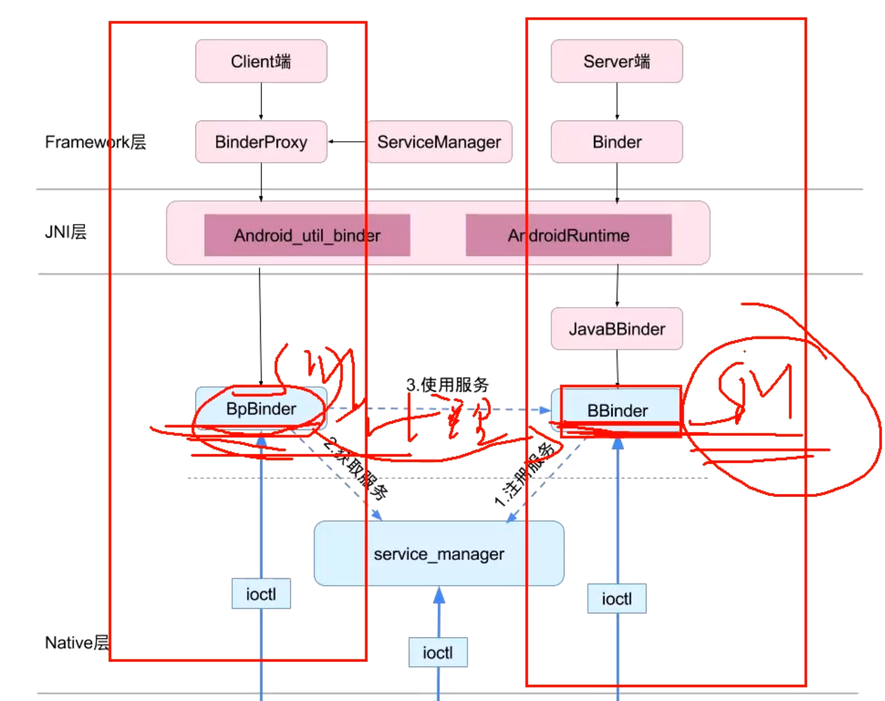
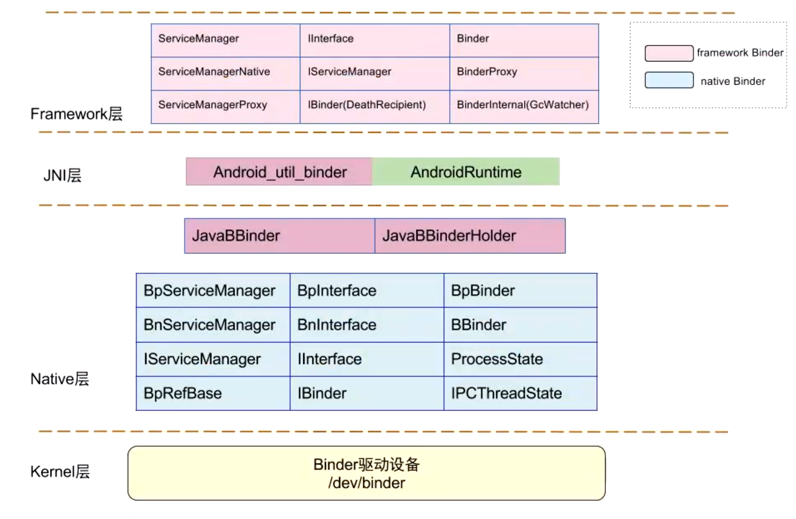
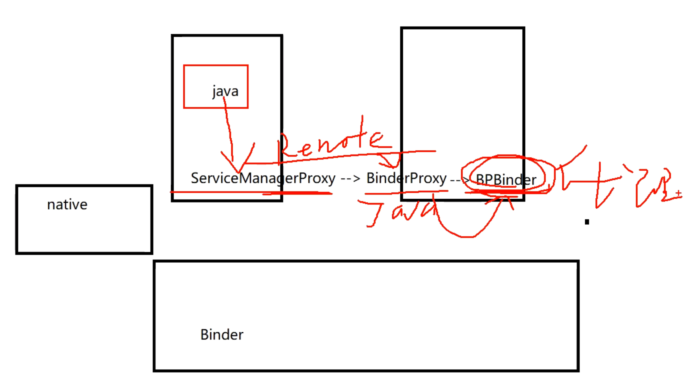

- 
- # 左侧相当于客户端，右侧是服务端（里边有SM对象）
	- 客户端想要拿到SM对象，java里是直接new。但是跨进程是不能直接new的。
		- 客户端想要和服务端通信，拿到里边的SM对象(相当于BBinder就是SM对象)是没办法直接拿到的
	- 服务端将BBinder（相当于SM）注册到内核层的Binder驱动中
	- 客户端通过binder驱动，拿到的BpBinder 相当于 BBinder的代理对象。
		- 可以通过BinderProxy，拿到BpBinder（相当于BBinder的一个代理对象，代理SM）
- # Binder框架类图：涉及的方法
	- {:height 517, :width 780}
- # Java层怎么获取BBinder的
	- 
- # [[Native层怎么获取BpBinder的]]
	-