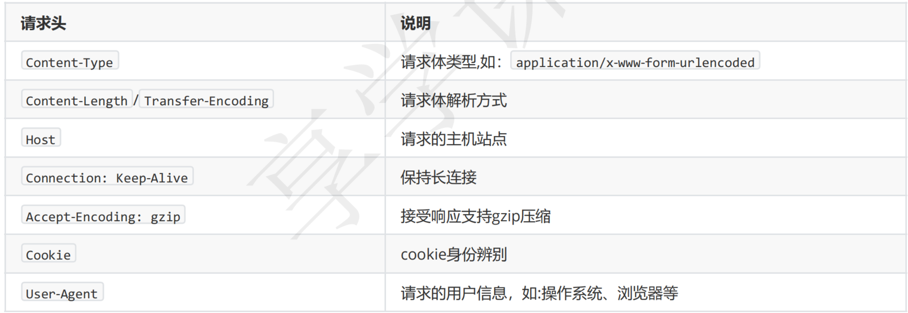

- [[BridgeInterceptor]] ，连接应用程序和服务器的桥梁，我们发出的请求将会经过它的处理才能发给服务器，比如设置[[#red]]==**请求内容长度，编码，gzip压缩，cookie等，获取响应后保存Cookie等**==操作。这个拦截器相对比较简单。
- ## 补全请求头:
	- 
	- 在补全了请求头后交给下一个拦截器处理，得到响应后，主要干两件事情：
	- 1、保存cookie，在下次请求则会读取对应的数据设置进入请求头，默认的 CookieJar 不提供实现
	- 2、如果使用gzip返回的数据，则使用 GzipSource 包装便于解析。
- ## 总结
	- 桥接拦截器的执行逻辑主要就是以下几点
	-
	- 对用户构建的 Request 进行添加或者删除相关头部信息，以转化成能够真正进行网络请求的 Request 将符合网络请求规范的Request交给下一个拦截器处理，
	- 并获取 Response 如果响应体经过了GZIP压缩，那就需要解压，再构建成用户可用的 Response 并返回
-