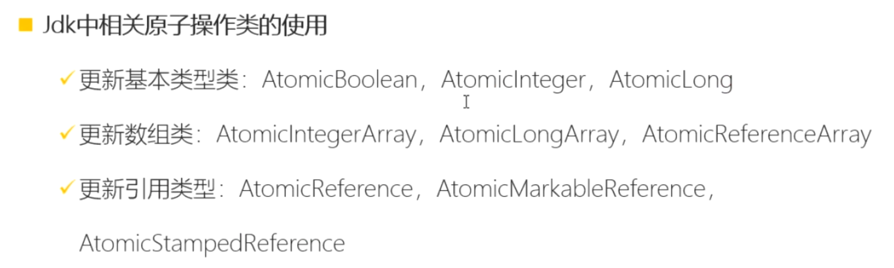

- # 概念：
	- CAS 是 Compare and Swap（比较并交换）的缩写，是一种用于并发编程中解决并发安全问题的技术。
	- CAS 操作通过[[#red]]==**比较内存中的值与预期值是否相等**==来决定是否更新内存中的值。
		- 1、如果相等，就说明内存中的值没有被其他线程修改，此时可以原子地将新值写入内存；
		- 2、如果不相等，则说明内存中的值已经被其他线程修改，此时不进行更新。
	- CAS 是基于硬件原语提供的原子操作，它通常由处理器提供支持。在执行 CAS 操作时，它会首先读取内存中的值和预期值进行比较，如果相等则将新值写入内存，否则放弃操作。CAS 操作是原子的，因此可以确保多个线程对共享资源的并发访问安全。
- # 使用场景
	- CAS 可以用于解决多线程环境下的并发冲突，[[#red]]==**例如多个线程同时对同一变量进行更新操**==作。传统的锁机制（例如互斥锁）在多线程并发访问时需要进行加锁和解锁操作，[[#red]]==**而 CAS 可以通过无锁的方式实现对共享资源的并发安全访问，从而提高了并发性能。**==
- # 缺点
	- 1、然而，CAS 也有一些限制。它在高并发情况下可能会导致[[#red]]==**自旋（Spin）操作导致开销问题**==，即不断尝试进行 CAS 操作直到成功，这可能会浪费一些处理器资源。
	- 2、另外，CAS 无法解决所有的并发安全问题，[[#red]]==**例如ABA 问题（**==一个值从 A 变为 B，再变回 A，在这个过程中其他线程进行了修改操作）可能会导致 CAS 操作判断出现错误。
	- 3、[[#red]]==**只能保证一个共享变量的原子操作**==
- 总的来说，CAS 是一种用于解决并发安全问题的技术，可以提供高性能的并发访问机制。然而，在使用 CAS 时需要注意其适用范围和局限性，并结合具体场景进行合理的使用和处理。
- # CAS，怎么使用
	- ## java 的Atomic开头的原子变量类都是使用了CAS机制
	- 
- ## [[CAS机制面试题]]