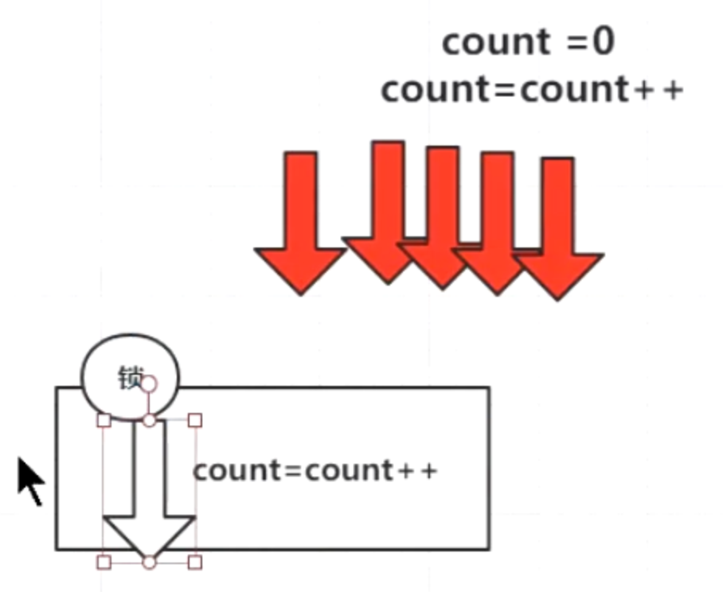

- 1、利用了现代处理器都支持CAS指令
- 2、循环这个指令，直到成功
- ## 详细
	- ## 锁机制：
	  collapsed:: true
		- 
		- 多个线程，谁抢到锁，谁就执行count++,执行完释放锁，其他线程也一样
	- ## CAS
		- ## 前提4个线程（ABCD）做count累加
		- 第一步，4个线程先把count=0从内存取出来，都放在每个线程内部
		  collapsed:: true
			- 
		- 第二步，4个线程都在自己内部执行到了count++，把0变成了1
		  collapsed:: true
			- 
		- 第三步，接下来都想把自己的值，更新到内存中，计算机就使用了CAS指令，同一时刻只能一个线程执行这个指令，
		  collapsed:: true
			- 
		- 第四步，假如线程A进入了，先比较当前内存count是否等于0（因为我做count++前以0开始的）
			- 等于0，期间没有其他线程修改，则交换值把内存赋值为1
			- 不等于0，则再次从第一步循环
			- 假如，等于0.线程A更新了count = 1
		- 第五步，线程B又执行CAS指令时，发现count！=0了为1了，被其他线程修改了，则从第一步循环，取出count =1 放自己内部执行++。线程CD也一样。