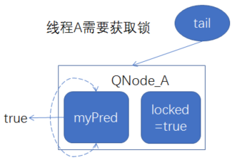

- 将申请锁的所有线程，都加入到一个链表中进行排队
- 1、比如；当一个线程A需要获取锁时，创建一个链接节点，至少含有3个变量（1、线程A本身，2、前驱节点引用，3、locked代表当前锁的获取状态，true需要获取锁）
  collapsed:: true
	- 
- 2、线程通过CAS操作调用getAndSet方法，把自己加入队列的尾部，myPred指向其前驱结点的引用，locked改为true，表示需要获得锁
  collapsed:: true
	- {:height 233, :width 325}
- 3、线程B需要获得锁，也是新建节点，通过CAS操作把自己加入队列尾部，同样的流程再来一遍
  collapsed:: true
	- 
- 4、然后线程就在前驱结点的locked字段上旋转，直到前驱结点释放锁(前驱节点的锁值 locked == false)
- 5.当一个线程需要释放锁时，将当前结点的locked域设置为false，同时回收前驱结点
  collapsed:: true
	- 
- 如上图所示，前驱结点释放锁，线程A的myPred所指向的前驱结点的locked字段变为false，线程A就可以获取到锁。