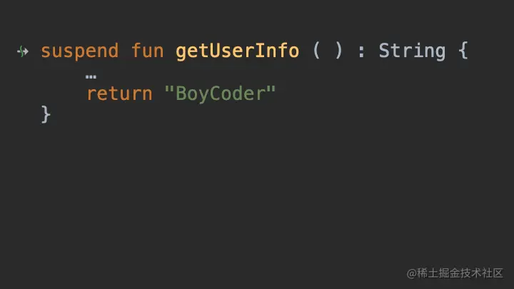
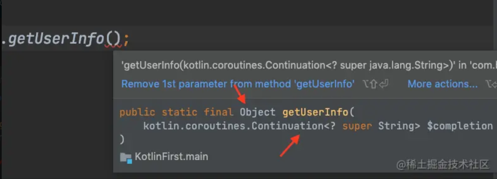

# 1、概念
	- 编译器将挂起函数转换为Continuation函数（相当于回调CallBack）的过程，就叫做CPS转换
	- ## 变换在哪
		- 1、方法去掉Suspend关键字、返回值变为Any
		- 2、方法入参添加Continuation
		- 3、block代码块转变为：Continuation+switch代码块
- # 2、具体变换
	- 所以当我们定义的函数前面加了`suspend`关键字的时候，编译器在编译时就会对挂起函数做特殊处理，而这个特殊处理就是CPS，下面是一张动图来简单说明是如何变化的：
	- {:height 413, :width 720}
	- 在这个过程中我们会发现我们在Kotlin代码中的函数类型`suspend () -> String`变成了`(Continuation) -> Any?`，这里其实就把`suspend`关键字给解析了，反编译的Java代码将不会出现`suspend`关键字了。
	- 同时我们可以验证一下，使用Java代码访问Kotlin的挂起函数`getUserInfo()`，来看一下类型
	- 
	- 所以这里压力就来到了`Continuation`这个类上面了，既然挂起本质就是`CallBack`，那这个`CallBack`的变种`Continuation`就是关键了
- # 重要结论
	- launch协程体block反编译成了Continuation+switch 状态机逻辑代码