# 8.0以上运行使用产生图表
collapsed:: true
	- 1. 依次选择 Run > Edit Configurations。
		- 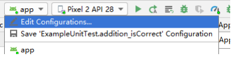
	- collapsed:: true
	  2. 在 Profiling 标签中，勾选 Start recording CPU activity on startup 旁边的复选框。
		- 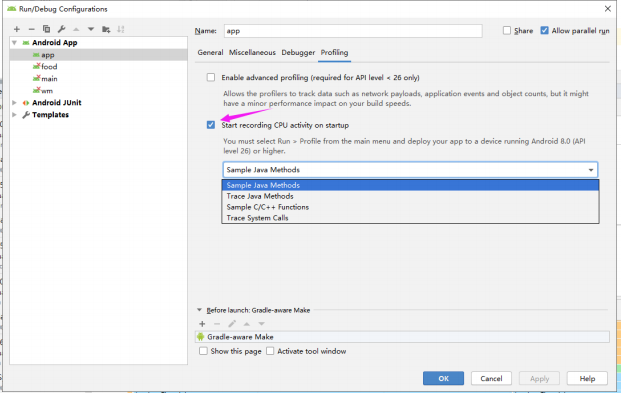
	- collapsed:: true
	  3. 从菜单中选择 CPU 记录配置。启动耗时关心前2个就行
		- Sample Java Methods
			- ==**对 Java 方法采样：**==在应用的 Java 代码执行期间，频繁捕获应用的调用堆栈。分析器会比较捕获的数据集，以推导与应用的 Java 代码执行有关的时间和资源使用信息。如果应用在捕获调用堆栈后进入一个方法并在下次捕获前退出该方法，分析器将不会记录该方法调用。如果您想要跟踪生命周期如此短的方法，应使用检测跟踪。
			- ==**采样，有采样间隔，有可能有些方法执行快采样不到**==，
		- Trace Java Methods
			- [[#red]]==**跟踪 Java 方法**==：在运行时检测应用，以在每个方法调用开始和结束时记录一个时间戳。系统会收集并比较这些时间戳，以生成方法跟踪数据，包括时间信息和 CPU 使用率。
		- Sample C/C++ Functions
			- 对 C/C++ 函数采样：捕获应用的原生线程的采样跟踪数据。要使用此配置，您必须将应用部署到搭载
			  Android 8.0（API 级别 26）或更高版本的设备上。
		- Trace System Calls
			- 跟踪系统调用：捕获非常翔实的细节，以便您检查应用与系统资源的交互情况。您可以检查线程状态的确切时间和持续时间、直观地查看所有内核的 CPU 瓶颈在何处，并添加要分析的自定义跟踪事件。要使用此配置，您必须将应用部署到搭载 Android 7.0（API 级别 24）或更高版本的设备上。
		- 此跟踪配置在 systrace 的基础上构建而成。您可以使用 systrace 命令行实用程序指定除 CPU Profiler 提供的
		  选项之外的其他选项。systrace 提供的其他系统级数据可帮助您检查原生系统进程并排查丢帧或帧延迟问
		  题。
	- 4. 点击 Apply。
	- collapsed:: true
	  5. 依次选择 Run > Profile，将您的应用部署到搭载 Android 8.0（API 级别 26）或更高版本的设备上。
		- 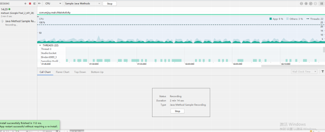
	- 点击Stop，结束跟踪后显示：
		- 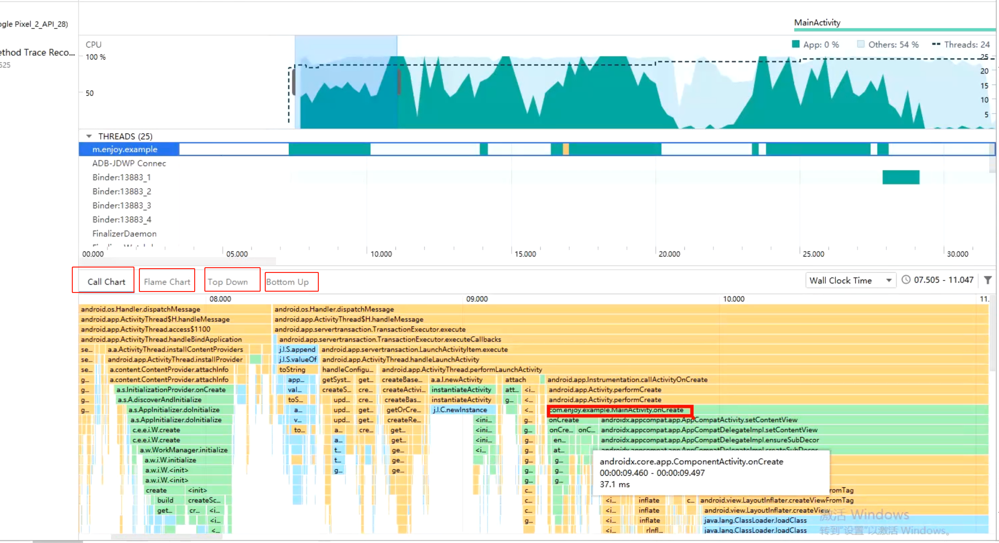
- # 8.0以下使用
	- 除了直接使用 Profile 启动之外，我们还可以借助Debug API生成trace文件。
	- ```java
	  public class MyApplication extends Application {
	      public MyApplication() {
	          Debug.startMethodTracing("enjoy");
	      }
	  //.....
	  }
	  public class MainActivity extends AppCompatActivity {
	      @Override
	      public void onWindowFocusChanged(boolean hasFocus) {
	          super.onWindowFocusChanged(hasFocus);
	          Debug.stopMethodTracing();
	      }
	  //.......
	  }
	  ```
	- 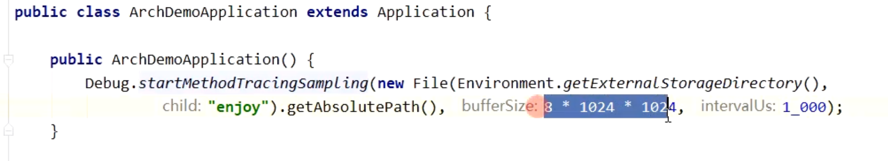
	- 运行App，则会在sdcard中生成一个enjoy.trace文件（需要sdcard读写权限）。将手机中的trace文件保存至电脑，随后拖入Android Studio即可。
- # 分析表
	- ## [[#red]]==**第一个表Call Chart**==，从上往下看调用栈
	  collapsed:: true
		- 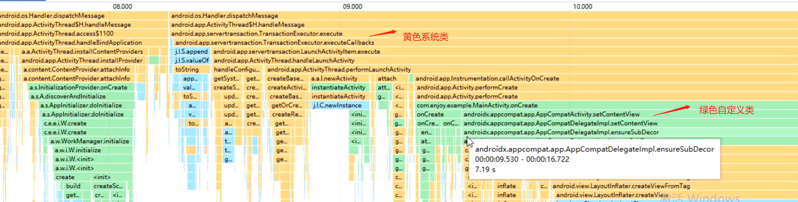
		- ## 代码颜色分类，有bug的有时颜色不准
			- 1、黄色为系统类
			- 2、绿色自定义类
			- 3、蓝色 三方SDK
		- ## 方法横条越宽，往右花费的时间越长
		  collapsed:: true
			- 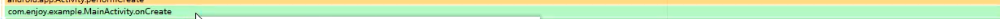
			- 比如这里MainActivity的onCreate 耗时13s
			- ## 调用顺序是从上往下的
			- 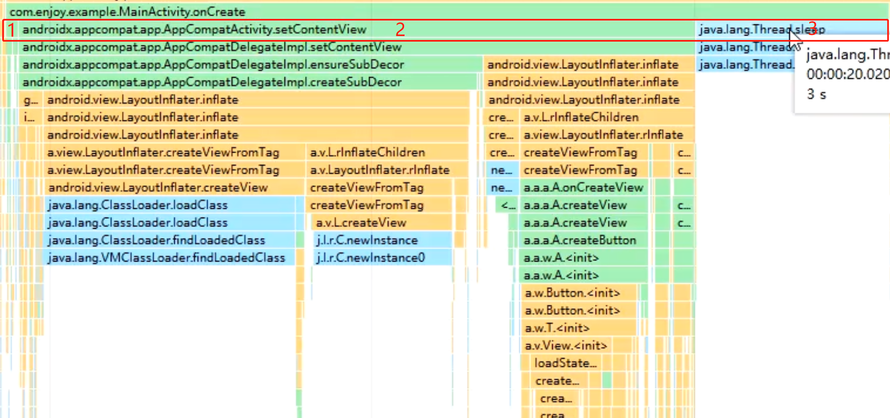
			- 下边就是onCreate每个方法具体耗时 比如
				- 1、调用super耗时多少
				- 2、setContentView 耗时多少
				- 3、还有个线程睡3s
	- ## ==**第二个表Flame Chart**==-火焰图，从下往上看
	  collapsed:: true
		- 作用和第一个差不多
		- 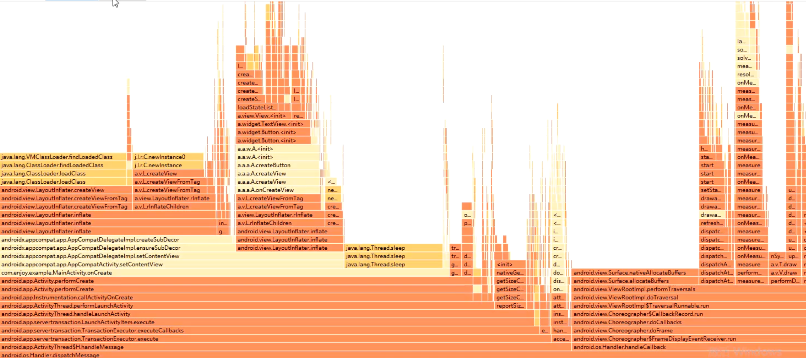
	- ## ==**第三个表Top Down**==,可以按耗时排序
	  collapsed:: true
		- 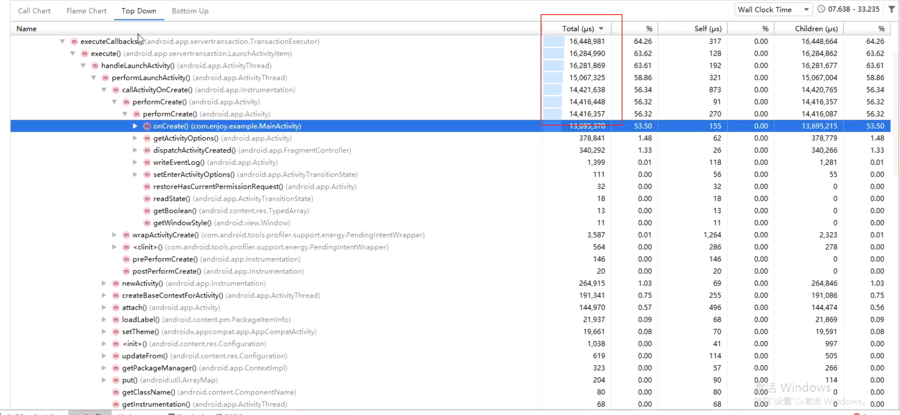
		- 可以查询到Activity的 onCreate 的方法耗时在inflate里。
		- 优化点，优化布局层级，或者Androidx里的异步加载能不能用
	- ## ==**第四个表 Bottom Up**==,可以看每个方法被谁调用的
	  collapsed:: true
		- 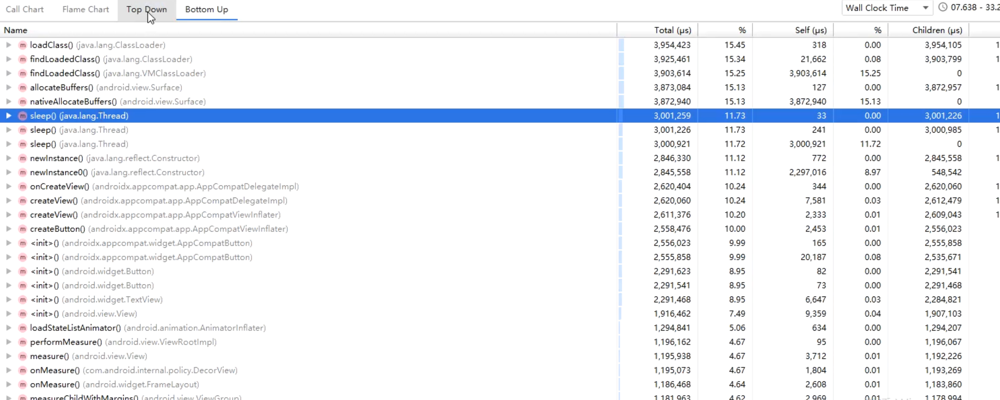
	- 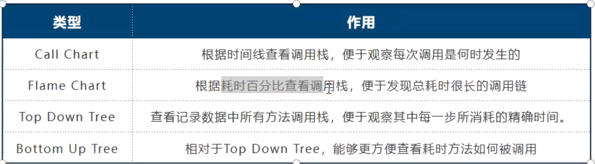