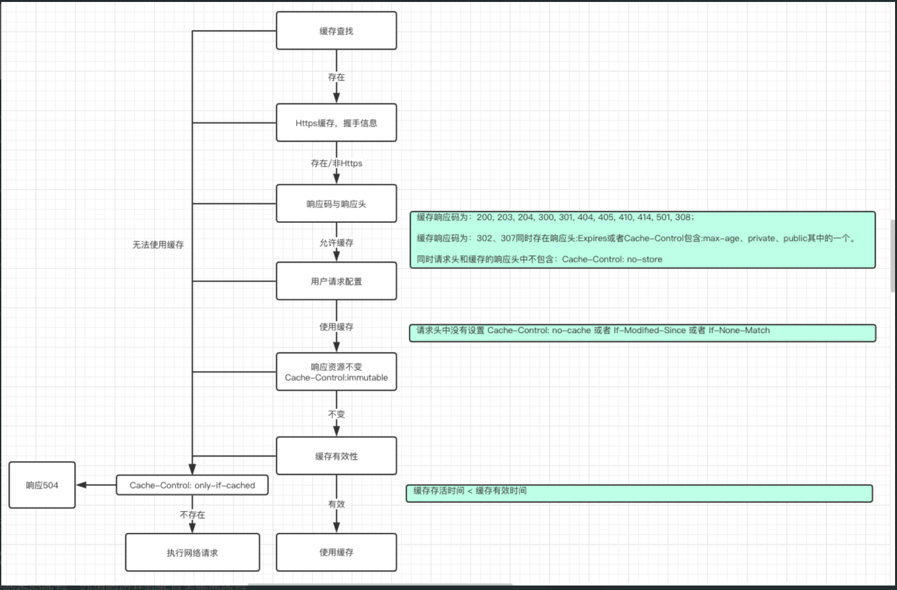

- ## [[缓存拦截器介绍]]
- ## 拦截器代码
  collapsed:: true
	- ```java
	  @Throws(IOException::class)
	    override fun intercept(chain: Interceptor.Chain): Response {
	      val call = chain.call()
	      val cacheCandidate = cache?.get(chain.request())
	  
	      val now = System.currentTimeMillis()
	  
	      val strategy = CacheStrategy.Factory(now, chain.request(), cacheCandidate).compute()
	      val networkRequest = strategy.networkRequest
	      val cacheResponse = strategy.cacheResponse
	  
	      cache?.trackResponse(strategy)
	      val listener = (call as? RealCall)?.eventListener ?: EventListener.NONE
	  
	      if (cacheCandidate != null && cacheResponse == null) {
	        // The cache candidate wasn't applicable. Close it.
	        cacheCandidate.body?.closeQuietly()
	      }
	  
	      // 没有请求也没有缓存：直接返回失败 504
	      if (networkRequest == null && cacheResponse == null) {
	        return Response.Builder()
	            .request(chain.request())
	            .protocol(Protocol.HTTP_1_1)
	            .code(HTTP_GATEWAY_TIMEOUT)
	            .message("Unsatisfiable Request (only-if-cached)")
	            .body(EMPTY_RESPONSE)
	            .sentRequestAtMillis(-1L)
	            .receivedResponseAtMillis(System.currentTimeMillis())
	            .build().also {
	              listener.satisfactionFailure(call, it)
	            }
	      }
	  
	      // If we don't need the network, we're done.
	      if (networkRequest == null) {
	        return cacheResponse!!.newBuilder()
	            .cacheResponse(stripBody(cacheResponse))
	            .build().also {
	              listener.cacheHit(call, it)
	            }
	      }
	  
	      if (cacheResponse != null) {
	        listener.cacheConditionalHit(call, cacheResponse)
	      } else if (cache != null) {
	        listener.cacheMiss(call)
	      }
	  
	      var networkResponse: Response? = null
	      try {
	        networkResponse = chain.proceed(networkRequest)
	      } finally {
	        // If we're crashing on I/O or otherwise, don't leak the cache body.
	        if (networkResponse == null && cacheCandidate != null) {
	          cacheCandidate.body?.closeQuietly()
	        }
	      }
	  
	      // If we have a cache response too, then we're doing a conditional get.
	      if (cacheResponse != null) {
	        if (networkResponse?.code == HTTP_NOT_MODIFIED) {
	          val response = cacheResponse.newBuilder()
	              .headers(combine(cacheResponse.headers, networkResponse.headers))
	              .sentRequestAtMillis(networkResponse.sentRequestAtMillis)
	              .receivedResponseAtMillis(networkResponse.receivedResponseAtMillis)
	              .cacheResponse(stripBody(cacheResponse))
	              .networkResponse(stripBody(networkResponse))
	              .build()
	  
	          networkResponse.body!!.close()
	  
	          // Update the cache after combining headers but before stripping the
	          // Content-Encoding header (as performed by initContentStream()).
	          cache!!.trackConditionalCacheHit()
	          cache.update(cacheResponse, response)
	          return response.also {
	            listener.cacheHit(call, it)
	          }
	        } else {
	          cacheResponse.body?.closeQuietly()
	        }
	      }
	  
	      val response = networkResponse!!.newBuilder()
	          .cacheResponse(stripBody(cacheResponse))
	          .networkResponse(stripBody(networkResponse))
	          .build()
	  
	      if (cache != null) {
	        if (response.promisesBody() && CacheStrategy.isCacheable(response, networkRequest)) {
	          // Offer this request to the cache.
	          val cacheRequest = cache.put(response)
	          return cacheWritingResponse(cacheRequest, response).also {
	            if (cacheResponse != null) {
	              // This will log a conditional cache miss only.
	              listener.cacheMiss(call)
	            }
	          }
	        }
	  
	        if (HttpMethod.invalidatesCache(networkRequest.method)) {
	          try {
	            cache.remove(networkRequest)
	          } catch (_: IOException) {
	            // The cache cannot be written.
	          }
	        }
	      }
	  
	      return response
	    }
	  ```
- ## [[缓存拦截器步骤]]
- 缓存拦截器的工作说起来比较简单，但是具体的实现，需要处理的内容很多。在缓存拦截器中判断是否可以使用缓存，或是请求服务器都是通过 CacheStrategy 判断
- ## 缓存策略
	- CacheStrategy 。首先需要认识几个请求头与响应头
		- ## 响应头
		  collapsed:: true
			- 
		- ## **请求头**
		  collapsed:: true
			- 
			- 其中 Cache-Control 可以在请求头存在，也能在响应头存在，对应的value可以设置多种组合：
				- 1. max-age=[秒] ：资源最大有效时间;
				- 2. public ：表明该资源可以被任何用户缓存，比如客户端，代理服务器等都可以缓存资源;
				- 3. private ：表明该资源只能被单个用户缓存，默认是private。
				- 4. no-store ：资源不允许被缓存
				- 5. no-cache ：(请求)不使用缓存
				- 6. immutable ：(响应)资源不会改变
				- 7. min-fresh=[秒] ：(请求)缓存最小新鲜度(用户认为这个缓存有效的时长)
				- 8. must-revalidate ：(响应)不允许使用过期缓存
				- 9. max-stale=[秒] ：(请求)缓存过期后多久内仍然有效
			- > 假设存在max-age=100，min-fresh=20。这代表了用户认为这个缓存的响应，从服务器创建响应 到 能够缓存使用的时间为100-20=80s。但是如果max-stale=100。这代表了缓存有效时间80s过后，仍然允许使用100s，可以看成缓存有效时长为180s。
			- 
- ## **详细流程**
	- 如果从缓存中获得了本次请求URL对应的 Response ，首先会从响应中获得以上数据备用
	  collapsed:: true
		- Factory
		  collapsed:: true
			- ```java
			   public Factory(long nowMillis, Request request, Response cacheResponse) {
			          this.nowMillis = nowMillis;
			          this.request = request;
			          this.cacheResponse = cacheResponse;
			          if (cacheResponse != null) {
			  //对应响应的请求发出的本地时间 和 接收到响应的本地时间
			              this.sentRequestMillis = cacheResponse.sentRequestAtMillis();
			              this.receivedResponseMillis = cacheResponse.receivedResponseAtMillis();
			              Headers headers = cacheResponse.headers();
			              for (int i = 0, size = headers.size(); i < size; i++) {
			                  String fieldName = headers.name(i);
			                  String value = headers.value(i);
			                  if ("Date".equalsIgnoreCase(fieldName)) {
			                      servedDate = HttpDate.parse(value);
			                      servedDateString = value;
			                  } else if ("Expires".equalsIgnoreCase(fieldName)) {
			                      expires = HttpDate.parse(value);
			                  } else if ("Last-Modified".equalsIgnoreCase(fieldName)) {
			                      lastModified = HttpDate.parse(value);
			                      lastModifiedString = value;
			                  } else if ("ETag".equalsIgnoreCase(fieldName)) {
			                      etag = value;
			                  } else if ("Age".equalsIgnoreCase(fieldName)) {
			                      ageSeconds = HttpHeaders.parseSeconds(value, -1);
			                  }
			              }
			          }
			      }
			  ```
	- 判断缓存的命中会使用 get() 方法
	  collapsed:: true
		- ```java
		    public CacheStrategy get() {
		          CacheStrategy candidate = getCandidate();
		  //todo 如果可以使用缓存，那networkRequest必定为null；指定了只使用缓存但是networkRequest又不为
		          null，冲突。那就gg(拦截器返回504)
		          if (candidate.networkRequest != null && request.cacheControl().onlyIfCached()) {
		  // We're forbidden from using the network and the cache is insufficient.
		              return new CacheStrategy(null, null);
		          }
		          return candidate;
		      }
		  ```
	- 方法中调用 getCandidate() 方法来完成真正的缓存判断。
	- ### 1、缓存是否存在
	  collapsed:: true
		- 整个方法中的第一个判断是缓存是不是存在：
		- ```java
		  if (cacheResponse == null) {
		  	return new CacheStrategy(request, null);
		  }
		  ```
		- cacheResponse 是从缓存中找到的响应，如果为null，那就表示没有找到对应的缓存，创建的 CacheStrategy 实例 对象只存在 networkRequest ，这代表了需要发起网络请求。
	- ### 2、https请求的缓存
	  collapsed:: true
		- 继续往下走意味着 cacheResponse 必定存在，但是它不一定能用。后续进行有效性的一系列判断
		- ```java
		    if (request.isHttps() && cacheResponse.handshake() == null) {
		          return new CacheStrategy(request, null);
		      }
		  ```
		- 如果本次请求是HTTPS，但是缓存中没有对应的握手信息，那么缓存无效
	- ### **3****、响应码以及响应头**
	  collapsed:: true
		- ```java
		  if (!isCacheable(cacheResponse, request)) {
		  	return new CacheStrategy(request, null);
		  }
		  ```
		- 整个逻辑都在 isCacheable 中，他的内容是
		  collapsed:: true
			- ```java
			  public static boolean isCacheable(Response response, Request request) {
			          // Always go to network for uncacheable response codes (RFC 7231 section 6.1),
			          // This implementation doesn't support caching partial content.
			          switch (response.code()) {
			              case HTTP_OK:
			              case HTTP_NOT_AUTHORITATIVE:
			              case HTTP_NO_CONTENT:
			              case HTTP_MULT_CHOICE:
			              case HTTP_MOVED_PERM:
			              case HTTP_NOT_FOUND:
			              case HTTP_BAD_METHOD:
			              case HTTP_GONE:
			              case HTTP_REQ_TOO_LONG:
			              case HTTP_NOT_IMPLEMENTED:
			              case StatusLine.HTTP_PERM_REDIRECT:
			          // These codes can be cached unless headers forbid it.
			                  break;
			              case HTTP_MOVED_TEMP:
			              case StatusLine.HTTP_TEMP_REDIRECT:
			          // These codes can only be cached with the right response headers.
			          // http://tools.ietf.org/html/rfc7234#section-3
			                          // s-maxage is not checked because OkHttp is a private cache that should ignore
			          // s-maxage.
			                  if (response.header("Expires") != null
			                          || response.cacheControl().maxAgeSeconds() != -1
			                          || response.cacheControl().isPublic()
			                          || response.cacheControl().isPrivate()) {
			                      break;
			                  }
			          // Fall-through.
			              default:
			          // All other codes cannot be cached.
			                  return false;
			          }
			          // A 'no-store' directive on request or response prevents the response from being cached.
			          return !response.cacheControl().noStore() && !request.cacheControl().noStore();
			      }
			  ```
		- 缓存响应中的响应码为 200, 203, 204, 300, 301, 404, 405, 410, 414, 501, 308 的情况下,只判断服务器是不是给了Cache-Control: no-store (资源不能被缓存)，所以如果服务器给到了这个响应头，那就和前面两个判定一致(缓存不可用)。否则继续进一步判断缓存是否可用而如果响应码是302/307(重定向)，则需要进一步判断是不是存在一些允许缓存的响应头。根据注解中的给到的[文档](http://tools.ietf.org/html/rfc7234#section-3) 中的描述，如果存在 Expires 或者 Cache-Control 的值为：
			- 1. max-age=[秒] ：资源最大有效时间;
			- 2. public ：表明该资源可以被任何用户缓存，比如客户端，代理服务器等都可以缓存资源;
			- 3. private ：表明该资源只能被单个用户缓存，默认是private。
		- 同时不存在 Cache-Control: no-store ，那就可以继续进一步判断缓存是否可用。
		- 所以综合来看判定优先级如下：
			- 1、响应码不为 200, 203, 204, 300, 301, 404, 405, 410, 414, 501, 308，**302**，**307 **缓存不可用;
			- 2、当响应码为302或者307时，未包含某些响应头，则缓存不可用;
			- 3、当存在 Cache-Control: no-store 响应头则缓存不可用。
		- 如果响应缓存可用，进一步再判断缓存有效性
	- ### **4****、用户的请求配置**
	  collapsed:: true
		- ```java
		      CacheControl requestCaching = request.cacheControl();
		      if (requestCaching.noCache() || hasConditions(request)) {
		          return new CacheStrategy(request, null);
		      }
		      private static boolean hasConditions(Request request) {
		          return request.header("If-Modified-Since") != null || 
		            request.header("If-None-Match") != null;
		      }
		  ```
		- 走到这一步，OkHttp需要先对用户本次发起的 Request 进行判定，如果用户指定了 Cache-Control: no-cache (不使用缓存)的请求头或者请求头包含 If-Modified-Since 或 If-None-Match (请求验证)，那么就不允许使用缓存。
		- 
		- 这意味着如果用户请求头中包含了这些内容，那就必须向服务器发起请求。但是需要注意的是，OkHttp并不会缓存304的响应，如果是此种情况，即用户主动要求与服务器发起请求，服务器返回的304(无响应体)，则直接把304的响应返回给用户：**“****既然你主动要求，我就只告知你本次请求结果****”**。而如果不包含这些请求头，那继续判定缓存有效性。
	- ### **5****、资源是否不变**
	  collapsed:: true
		- ```java
		  CacheControl responseCaching = cacheResponse.cacheControl();
		  if (responseCaching.immutable()) {
		  	return new CacheStrategy(null, cacheResponse);
		  }
		  ```
		- 如果缓存的响应中包含 Cache-Control: immutable ，这意味着对应请求的响应内容将一直不会改变。此时就可以直接使用缓存。否则继续判断缓存是否可用
	- ### **6****、响应的缓存有效期**
	  collapsed:: true
		- 这一步为进一步根据缓存响应中的一些信息判定缓存是否处于有效期内。如果满足：
		- >缓存存活时间 < 缓存新鲜度 - 缓存最小新鲜度 + 过期后继续使用时长
		- 代表可以使用缓存。其中新鲜度可以理解为有效时间，而这里的 **"****缓存新鲜度****-****缓存最小新鲜度****" **就代表了缓存真正有效的时间。
		- ```java
		  // 6.1、获得缓存的响应从创建到现在的时间
		   long ageMillis = cacheResponseAge();
		  //todo
		  // 6.2、获取这个响应有效缓存的时长
		      long freshMillis = computeFreshnessLifetime();
		      if (requestCaching.maxAgeSeconds() != -1) {
		  //todo 如果请求中指定了 max-age 表示指定了能拿的缓存有效时长，就需要综合响应有效缓存时长与请求能拿缓存的
		          时长，获得最小的能够使用响应缓存的时长
		                  freshMillis = Math.min(freshMillis, SECONDS.toMillis(requestCaching.maxAgeSeconds()));
		      }
		  // 6.3 请求包含 Cache-Control:min-fresh=[秒] 能够使用还未过指定时间的缓存 （请求认为的缓存有效时间）
		      long minFreshMillis = 0;
		      if (requestCaching.minFreshSeconds() != -1) {
		          minFreshMillis = SECONDS.toMillis(requestCaching.minFreshSeconds());
		      }
		  // 6.4
		  // 6.4.1、Cache-Control:must-revalidate 可缓存但必须再向源服务器进行确认
		  // 6.4.2、Cache-Control:max-stale=[秒] 缓存过期后还能使用指定的时长 如果未指定多少秒，则表示无论过期
		      多长时间都可以；如果指定了，则只要是指定时间内就能使用缓存
		  // 前者会忽略后者，所以判断了不必须向服务器确认，再获得请求头中的max-stale
		      long maxStaleMillis = 0;
		      if (!responseCaching.mustRevalidate() && requestCaching.maxStaleSeconds() != -1) {
		          maxStaleMillis = SECONDS.toMillis(requestCaching.maxStaleSeconds());
		      }
		  // 6.5 不需要与服务器验证有效性 && 响应存在的时间+请求认为的缓存有效时间 小于 缓存有效时长+过期后还可以
		      使用的时间
		  // 允许使用缓存
		      if (!responseCaching.noCache() && ageMillis + minFreshMillis < freshMillis + maxStaleMillis) {
		          Response.Builder builder = cacheResponse.newBuilder();
		  //todo 如果已过期，但未超过 过期后继续使用时长，那还可以继续使用，只用添加相应的头部字段
		          if (ageMillis + minFreshMillis >= freshMillis) {
		              builder.addHeader("Warning", "110 HttpURLConnection \"Response is stale\"");
		          }
		  //todo 如果缓存已超过一天并且响应中没有设置过期时间也需要添加警告
		          long oneDayMillis = 24 * 60 * 60 * 1000L;
		          if (ageMillis > oneDayMillis && isFreshnessLifetimeHeuristic()) {
		              builder.addHeader("Warning", "113 HttpURLConnection \"Heuristic expiration\"");
		          }
		          return new CacheStrategy(null, builder.build());
		      }  
		  ```
		- **6.1****、缓存到现在存活的时间：****ageMillis**
		  collapsed:: true
			- 首先 cacheResponseAge() 方法获得了响应大概存在了多久:
				- ```java
				   long ageMillis = cacheResponseAge();
				      private long cacheResponseAge() {
				          long apparentReceivedAge = servedDate != null
				                  ? Math.max(0, receivedResponseMillis - servedDate.getTime())
				                  : 0;
				          long receivedAge = ageSeconds != -1
				                  ? Math.max(apparentReceivedAge, SECONDS.toMillis(ageSeconds))
				                  : apparentReceivedAge;
				          long responseDuration = receivedResponseMillis - sentRequestMillis;
				          long residentDuration = nowMillis - receivedResponseMillis;
				          return receivedAge + responseDuration + residentDuration;
				      }
				  ```
			- 1、 apparentReceivedAge 代表了客户端收到响应到服务器发出响应的一个时间差
			- > seredData 是从缓存中获得的 Date 响应头对应的时间（服务器发出本响应的时间）；receivedResponseMillis 为本次响应对应的客户端发出请求的时间
			- 2、 receivedAge 是代表了客户端的缓存，在收到时就已经存在多久了
			- > ageSeconds 是从缓存中获得的 Age 响应头对应的秒数 (本地缓存的响应是由服务器的缓存返回，这个缓存在服务器存在的时间)ageSeconds 与上一步计算结果 apparentReceivedAge 的最大值为收到响应时，这个响应数据已经存在多久。
			- > 假设我们发出请求时，服务器存在一个缓存，其中 Data: 0点 。 此时，客户端在1小时候发起请求，此时由服务器在缓存中插入 Age: 1小时 并返回给客户端，此时客户端计算的 receivedAge 就是1小时，这就代表了客户端的缓存在收到时就已经存在多久了。（不代表到本次请求时存在多久了）
			- 3、 responseDuration 是缓存对应的请求，在发送请求与接收请求之间的时间差
			- 4、 residentDuration 是这个缓存接收到的时间到现在的一个时间差
			- > receivedAge + responseDuration + residentDuration 所代表的意义就是：缓存在客户端收到时就已经存在的时间 + 请求过程中花费的时间 + 本次请求距离缓存获得的时间，就是缓存真正存在了多久。
		- **6.2****、缓存新鲜度****(****有效时间****)****：****freshMillis**
		  collapsed:: true
			- ```java
			    long freshMillis = computeFreshnessLifetime();
			      private long computeFreshnessLifetime() {
			          CacheControl responseCaching = cacheResponse.cacheControl();
			          if (responseCaching.maxAgeSeconds() != -1) {
			              return SECONDS.toMillis(responseCaching.maxAgeSeconds());
			          } else if (expires != null) {
			              long servedMillis = servedDate != null ? servedDate.getTime() : receivedResponseMillis;
			              long delta = expires.getTime() - servedMillis;return delta > 0 ? delta : 0;
			          } else if (lastModified != null && cacheResponse.request().url().query() == null) {
			  // As recommended by the HTTP RFC and implemented in Firefox, the
			  // max age of a document should be defaulted to 10% of the
			  // document's age at the time it was served. Default expiration
			  // dates aren't used for URIs containing a query.
			              long servedMillis = servedDate != null ? servedDate.getTime() : sentRequestMillis;
			              long delta = servedMillis - lastModified.getTime();
			              return delta > 0 ? (delta / 10) : 0;
			          }
			          return 0;
			      }
			  ```
			- 缓存新鲜度(有效时长)的判定会有几种情况，按优先级排列如下:
			- 1、缓存响应包含 Cache-Control: max-age=[秒] 资源最大有效时间
			- 2、缓存响应包含 Expires: 时间 ，则通过 Data 或接收该响应时间计算资源有效时间
			- 3、缓存响应包含 Last-Modified: 时间 ，则通过 Data 或发送该响应对应请求的时间计算资源有效时间；并且根据建议以及在Firefox浏览器的实现，使用得到结果的10%来作为资源的有效时间
		- **6.3****、缓存最小新鲜度：****minFreshMillis**
		  collapsed:: true
			- ```java
			  long minFreshMillis = 0;
			  if (requestCaching.minFreshSeconds() != -1) {
			  minFreshMillis = SECONDS.toMillis(requestCaching.minFreshSeconds());
			  }
			  ```
			- 如果用户的请求头中包含 Cache-Control: min-fresh=[秒] ，代表用户认为这个缓存有效的时长。假设本身缓存新
			- 鲜度为: 100毫秒，而缓存最小新鲜度为：10毫秒，那么缓存真正有效时间为90毫秒。
		- **6.4****、缓存过期后仍有效时长：****maxStaleMillis**
		  collapsed:: true
			- ```java
			  long maxStaleMillis = 0;
			  if (!responseCaching.mustRevalidate() && requestCaching.maxStaleSeconds() != -1) {
			  maxStaleMillis = SECONDS.toMillis(requestCaching.maxStaleSeconds());
			  }
			  ```
			- 这个判断中第一个条件为缓存的响应中没有包含 Cache-Control: must-revalidate (不可用过期资源)，获得用户请求头中包含 Cache-Control: max-stale=[秒] 缓存过期后仍有效的时长。
		- **6.5****、判定缓存是否有效**
			- ```java
			      if (!responseCaching.noCache() && ageMillis + minFreshMillis < freshMillis + maxStaleMillis) {
			          Response.Builder builder = cacheResponse.newBuilder();
			  //todo 如果已过期，但未超过 过期后继续使用时长，那还可以继续使用，只用添加相应的头部字段
			          if (ageMillis + minFreshMillis >= freshMillis) {
			              builder.addHeader("Warning", "110 HttpURLConnection \"Response is stale\"");
			          }
			  //todo 如果缓存已超过一天并且响应中没有设置过期时间也需要添加警告
			          long oneDayMillis = 24 * 60 * 60 * 1000L;
			          if (ageMillis > oneDayMillis && isFreshnessLifetimeHeuristic()) {
			              builder.addHeader("Warning", "113 HttpURLConnection \"Heuristic expiration\"");
			          }
			          return new CacheStrategy(null, builder.build());
			      }
			  
			  ```
			- 最后利用上4步产生的值，只要缓存的响应未指定 no-cache 忽略缓存，如果：
			- 缓存存活时间+缓存最小新鲜度 < 缓存新鲜度+过期后继续使用时长，代表可以使用缓存
			- >假设 缓存到现在存活了：100 毫秒; 用户认为缓存有效时间(缓存最小新鲜度)为：10 毫秒; 缓存新鲜度为: 100毫秒; 缓存过期后仍能使用: 0 毫秒; 这些条件下，首先缓存的真实有效时间为: 90毫秒，而缓存已经过了这个时间，所以无法使用缓存。
			  不等式可以转换为: 缓存存活时间 < 缓存新鲜度 - 缓存最小新鲜度 + 过期后继续使用时长，即 存活时间 < 缓存有效时间 + 过期后继续使用时间
			- 总体来说，只要不忽略缓存并且缓存未过期，则使用缓存
	- ### **7****、缓存过期处理**
	  collapsed:: true
		- ```java
		  
		      String conditionName;
		      String conditionValue;
		      if (etag != null) {
		          conditionName = "If-None-Match";
		          conditionValue = etag;
		      } else if (lastModified != null) {
		          conditionName = "If-Modified-Since";
		          conditionValue = lastModifiedString;
		      } else if (servedDate != null) {
		          conditionName = "If-Modified-Since";
		          conditionValue = servedDateString;
		      } else {
		  //意味着无法与服务器发起比较，只能重新请求
		          return new CacheStrategy(request, null); // No condition! Make a regular request.
		      }
		  //添加请求头
		      Headers.Builder conditionalRequestHeaders = request.headers().newBuilder();
		      Internal.instance.addLenient(conditionalRequestHeaders, conditionName, conditionValue);
		      Request conditionalRequest = request.newBuilder()
		              .headers(conditionalRequestHeaders.build())
		              .build();
		      return new CacheStrategy(conditionalRequest, cacheResponse);
		  ```
		- 如果继续执行，表示缓存已经过期无法使用。此时我们判定缓存的响应中如果存在 Etag ，则使用 If-None-Match
		- 交给服务器进行验证；如果存在 Last-Modified 或者 Data ，则使用 If-Modified-Since 交给服务器验证。服务器
		- 如果无修改则会返回304，这时候注意：
		- **由于是缓存过期而发起的请求****(****与第****4****个判断用户的主动设置不同****)****，如果服务器返回****304****，那框架会自动更新缓存，****所以此时 ****CacheStrategy ****既包含 ****networkRequest ****也包含 ****cacheResponse**
	- ### **8****、收尾**
	  collapsed:: true
		- 至此，缓存的判定结束，拦截器中只需要判断 CacheStrategy 中 networkRequest 与 cacheResponse 的不同组合就能够判断是否允许使用缓存。
		- 但是需要注意的是，如果用户在创建请求时，配置了 onlyIfCached 这意味着用户这次希望这个请求只从缓存获得，不需要发起请求。那如果生成的 CacheStrategy 存在 networkRequest 这意味着肯定会发起请求，此时出现冲突！那会直接给到拦截器一个既没有 networkRequest 又没有 cacheResponse 的对象。拦截器直接返回用户 504 ！
		- ```java
		  //缓存策略 get 方法
		  if (candidate.networkRequest != null && request.cacheControl().onlyIfCached()) {
		  // We're forbidden from using the network and the cache is insufficient.
		  return new CacheStrategy(null, null);
		  }
		  //缓存拦截器
		  if (networkRequest == null && cacheResponse == null) {
		  return new Response.Builder()
		  .request(chain.request())
		  .protocol(Protocol.HTTP_1_1)
		  .code(504)
		  .message("Unsatisfiable Request (only-if-cached)")
		  .body(Util.EMPTY_RESPONSE)
		  .sentRequestAtMillis(-1L)
		  .receivedResponseAtMillis(System.currentTimeMillis())
		  .build();
		  }
		  ```
	- ### **9****、总结**
		- 1、如果从缓存获取的 Response 是null，那就需要使用网络请求获取响应；
		- 2、如果是Https请求，但是又丢失了握手信息，那也不能使用缓存，需要进行网络请求；
		- 3、如果判断响应码不能缓存且响应头有 no-store 标识，那就需要进行网络请求；
		- 4、如果请求头有 no-cache 标识或者有 If-Modified-Since/If-None-Match ，那么需要进行网络请求；
		- 5、如果响应头没有 no-cache 标识，且缓存时间没有超过极限时间，那么可以使用缓存，不需要进行网络请求；
		- 6、如果缓存过期了，判断响应头是否设置 Etag/Last-Modified/Date ，没有那就直接使用网络请求否则需要考虑服务器返回304；并且，只要需要进行网络请求，请求头中就不能包含 only-if-cached ，否则框架直接返回504！
		- > 缓存拦截器本身主要逻辑其实都在缓存策略中，拦截器本身逻辑非常简单，如果确定需要发起网络请求，则下一个拦截器为 ConnectInterceptor
	- 
- ## [[缓存拦截器面试题]]