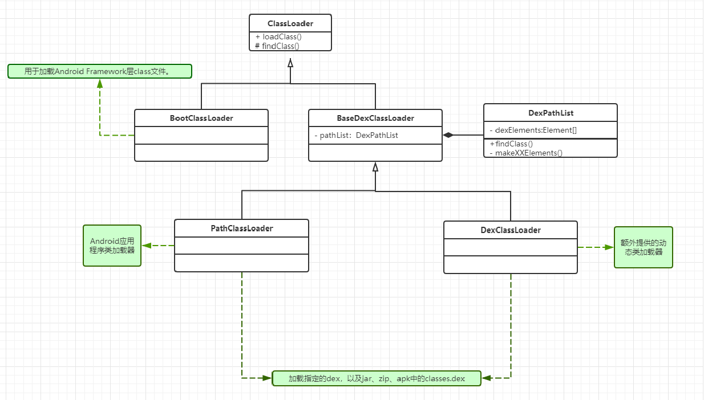
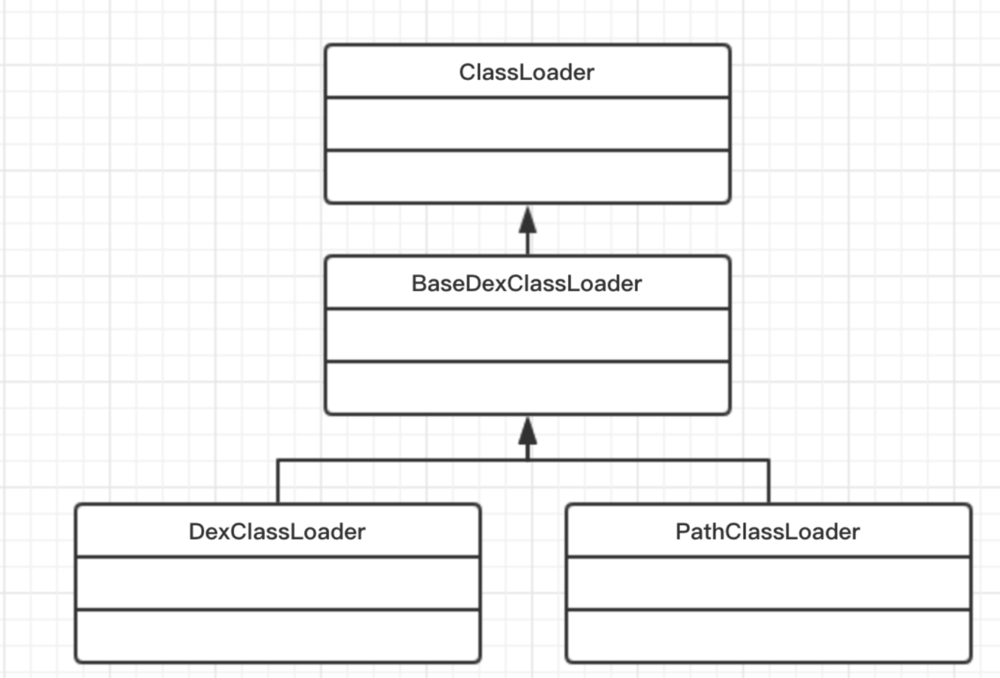

# 一、介绍
collapsed:: true
	- 任何一个 Java 程序都是由一个或多个 class 文件组成，在程序运行时，需要将 class 文件加载到 JVM 中才可以使用，负责加载这些 class 文件的就是 [[#red]]==**Java 的类加载机制**==。ClassLoader 的作用简单来说就是加载 class 文件，提供给程序运行时使用。每个 Class 对象的内部都有一个 classLoader 字段来标识自己是由哪个 ClassLoader 加载的。
		- ```java
		  class Class<T> {
		  ...
		  private transient ClassLoader classLoader;
		  ...
		  }
		  ```
- # 二、作用
  collapsed:: true
	- 加载class文件 到 运行时数据区，供程序运行时使用
- # 三、具体实现类
	- {:height 434, :width 749}
	- ## BootClassLoader
		- 用于加载Android[[#red]]==**Framework层class文件**==
	- ## PathClassLoader
		- 用于[[#red]]==**Android应用程序类加载器**==。可以加载指定的dex，以及jar、zip、apk中的classes.dex
		- > 很多博客里说PathClassLoader只能加载已安装的apk的dex，其实这说的应该是在dalvik虚拟机上。但现在一般不用关心dalvik了。
		- 源码
			- ```java
			  public class PathClassLoader extends BaseDexClassLoader {
			    public PathClassLoader(String dexPath, ClassLoader parent) {
			      super(dexPath, null, null, parent);
			    }
			    public PathClassLoader(String dexPath, String librarySearchPath, ClassLoader parent){
			    		super(dexPath, null, librarySearchPath, parent);
			    }
			  }
			  ```
	- ## DexClassLoader
		- 用于加载指定的dex，以及jar、zip、apk中的classes.dex
		- 源码
			- ```java
			  public class DexClassLoader extends BaseDexClassLoader {
			      public DexClassLoader(String dexPath, String optimizedDirectory,
			          String librarySearchPath, ClassLoader parent) {
			          super(dexPath, new File(optimizedDirectory), librarySearchPath, parent);
			      }
			  }
			  ```
	- ## 示例
		- ```java
		  Log.e(TAG, "Activity.class 由：" + Activity.class.getClassLoader() +" 加载");
		  Log.e(TAG, "MainActivity.class 由：" + getClassLoader() +" 加载");
		  //输出：
		  Activity.class 由：java.lang.BootClassLoader@d3052a9 加载
		  MainActivity.class 由：dalvik.system.PathClassLoader[DexPathList[[zip file
		  "/data/app/com.enjoy.enjoyfix-1/base.apk"],nativeLibraryDirectories=
		  [/data/app/com.enjoy.enjoyfix-1/lib/x86, /system/lib, /vendor/lib]]] 加载
		  ```
- # 四、classLoader实现类关系
  collapsed:: true
	- 
	- 看源码发现
	- 可以看到两者唯一的区别在于：创建 DexClassLoader 需要传递一个 optimizedDirectory 参数，并且会将其创建为 File 对象传给 super ，而 PathClassLoader 则直接给到null。
	- 因此两者都可以加载**指定的****dex****，以及****jar**** ****zip****、****ap****k****中的****classes.dex**
		- ```java
		  PathClassLoader pathClassLoader = new PathClassLoader("/sdcard/xx.dex", getClassLoader());
		  File dexOutputDir = context.getCodeCacheDir();
		  
		  DexClassLoader dexClassLoader = new
		  DexClassLoader("/sdcard/xx.dex",dexOutputDir.getAbsolutePath(), null,getClassLoader());
		  ```
	- 其实, optimizedDirectory 参数就是[[#red]]==**dexopt的产出目录(odex)**==。那 PathClassLoader 创建时，这个目录为null，就意味着不进行dexopt？并不是， optimizedDirectory 为null时的默认路径为：***/data/dalvik-cache***。
	- 在API 26源码中，将DexClassLoader的optimizedDirectory标记为了 deprecated 弃用，实现也变为了：和PathClassLoader一摸一样了！
		- ```java
		  public DexClassLoader(String dexPath, String optimizedDirectory,
		  String librarySearchPath, ClassLoader parent) {
		  super(dexPath, null, librarySearchPath, parent);
		  }
		  ```
- # 五、[[双亲委托机制]]
-