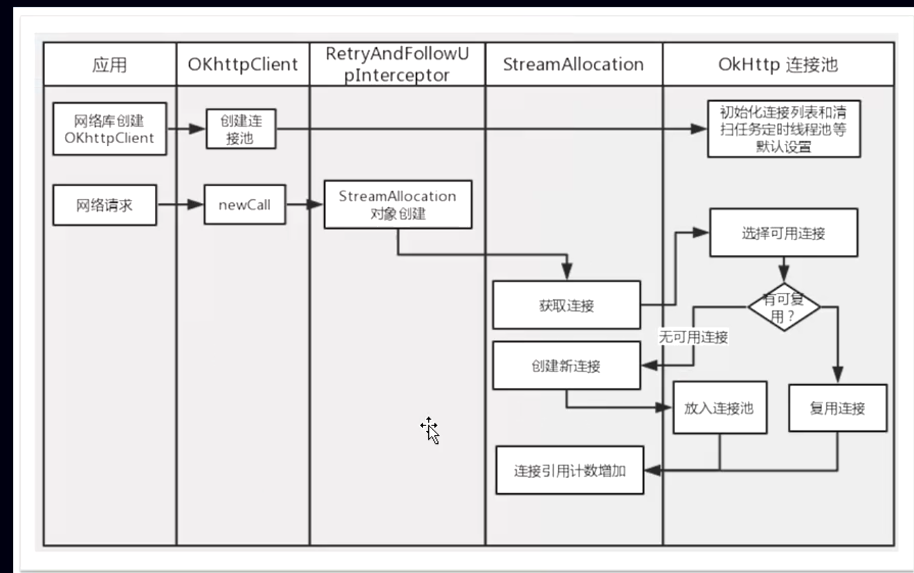

- ## 一、源码
	- ```kotlin
	  object ConnectInterceptor : Interceptor {
	    @Throws(IOException::class)
	    override fun intercept(chain: Interceptor.Chain): Response {
	      val realChain = chain as RealInterceptorChain
	      val exchange = realChain.call.initExchange(chain)
	      val connectedChain = realChain.copy(exchange = exchange)
	      return connectedChain.proceed(realChain.request)
	    }
	  }
	  
	  ```
- ## 二、工作
	- 前置：建立链接（无论是新建还是从链接池取）返回一个Socket链接 就是RealConnection
	- 中置：向后传递请求
- ## 三、[[连接池ConnectionPool]]
- ## 四、建立连接流程
  collapsed:: true
	- 
- ## 五、[[获取一个可用链接的详细过程]]
- ## 旧版本
  collapsed:: true
	- ConnectInterceptor ，打开与目标服务器的连接，并执行下一个拦截器。它简短的可以直接完整贴在这里
	  collapsed:: true
		- ```java
		   public final class ConnectInterceptor implements Interceptor {
		          public final OkHttpClient client;
		          public ConnectInterceptor(OkHttpClient client) {
		              this.client = client;
		          }
		          @Override public Response intercept(Chain chain) throws IOException {
		              RealInterceptorChain realChain = (RealInterceptorChain) chain;
		              Request request = realChain.request();
		              StreamAllocation streamAllocation = realChain.streamAllocation();
		  // We need the network to satisfy this request. Possibly for validating a conditional GET.
		              boolean doExtensiveHealthChecks = !request.method().equals("GET");
		              HttpCodec httpCodec = streamAllocation.newStream(client, chain, doExtensiveHealthChecks);
		              RealConnection connection = streamAllocation.connection();
		              return realChain.proceed(request, streamAllocation, httpCodec, connection);
		          }
		      }
		  ```
	- 虽然代码量很少，实际上大部分功能都封装到其它类去了，这里只是调用而已。
	- 首先我们看到的 StreamAllocation 这个对象是在第一个拦截器：重定向拦截器创建的，但是真正使用的地方却在这里。
	- *"*当一个请求发出，需要建立连接，连接建立后需要使用流用来读写数据*"*；而这个StreamAllocation就是协调请求、连接与数据流三者之间的关系，它负责为一次请求寻找连接，然后获得流来实现网络通信。
	- 这里使用的 newStream 方法实际上就是去查找或者建立一个与请求主机有效的连接，返回的 HttpCodec 中包含了输入输出流，并且封装了对HTTP请求报文的编码与解码，直接使用它就能够与请求主机完成HTTP通信。
	- StreamAllocation 中简单来说就是维护连接： RealConnection ——封装了Socket与一个Socket连接池。可复用的 RealConnection 需要：
	  collapsed:: true
		- ```java
		  public boolean isEligible(Address address, @Nullable Route route) {
		  // If this connection is not accepting new streams, we're done.
		          if (allocations.size() >= allocationLimit || noNewStreams) return false;
		  // If the non-host fields of the address don't overlap, we're done.
		          if (!Internal.instance.equalsNonHost(this.route.address(), address)) return false;
		  // If the host exactly matches, we're done: this connection can carry the address.
		          if (address.url().host().equals(this.route().address().url().host())) {return true; // This connection is a perfect match.
		          }
		  // At this point we don't have a hostname match. But we still be able to carry the request if
		  // our connection coalescing requirements are met. See also:
		  // https://hpbn.co/optimizing-application-delivery/#eliminate-domain-sharding
		  // https://daniel.haxx.se/blog/2016/08/18/http2-connection-coalescing/
		  // 1. This connection must be HTTP/2.
		          if (http2Connection == null) return false;
		  // 2. The routes must share an IP address. This requires us to have a DNS address for both
		  // hosts, which only happens after route planning. We can't coalesce connections that use a
		  // proxy, since proxies don't tell us the origin server's IP address.
		          if (route == null) return false;
		          if (route.proxy().type() != Proxy.Type.DIRECT) return false;
		          if (this.route.proxy().type() != Proxy.Type.DIRECT) return false;
		          if (!this.route.socketAddress().equals(route.socketAddress())) return false;
		  // 3. This connection's server certificate's must cover the new host.
		          if (route.address().hostnameVerifier() != OkHostnameVerifier.INSTANCE) return false;
		          if (!supportsUrl(address.url())) return false;
		  // 4. Certificate pinning must match the host.
		          try {
		              address.certificatePinner().check(address.url().host(), handshake().peerCertificates());
		          } catch (SSLPeerUnverifiedException e) {
		              return false;
		          }
		          return true; // The caller's address can be carried by this connection.
		      }
		  
		  ```
	- ### 1、 if (allocations.size() >= allocationLimit || noNewStreams) return false;
		- 连接到达最大并发流或者连接不允许建立新的流；如http1.x正在使用的连接不能给其他人用(最大并发流为:1)或者连接被关闭；那就不允许复用；
	- ### 2、
		- ```java
		  if (!Internal.instance.equalsNonHost(this.route.address(), address)) return false;
		  if (address.url().host().equals(this.route().address().url().host())) {
		  return true; // This connection is a perfect match.
		  }
		  ```
	- DNS、代理、SSL证书、服务器域名、端口完全相同则可复用；
	- 如果上述条件都不满足，在HTTP/2的某些场景下可能仍可以复用(http2先不管)。
	- 所以综上，如果在连接池中找到个连接参数一致并且未被关闭没被占用的连接，则可以复用。
- ## 总结
	- 这个拦截器中的所有实现都是为了获得一份与目标服务器的连接，在这个连接上进行HTTP数据的收发
- ## [[连接拦截器面试题]]