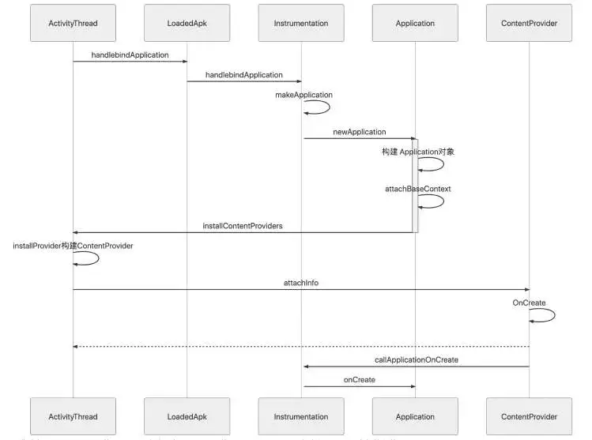

- 通过深入分析ActivityThread.handleBindApplication()方法分析，我们可以发现ContentProvider的执行时机，不再带大家看源码了，直接将时序图分享给大家
	- 
- 以上时序图不难看出ContentProvider的[[#red]]==**OnCreate方法是在Application的attachBaseContext方法和onCreate之间执行的。**==
- 到此目标应用进程创建成功，application创建成功并执行了onCreate方法，==**整个过程共涉及3个进程Launcher进程、AMS进程、目标应用的进程。**==
- 那Activity的是如何创建和执行生命周期的呢？