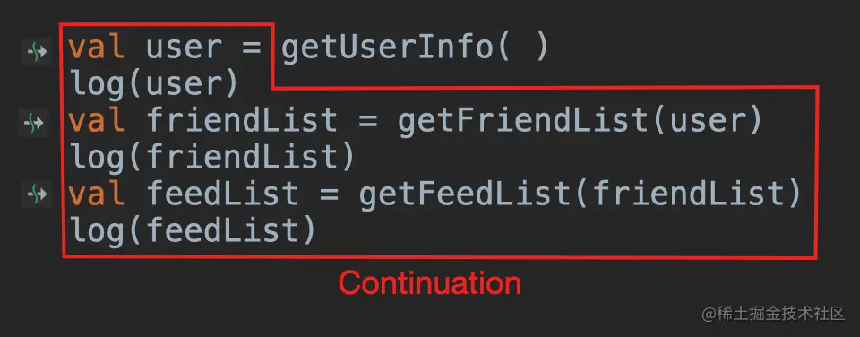
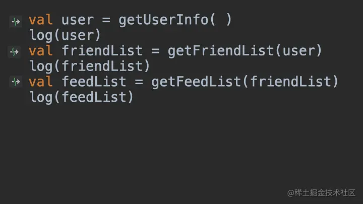

- # 是什么
	- 这个词的词源`Continue`就可以猜的出来，是继续的意思，而`Continuation`代表的就是"**接下来要做的事情**"，或者在代码中就代表"**持续继续运行下去需要执行的代码**"，或者"**接下来要执行的代码**"，或者"**剩下的代码**"。
- # CPS转换Continuation介绍
	- 比如还是以`getUserInfo()`为例，下图红框中的代码就表示`Continuation`：
		- {:height 205, :width 502}
	- 是不是突然就理解CPS了，它其实就是将程序接下来要执行的代码进行传递的一种模式。
	- 而**CPS转换就是将原本的同步挂起函数转换为CallBack异步代码的过程**，这个转换过程是编译器做的，对程序员是无感知的：
	- 
	- 这里只是简单的示意图，真实过程要复杂得多。
	- 到这里，我们就知道了挂起函数本质就是`CallBack`。
- # Continuation理解
	- [[挂起函数原理总结]]
	- 通过原理后，我们再来看看这个`Continuation`接口的定义：
	- ```kotlin
	  /**
	   * Interface representing a continuation after a suspension point 
	   * that returns a value of type `T`.
	   */
	  public interface Continuation<in T> {
	  
	      public val context: CoroutineContext
	  
	      public fun resumeWith(result: Result<T>)
	  }
	  ```
	- 它是一个接口，表示挂起点后的延续，返回类型为`T`的值。
	- 什么是接口，接口可以看成是一种通用的抽象和封装，而这里的`Continuaiton`接口则是对挂起函数的一种行为封装。即所有挂起函数，它都会有一个挂起点，然后该挂起点后面的协程代码就是延续(`continuation`)，该挂起函数恢复时会携带`T`类型的值，这么一看`Continuaiton`的泛型参数也就很好理解了。
	- 再接着看，由于挂起函数需要恢复的行为，所以接口中定义和抽象了`resumeWith`方法，而且还需要当前协程的上下文`context`。
	- 这里说一个特殊的实现，我们在平时使用挂起函数时，好像从来没有使用过这个`continuation`，但是可以在挂起函数中访问协程上下文，这是咋做到的呢？
	- 比如下面代码：
		- ```kotlin
		  suspend fun testCoroutine() = coroutineContext
		  ```
	- 在该挂起函数中，我们可以访问协程上下文，可以发现定义如下：
		- ```kotlin
		  public suspend inline val coroutineContext: CoroutineContext
		      get() {
		          throw NotImplementedError("Implemented as intrinsic")
		      }
		  ```
	- 这居然是一个`suspend inline`类型的变量，不必惊讶，这种写法是Kotlin编译器帮我们做的，我们自己无法实现，通过这种方法，我们再反编译一下上面代码：
		- ```kotlin
		  public static final Object testCoroutine(@NotNull Continuation $completion) {
		     return $completion.getContext();
		  }
		  ```
	- 就可以清晰地发现，我们调用的其实还是`Continuation`对象的协程上下文，知识协程框架帮我们做了省略。
- # 作用
	- 用于实现挂起函数，对外传递返回值；也可以实现其接口，接收挂起函数的返回值。
	  id:: 64c60fb1-99af-4c3d-a10b-2c91085830fc
- # suspendCoroutineUninterceptedOrReturn
	- 编译器内建函数，是我们能接触的创建挂起函数最底层的函数了，该函数主要就是实现了之前文章所介绍的状态机逻辑，同时消除`suspend`关键字
- # [[Continuation继承关系图]]
-