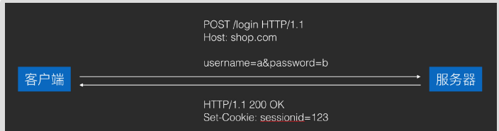

# 工作机制：
	- 1 服务器需要客户端保存的内容，放在 Set-Cookie headers ⾥返回，客户端会⾃动保存。
	- 2. 客户端保存的 Cookies ，会在之后的所有请求⾥都携带进 Cookie header⾥发回给服务器。
	- 3 客户端保存 Cookie 是按照服务器域名来分类的，例如 shop.com 发回的Cookie 保存下来以后，在之后向 games.com 的请求中并不会携带。
	- 4 他是由服务器和 客户端 共同配合实现的信息存储机制
- # 使用Cookie管理登录状态：
	- 
	- 1 客户端提交用户名密码，，服务器返回Set_cookie：sessionid= 123   返回一个sessionid  用来记录登录状态的
	- 2 客户端保存这个cookie的 sessionid，下一次请求相同服务器地址时，把sessionId放到cookie上；服务器就知道你登录了 【同一个服务器是可以有多个cookie的 服务器让你存啥你就存啥，只有名字不一样就行 比如一个保存购物车 一个 记录sessionid】