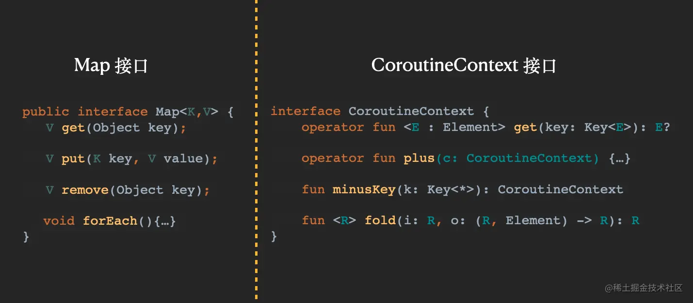

- # 一、概念
	- 所以通俗来理解，`Context`就可以看成是一个容器，程序需要的一些信息没地方保存就可以保存在`Context`中。或者更为直接的是，你在编码过程中发现你这个代码需要一大堆配置信息，你大可把这些信息都保存在`Context`中。比如整个Android应用都要用到某个变量，我就把它定义在`ApplicationContext`中，这个变量只在协程框架中用到，我就定义在`CoroutineContext`中。
	- 是不是这样理解完就通透了，[[#red]]==**context就是一堆变量的集合**==。
- # 二、作用
	- 以有很多作用，包括携带参数，拦截协程执行等等，多数情况下我们不需要自己去实现上下文，只需要使用现成的就好。
	- 上下文有一个重要的作用就是线程切换，`Dispatchers.Main` 就是一个官方提供的上下文，它可以确保 `launch` 启动的协程体运行在 UI 线程当中（除非你自己在 `launch` 的协程体内部进行线程切换、或者启动运行在其他有线程切换能力的上下文的协程）。
- # 三、成员，万物皆是context
	- [[协程调度器-CoroutineDispatcher]]
	- [[协程-job]]
	- [[协程作用域CoroutineScope]]
	- [[协程命名CoroutineName]]
	- [[协程异常处理CoroutineExceptionHandler]]
- # 四、CoroutineContext接口设计
  collapsed:: true
	- 看了上面我们不免发现协程中居然这么多重要的概念都是`CoroutineContext`的子类，我们来看看该类的源码：
	- ```kotlin
	  public interface CoroutineContext {
	      //get方法通过operator可以简写为[Key]
	      public operator fun <E : Element> get(key: Key<E>): E?
	  
	      public fun <R> fold(initial: R, operation: (R, Element) -> R): R
	      //plus方法通过operator可以简写为 + 
	      public operator fun plus(context: CoroutineContext): CoroutineContext
	  
	      public fun minusKey(key: Key<*>): CoroutineContext
	      
	      //仅仅是接口Key，没有任何属性和方法
	      public interface Key<E : Element>
	  
	      //继承至CoroutineContext的接口
	      public interface Element : CoroutineContext {
	       
	          //接口属性，Kotlin的接口属性相当于Java的抽象方法 
	          public val key: Key<*>
	  
	          //根据唯一Key，返回Element
	          public override operator fun <E : Element> get(key: Key<E>): E? =
	              @Suppress("UNCHECKED_CAST")
	              if (this.key == key) this as E else null
	  
	          public override fun <R> fold(initial: R, operation: (R, Element) -> R): R =
	              operation(initial, this)
	  
	          public override fun minusKey(key: Key<*>): CoroutineContext =
	              if (this.key == key) EmptyCoroutineContext else this
	      }
	  }。
	  ```
	- 这个接口设计的非常巧妙，首先是充分利用了Kotlin接口可以带属性和默认实现的特性，其次这种无属性和无抽象方法的`Key`接口也是很精巧的设计。
	- 这里就需要发挥我们对泛型的理解，首先类是对事务的抽象，而泛型可以看成对代码的抽象。就比如本例中，其实就是实现类似`Map`的效果，通过`key`来获取对应的`Element`对象。
	- 第一种做法是`key`使用字符串，然后存和取都是利用这个字符串`key`，但是这种效果必须要我们手动实现一个`Map`来保存，来遍历。
	- 第二种做法就是协程框架这种，`Key`接口对象自己就是一个`key`，这时子类在实现`Element`时，就必须会有一个`Key`类型的对象，把这个对象作为`key`。(这里`Key`表示接口类型，`key`表示键值对的键)
	- 然后多种类型的`Key`，直接抽象为`Key<T>`即可，关于这种用法，我们后面仔细分析，先看一下接口设计。
	- 这里的接口设计看着非常像是集合，确切的说很像集合中的Map结构，对比如下图：
	- 
	- 所以我们完全可以把`CoroutineContext`当作`Map`来使用，都是可以通过`get`(简写为`[]`)、`plus`(简写为`+`)来表示，为什么这么设计呢？
	- 1、类似`Map`结构，可以方便运算符重载，快速构造`CoroutineContext`，比如下面代码
	  collapsed:: true
		- ```kotlin
		  fun main() = runBlocking {
		      //手动创建一个CoroutineScope对象
		      val scope = CoroutineScope(Job() + mySingleDispatcher)
		      scope.launch {
		          //在协程内部，获取coroutineContext上下文对象
		          logX(coroutineContext[CoroutineDispatcher] == mySingleDispatcher)
		          delay(1000L)
		          logX("First end!")  
		      }
		  
		      delay(500L)
		      scope.cancel()
		      delay(1000L)
		  }
		  ```
		- 这里创建了一个`CoroutineScope`，使用`Job() + mySingleDispatcher`这种方式，这里之所以能使用加号，是因为**运算符重载**。
		- 具体原因我们前面分析过，`Job`就是一个`Element`对象，而`mySingleDispatcher`也是一个`Element`对象，根据接口种定义，所以可以这样操作。
		- `Job() + mySingleDispatcher`这种方式创建的`CoroutineScope`其实也就制定了`Job`和`Dispatcher`，这种`+`号就很像集合操作符。
		- 由于`launch`的`block`是`CoroutineScope`接收者的高阶函数类型，所以在里面我们可以获取该协程的上下文`coroutineContext`对象，通过`[CoroutineDispatcher]`获取`Dispatcher`。
		- 这里又有一个非常有意思的点，这里`coroutineContext[CoroutineDispatcher]`为什么`get()`方法传入的是`CoroutineDispatcher`就可以获取其调度器呢？
		- 我们来看一下`CoroutineDispatcher`源码：
			- ```kotlin
			  public abstract class CoroutineDispatcher :
			      AbstractCoroutineContextElement(ContinuationInterceptor), ContinuationInterceptor {
			  
			      //这里伴生对象类Key
			      public companion object Key : AbstractCoroutineContextKey<ContinuationInterceptor, CoroutineDispatcher>(
			          ContinuationInterceptor,
			          { it as? CoroutineDispatcher })
			  
			     ...
			  }
			  ```
			- ```kotlin
			  //实际该抽象类还是实现Key接口
			  public abstract class AbstractCoroutineContextKey<B : Element, E : B>(
			      baseKey: Key<B>,
			      private val safeCast: (element: Element) -> E?
			  ) : Key<E>
			  
			  ```
		- 根据前面我们对接口中`Key`的理解，已经`companion object`的本质:**声明类的同时，并且创建对象**，这里我们应该使用`coroutineContext[CoroutineDispatcher.Key]`才是合理的，因为根据伴生对象的调用规则：这里的`CoroutineContext[CoroutineDispatcher.Key`就等于`CoroutineContext[CoroutineDispatcher.Key.INSTANCE`，毕竟`get`方法的参数需要一个`Key`的对象。
		- 那为什么这里可以直接传递`CoroutineDispatcher`作为参数呢？这也是一种伴生对象的简写，因为一个类只能定义一个伴生对象，就比如本类的`Key`单例，所以可以这样简写。
		- 捋清楚这一套操作后，会发现这样设计背后的逻辑也非常精妙。
	- 2、从`Context`本质出发，在文章开始说了，它其实就是一大堆环境变量的集合，而这些比如`Job`、`CoroutineDispatcher`等都可以看成是协程运行的辅助环境变量。
		- 同时，在前面接口设计中，`Element`虽然也是继承至`CoroutineContext`，但是从各种子类的继承规律来看，设计还是精巧的:`CoroutineScope`是一个范围，它包含一个环境变量的集合，所以它是封装了`CoroutineContext`。而其他的，比如`Dispatcher`、`ExceptionHandler`等等更像是每一个环境变量，所以他们都是继承至`Element`，可以互相通过算数运算符操作，更符合逻辑。
		- 理解这个可以借鉴后面的有篇说`Continuation`的文章，里面有个协程框架架构，其实`CoroutineContext`是最底层的概念，而`launch`、`Dispatcher`等则是中间层的概念，毫不夸张的说不要这些中间层API，协程一样可以运行，但是就没有这么多特性。所以说这些中层概念之所以为`Context`，其实都可以看成是协程运行的辅助环境变量。
- [[CoroutineContext上下文介绍-面试]]
- # 总结
	- [[CoroutineContext协程上下文map存储协程调度器]]