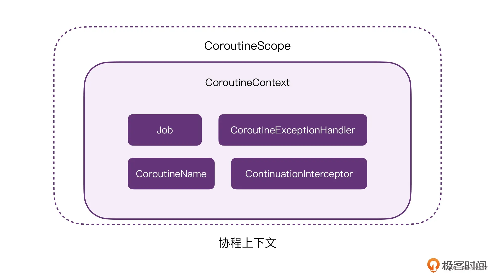

- 1、`CoroutineContext`本身是一个接口，而它的接口设计和`Map`的API极为相似，可以当成`Map`来使用，key value形式。
	- 这种设计的优点也就是方便我们使用运算符重载来创建我们希望的各种协程组件。
- 2、协程中非常多的类，本身就是`CoroutineContext`,它们通过继承`Element`，比如`Job`，`Deferred`，`Dispatcher`，`ContinuationInterceptor`、`CoroutineNmae`、`CoroutineExceptionHandler`，也正是由于这些是一个接口的子类，所以可以使用操作符重载来写出灵活的代码。
- 3、协程的`CoroutineScope`是`CoroutineContext`的一层简单封装，这个作用域可以访问这些`Context`,从而可以构建父子协程关系。
- 4、挂起函数也和CoroutineContext有关系
- ## 总结图
- 
-