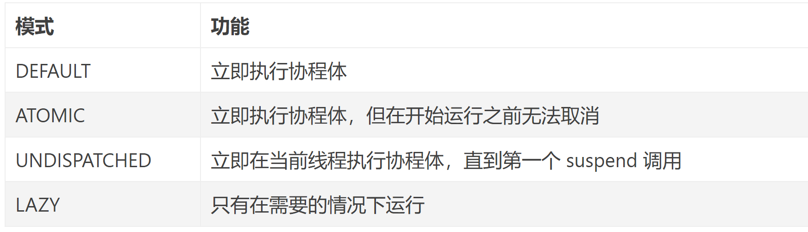

# 1、枚举类型
	- ```kotlin 
	  public enum class CoroutineStart {
	      DEFAULT,
	      LAZY,
	      @ExperimentalCoroutinesApi
	      ATOMIC,
	      @ExperimentalCoroutinesApi
	      UNDISPATCHED;
	  }
	  ```
	- 
	- ## 1-1、[[#red]]==DEFAULT：立即执行协程体==
	  collapsed:: true
		- `DEFAULT` 是饿汉式启动，`launch` 调用后，会立即进入待调度状态，一旦调度器 OK 就可以开始执行。我们来看个简单的例子：
			- ```kotlin
			  class MainActivity : AppCompatActivity() {
			      override fun onCreate(savedInstanceState: Bundle?) {
			          super.onCreate(savedInstanceState)
			          setContentView(R.layout.activity_main)
			          GlobalScope.launch(Dispatchers.Main) {
			              ss()
			          }
			      }
			  
			  
			  
			      suspend fun ss() {
			          Log.d("tag","1+${Thread.currentThread().name}")
			          val job = GlobalScope.launch {
			              Log.d("tag","2+${Thread.currentThread().name}")
			          }
			          Log.d("tag","3+${Thread.currentThread().name}")
			          job.join()
			          Log.d("tag","4+${Thread.currentThread().name}")
			      }
			  }
			  ```
			- ```kotlin
			  执行结果
			  2023-07-28 17:38:25.951 24672-24672 tag                     com.example.myapplication            D  1+main
			  2023-07-28 17:38:25.953 24672-24672 tag                     com.example.myapplication            D  3+main
			  2023-07-28 17:38:25.956 24672-24745 tag                     com.example.myapplication            D  2+DefaultDispatcher-worker-2
			  2023-07-28 17:38:25.957 24672-24672 tag                     com.example.myapplication            D  4+main
			  ```
			- 这段程序采用默认的启动模式，由于我们也没有指定调度器，因此调度器也是默认的，在 JVM 上，默认调度器的实现与其他语言的实现类似，它在后台专门会有一些线程处理异步任务
	- ## 1-2、LAZY：launch后返回job， 什么时候job.start 什么时候执行
	  collapsed:: true
		- `LAZY` 是懒汉式启动，`launch` 后并不会有任何调度行为，协程体也自然不会进入执行状态，直到我们需要它执行的时候。这其实就有点儿费解了，什么叫我们需要它执行的时候呢？就是需要它的运行结果的时候， `launch` 调用后会返回一个 `Job` 实例，对于这种情况，我们可以：
			- 调用 `Job.start`，主动触发协程的调度执行
				- ```kotlin
				  log(1)
				  val job = GlobalScope.launch(start = CoroutineStart.LAZY) {
				      log(2)
				  }
				  log(3)
				  job.start()
				  log(4)
				  ```
				- 执行结果
					- ```kotlin
					  14:56:28:374 [main] 1
					  14:56:28:493 [main] 3
					  14:56:28:511 [main] 4
					  14:56:28:516 [DefaultDispatcher-worker-1] 2
					  ```
			- 调用 `Job.join`，隐式的触发协程的调度执行
				- ```kotlin
				  ...
				  log(3)
				  job.join()
				  log(4)
				  ```
				- ```kotlin
				  14:47:45:963 [main] 1
				  14:47:46:054 [main] 3
				  14:47:46:069 [DefaultDispatcher-worker-1] 2
				  14:47:46:090 [main] 4
				  ```
		- 所以这个所谓的”需要“，其实是一个很有趣的措辞，后面你还会看到我们也可以通过 `await` 来表达对 `Deferred` 的需要。这个行为与 `Thread.join` 不一样，后者如果没有启动的话，调用 `join` 不会有任何作用。
		-
		- [[job-start启动协程]]
	- ## 1-3、ATOMIC，立即执行，开始运行之前无法取消
	  collapsed:: true
		- `ATOMIC` 只有涉及 cancel 的时候才有意义，cancel 本身也是一个值得详细讨论的话题，在这里我们就简单认为 cancel 后协程会被取消掉，也就是不再执行了。那么调用 cancel 的时机不同，结果也是有差异的，例如协程调度之前、开始调度但尚未执行、已经开始执行、执行完毕等等。
		- 为了搞清楚它与 `DEFAULT` 的区别，我们来看一段例子：
			- ```kotlin
			  log(1)
			  val job = GlobalScope.launch(start = CoroutineStart.ATOMIC) {
			      log(2)
			  }
			  job.cancel()
			  log(3)
			  ```
		- 我们创建了协程后立即 cancel，但由于是 `ATOMIC` 模式，因此协程一定会被调度，因此 1、2、3 一定都会输出，只是 2 和 3 的顺序就难说了。
			- ```kotlin
			  20:42:42:783 [main] 1
			  20:42:42:879 [main] 3
			  20:42:42:879 [DefaultDispatcher-worker-1] 2
			  ```
		- 对应的，如果是 `DEFAULT` 模式，在第一次调度该协程时如果 cancel 就已经调用，那么协程就会直接被 cancel 而不会有任何调用，当然也有可能协程开始时尚未被 cancel，那么它就可以正常启动了。所以前面的例子如果改用 `DEFAULT` 模式，那么 2 有可能会输出，也可能不会。
		- 需要注意的是，cancel 调用一定会将该 job 的状态置为 cancelling，只不过`ATOMIC` 模式的协程在启动时无视了这一状态。为了证明这一点，我们可以让例子稍微复杂一些：
			- ```kotlin
			  log(1)
			  val job = GlobalScope.launch(start = CoroutineStart.ATOMIC) {
			      log(2)
			      delay(1000)
			      log(3)
			  }
			  job.cancel()
			  log(4)
			  job.join()
			  ```
		- 我们在 2 和 3 之间加了一个 `delay`，`delay` 会使得协程体的执行被挂起，1000ms 之后再次调度后面的部分，因此 3 会在 2 执行之后 1000ms 时输出。对于 `ATOMIC` 模式，我们已经讨论过它一定会被启动，实际上在遇到第一个挂起点之前，它的执行是不会停止的，而 `delay` 是一个 suspend 函数，这时我们的协程迎来了自己的第一个挂起点，恰好 `delay` 是支持 cancel 的，因此后面的 3 将不会被打印。
		-
	- ## 1-4、UNDISPATCHED，立即在当前线程执行协程体，直到Suspend挂起切换到其他线程
	  collapsed:: true
		- 有了前面的基础，`UNDISPATCHED` 就很容易理解了。协程在这种模式下会直接开始在当前线程下执行，直到第一个挂起点，这听起来有点儿像前面的 `ATOMIC`，不同之处在于 `UNDISPATCHED` 不经过任何调度器即开始执行协程体。当然遇到挂起点之后的执行就取决于挂起点本身的逻辑以及上下文当中的调度器了。
			- ```kotlin
			  log(1)
			  val job = GlobalScope.launch(start = CoroutineStart.UNDISPATCHED) {
			      log(2)
			      delay(100)
			      log(3)
			  }
			  log(4)
			  job.join()
			  log(5)
			  ```
		- 我们还是以这样一个例子来认识下 `UNDISPATCHED` 模式，按照我们前面的讨论，协程启动后会立即在当前线程执行，因此 1、2 会连续在同一线程中执行，`delay` 是挂起点，因此 3 会等 100ms 后再次调度，这时候 4 执行，`join` 要求等待协程执行完，因此等 3 输出后再执行 5。以下是运行结果：
		- ```kotlin
		  22:00:31:693 [main] 1
		  22:00:31:782 [main @coroutine#1] 2
		  22:00:31:800 [main] 4
		  22:00:31:914 [DefaultDispatcher-worker-1 @coroutine#1] 3
		  22:00:31:916 [DefaultDispatcher-worker-1 @coroutine#1] 5
		  ```
		- 方括号当中是线程名，我们发现协程执行时会修改线程名来让自己显得颇有存在感。运行结果看上去还有一个细节可能会让人困惑，`join` 之后的 5 的线程与 3 一样，这是为什么？我们在前面提到我们的示例都运行在 suspend main 函数当中，所以 suspend main 函数会帮我们直接启动一个协程，而我们示例的协程都是它的子协程，所以这里 5 的调度取决于这个最外层的协程的调度规则了。关于协程的调度，我们后面再聊。