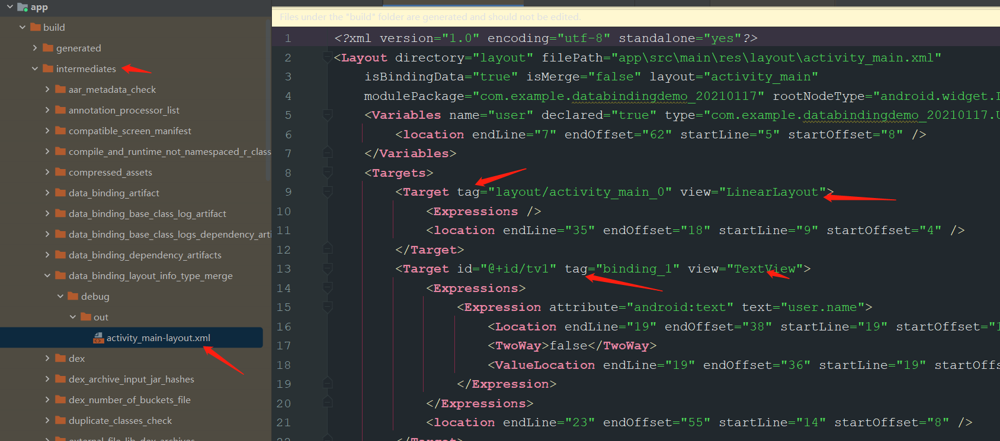
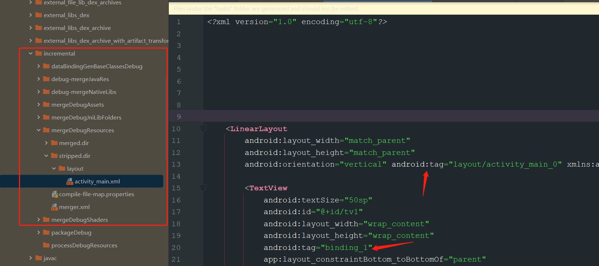
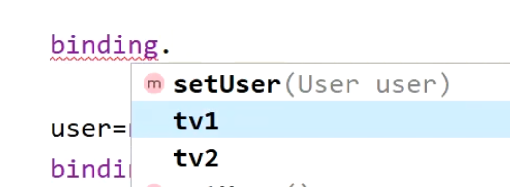

## DataBinding 是什么？
	- 将数据和页面绑定起来，实现双向绑定，数据变化同步界面，界面变化同步数据
- ## 1、 [[viewBinding和dataBinding区别]]
	- viewBinding：
		- 只能省略findViewById，绑定view，
		- 不需要修改xml
		- ```xml
		  viewBinding{ enabled true}
		  ```
	- dataBinding：
		- 除了viewBinding的功能还能绑定data，
		- 需要修改xml
- ## 3、BR文件的作用
	- 在ViewDataBinding中，会以BR里的id为下标。存储数据源属性监听器 weakListener
	- 作用应该就是确定，哪个属性的监听器
- ## 2、[[Databinding主流程-面试]]
	- [[Databinding原理解析]]
	- # 简单使用
		- 1、声明数据bean，继承被观察者BaseObservable，每个字段set方法，都会发出属性变换通知
		- 2、xml 声明数据源data， 绑定属性到ui
		- 3、Activity里使用 DataBindingUtil.setContentView设置布局
		- ```java
		  // 处理ui的
		  binding= DataBindingUtil.setContentView(this,R.layout.activity_main);
		  user=new User("jett","123");
		  binding.setUser(user);
		  ```
	- # 首先XML会被拆分
		- 使用了databinding的布局xml不是最终设置给DecorVIew的，会被进行拆分成2个xml文件
		- 文件1、为每个使用了data数据的@{}的View添加一个tag，viewid、tag、和data字段形成映射关系。文件生成在build路径下
		  collapsed:: true
			- {:height 312, :width 688}
		- 文件2、去掉data等标签，并将文件1里的tag。放入xml里。那么该view就可以通过tag去文件1里找用哪个字段[[#red]]==**这也是最终设置到DecorView  上的布局**==
		  collapsed:: true
			- {:height 313, :width 688}
			-
	- # 代码原理
		- dataBinding,采用了观察者模式。
		- 首先
			- ## 1、观察者被观察者介绍
				- 1、==**DataBindingUtil.setContentView（）**==返回的是通过APT生成ViewDataBinding子类对象：==**ActivityMainBindingImpl**==，[[#red]]==**作为观察者的，观察数据源属性变化**==
					- 1、[[#green]]==**构造函数中 将xml里布局节点，解析成view对象**==，所以ActivityMainBindingImpl是可以拿到view的
					  collapsed:: true
						- {:height 245, :width 643}
					- 2、ActivityMainBindingImpl内部有个==**数组，以BR文件里的id为下标**==，存储数据==**bean对应属性监听器**==
					  collapsed:: true
						- 
				- 2、我们声明数据bean时，比如User 是[[#red]]==**继承了BaseObservable，作为被观察者**==，提供属性监听器，注册方法。且每个==**属性变化都会发通知**==
					- ```java
					      public void setName(String name) {
					          this.name = name;
					          notifyPropertyChanged(BR.name);
					      }
					  ```
			- ## 2、绑定
				- 3、当Activity里调用[[#green]]==**binding.setUser(user)**==;实际调用的ActivityMainBindingImpl的setUser方法，[[#green]]==**将观察者ActivityMainBindingImpl 和被观察者数据bean 进行绑定**==，以及对应BR_id对应属性监听器的初始化等
				  collapsed:: true
					- 2、调用set方法时。会根据传入的BR_id。初始化对应的属性监听器。存储到观察者ActivityMainBindingImpl 监听器数组 并注册 到被观察者数据源User中
			- ## 3、通知更新
				- 4、当属性变化时，比如User调用 [[#green]]==**User.setName**==时。会通过notifyPropertyChanged（BR.Name）传入BRid,通知观察者对应的属性监听器。观察者ViewDataBinding.onPropertyChanged收到属性变化回调
				- 5、通过Handler切换到主线程更新ui，调用ActivityMainBindingImpl,[[#red]]==**executeBindings方法处理双向绑定逻辑。**==
					- 比如数据变化：
						- 按照传入的BR.id。去执行BindingAdapter对应方法更新ui：比如TextView 设置文本，就是执行SetText方法
					- view变化：
						- 通过给view设置监听，监听里把数据设置给model数据源
					-