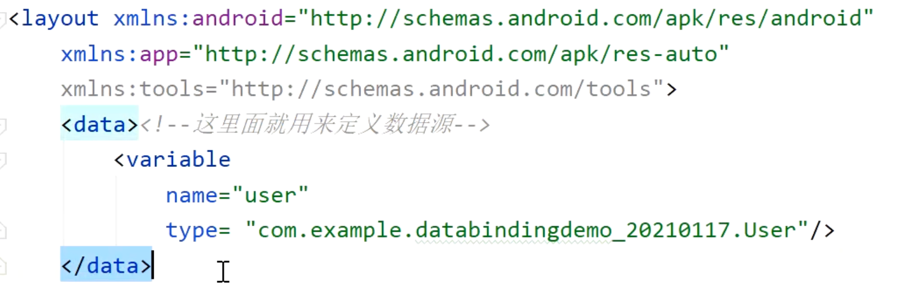
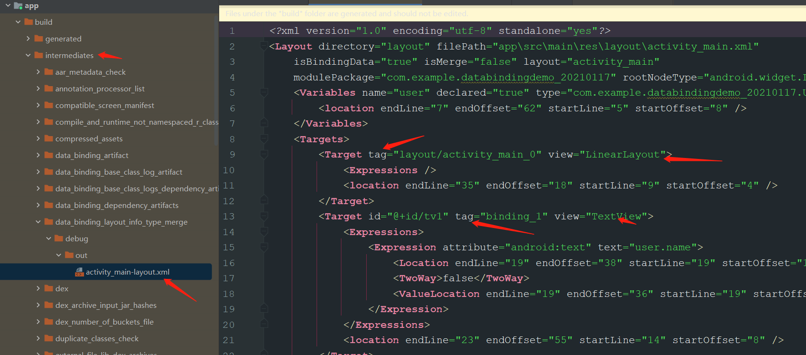
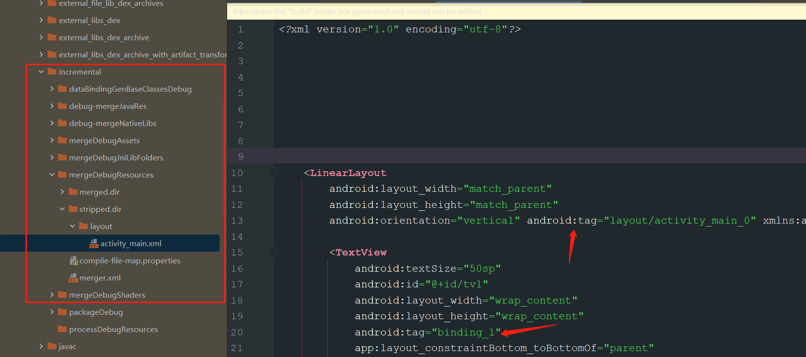
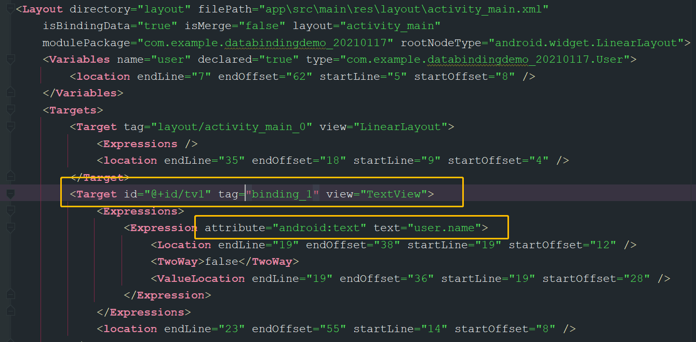
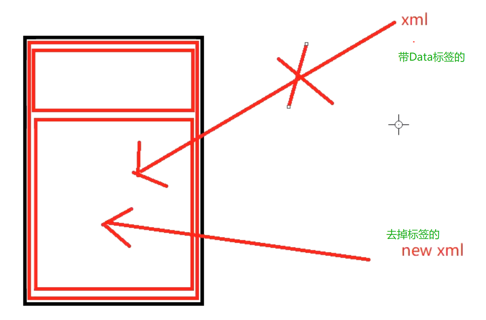
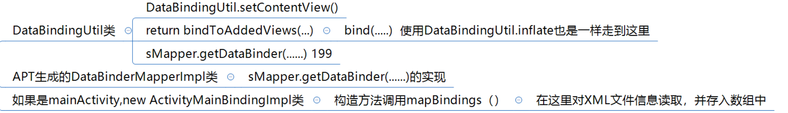
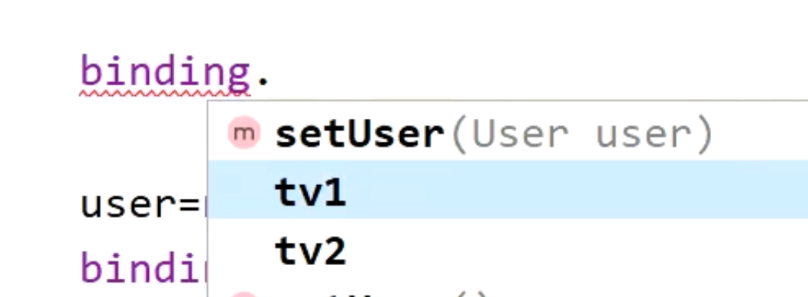

title:: DataBindingUtil.setContentView(this,R.layout.activity_main);解析

- ## 我们设置的xml-[[#red]]==**不是最终设置到DecorView上的布局，会拆分**==
  collapsed:: true
	- ```xml
	  <?xml version="1.0" encoding="utf-8"?>
	  <layout xmlns:android="http://schemas.android.com/apk/res/android"
	      xmlns:app="http://schemas.android.com/apk/res-auto"
	      xmlns:tools="http://schemas.android.com/tools">
	      <data><!--这里面就用来定义数据源-->
	          <variable
	              name="user"
	              type= "com.example.databindingdemo_20210117.User"/>
	      </data>
	      <LinearLayout
	          android:layout_width="match_parent"
	          android:layout_height="match_parent"
	          android:orientation="vertical">
	  
	          <TextView
	              android:textSize="50sp"
	              android:id="@+id/tv1"
	              android:layout_width="wrap_content"
	              android:layout_height="wrap_content"
	              android:text="@{user.name}"
	              app:layout_constraintBottom_toBottomOf="parent"
	              app:layout_constraintLeft_toLeftOf="parent"
	              app:layout_constraintRight_toRightOf="parent"
	              app:layout_constraintTop_toTopOf="parent" />
	  
	          <TextView
	              android:textSize="50sp"
	              android:id="@+id/tv2"
	              android:layout_width="wrap_content"
	              android:layout_height="wrap_content"
	              android:text="@{user.pwd}"
	              app:layout_constraintBottom_toBottomOf="parent"
	              app:layout_constraintLeft_toLeftOf="parent"
	              app:layout_constraintRight_toRightOf="parent"
	              app:layout_constraintTop_toTopOf="parent" />
	      </LinearLayout>
	  </layout>
	  ```
- ## 作用:用来完成布局初始化的，
  collapsed:: true
	- 1、因为加载布局的时候是没有data这种标签的
		- 
	- 2、将我们设置的XML。拆分成2个文件解读。去掉data标签后再设置上数据
		- 文件1、每个绑定了@{}的View添加一个tag，文件生成在build路径下
		  collapsed:: true
			- {:height 312, :width 688}
		- 文件2、另一个文件会将我们写的data等标签去掉。将上述的tag。放入xml里。形成相互对应。[[#red]]==**这也是最终设置到DecorView  上的布局**==
		  collapsed:: true
			- {:height 313, :width 688}
			-
		- > 在第二个图中，通过tag,可以去第一份文件去找具体的View。下边标识了，这个TextView 的text应该设置哪个字段
		- 
-
- ## DataBindingUtil.setContentView代码解析
	- 思路
	  collapsed:: true
		- 
	- setContentView代码
	  collapsed:: true
		- ```java
		  public static <T extends ViewDataBinding> T setContentView(@NonNull Activity activity,
		                                                             int layoutId) {
		    return setContentView(activity, layoutId, sDefaultComponent);
		  }
		  public static <T extends ViewDataBinding> T setContentView(@NonNull Activity activity,
		                                                             int layoutId, @Nullable DataBindingComponent bindingComponent) {
		    // 先设置Activity的setContentView
		    activity.setContentView(layoutId);
		    View decorView = activity.getWindow().getDecorView();
		    ViewGroup contentView = (ViewGroup) decorView.findViewById(android.R.id.content);
		    // 拿到contentView，将拆分后的去掉data标签的 布局设置上去
		    return bindToAddedViews(bindingComponent, contentView, 0, layoutId);
		  }
		  ```
	- 
- # 结论
	- 1、setContentView 最终返回的是ActivityMainBindingImpl。APT自动生成的类
	- 2、在ActivityMainBindingImpl的构造函数中，创建数组个数就是xml里@{}引用的个数，然后将那三个标签解析成view。放入数组中
	  collapsed:: true
		- 在MainActivity.就可以通过ActivityMainBindingImpl 这个实现类拿到view
		- {:height 245, :width 643}
-