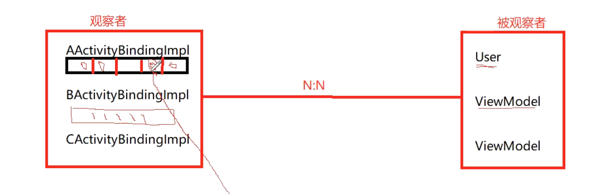

# 简单使用
	- ```java
	  // 处理ui的
	  binding= DataBindingUtil.setContentView(this,R.layout.activity_main);
	  user=new User("jett","123");
	  binding.setUser(user);
	  ```
- ## [[DataBindingUtil.setContentView(this,R.layout.activity_main);解析]]
  collapsed:: true
	- 首先看DataBindingUtil.setContentView
	  collapsed:: true
		- ```java
		      private static <T extends ViewDataBinding> T bindToAddedViews(DataBindingComponent component,
		              ViewGroup parent, int startChildren, int layoutId) {
		          final int endChildren = parent.getChildCount();
		          final int childrenAdded = endChildren - startChildren;
		          if (childrenAdded == 1) {
		              final View childView = parent.getChildAt(endChildren - 1);
		              return bind(component, childView, layoutId);
		          } else {
		              final View[] children = new View[childrenAdded];
		              for (int i = 0; i < childrenAdded; i++) {
		                  children[i] = parent.getChildAt(i + startChildren);
		              }
		              return bind(component, children, layoutId);
		          }
		      }
		  ```
	- bind
		- ```java
		  private static DataBinderMapper sMapper = new DataBinderMapperImpl();
		  static <T extends ViewDataBinding> T bind(DataBindingComponent bindingComponent, View root,
		                                            int layoutId) {
		    return (T) sMapper.getDataBinder(bindingComponent, root, layoutId);
		  }
		  ```
	- DataBinderMapperImpl.getDataBinder----APT自动生成的
	  collapsed:: true
		- 
		- ```java
		    @Override
		    public ViewDataBinding getDataBinder(DataBindingComponent component, View view, int layoutId) {
		      int localizedLayoutId = INTERNAL_LAYOUT_ID_LOOKUP.get(layoutId);
		      if(localizedLayoutId > 0) {
		        final Object tag = view.getTag();
		        if(tag == null) {
		          throw new RuntimeException("view must have a tag");
		        }
		        switch(localizedLayoutId) {
		          case  LAYOUT_ACTIVITYMAIN: {
		            if ("layout/activity_main_0".equals(tag)) {
		              return new ActivityMainBindingImpl(component, view);
		            }
		            throw new IllegalArgumentException("The tag for activity_main is invalid. Received: " + tag);
		          }
		        }
		      }
		      return null;
		    }
		  ```
		- 如果是Activity标签layout/activity_main_0。就会new  ActivityMainBindingImpl---也是APt生成的
		- 
			-
	- ActivityMainBindingImpl---也是APT生成的
	  collapsed:: true
		- collapsed:: true
		  ```java
		  构造函数
		  // 传入为3  是因为 APT 读取的，xml里有3个标签
		      public ActivityMainBindingImpl(@Nullable androidx.databinding.DataBindingComponent bindingComponent, @NonNull View root) {
		          this(bindingComponent, root, mapBindings(bindingComponent, root, 3, sIncludes, sViewsWithIds));
		      }
		  ```
			- mapBindings  干了啥
			  collapsed:: true
				- ```java
				  protected static Object[] mapBindings(DataBindingComponent bindingComponent, View root,
				                                        int numBindings, IncludedLayouts includes, SparseIntArray viewsWithIds) {
				    // new 一个 大小为3 的 数组
				     Object[] bindings = new Object[numBindings];
				    mapBindings(bindingComponent, root, bindings, includes, viewsWithIds, true);
				    return bindings;
				  }
				  ```
			- mapBindings:会把三个标签解析成view。放到数组里
			  collapsed:: true
				- ```java
				      private static void mapBindings(DataBindingComponent bindingComponent, View view,
				              Object[] bindings, IncludedLayouts includes, SparseIntArray viewsWithIds,
				              boolean isRoot) {
				          final int indexInIncludes;
				          final ViewDataBinding existingBinding = getBinding(view);
				          if (existingBinding != null) {
				              return;
				          }
				          Object objTag = view.getTag();
				          final String tag = (objTag instanceof String) ? (String) objTag : null;
				          boolean isBound = false;
				          if (isRoot && tag != null && tag.startsWith("layout")) {
				              final int underscoreIndex = tag.lastIndexOf('_');
				              if (underscoreIndex > 0 && isNumeric(tag, underscoreIndex + 1)) {
				                  final int index = parseTagInt(tag, underscoreIndex + 1);
				                  if (bindings[index] == null) {
				                      bindings[index] = view;
				                  }
				                  indexInIncludes = includes == null ? -1 : index;
				                  isBound = true;
				              } else {
				                  indexInIncludes = -1;
				              }
				          } else if (tag != null && tag.startsWith(BINDING_TAG_PREFIX)) {
				              int tagIndex = parseTagInt(tag, BINDING_NUMBER_START);
				              if (bindings[tagIndex] == null) {
				                  bindings[tagIndex] = view;
				              }
				              isBound = true;
				              indexInIncludes = includes == null ? -1 : tagIndex;
				          } else {
				              // Not a bound view
				              indexInIncludes = -1;
				          }
				          if (!isBound) {
				              final int id = view.getId();
				              if (id > 0) {
				                  int index;
				                  if (viewsWithIds != null && (index = viewsWithIds.get(id, -1)) >= 0 &&
				                          bindings[index] == null) {
				                      bindings[index] = view;
				                  }
				              }
				          }
				  
				          if (view instanceof  ViewGroup) {
				              final ViewGroup viewGroup = (ViewGroup) view;
				              final int count = viewGroup.getChildCount();
				              int minInclude = 0;
				              for (int i = 0; i < count; i++) {
				                  final View child = viewGroup.getChildAt(i);
				                  boolean isInclude = false;
				                  if (indexInIncludes >= 0 && child.getTag() instanceof String) {
				                      String childTag = (String) child.getTag();
				                      if (childTag.endsWith("_0") &&
				                              childTag.startsWith("layout") && childTag.indexOf('/') > 0) {
				                          // This *could* be an include. Test against the expected includes.
				                          int includeIndex = findIncludeIndex(childTag, minInclude,
				                                  includes, indexInIncludes);
				                          if (includeIndex >= 0) {
				                              isInclude = true;
				                              minInclude = includeIndex + 1;
				                              final int index = includes.indexes[indexInIncludes][includeIndex];
				                              final int layoutId = includes.layoutIds[indexInIncludes][includeIndex];
				                              int lastMatchingIndex = findLastMatching(viewGroup, i);
				                              if (lastMatchingIndex == i) {
				                                  bindings[index] = DataBindingUtil.bind(bindingComponent, child,
				                                          layoutId);
				                              } else {
				                                  final int includeCount =  lastMatchingIndex - i + 1;
				                                  final View[] included = new View[includeCount];
				                                  for (int j = 0; j < includeCount; j++) {
				                                      included[j] = viewGroup.getChildAt(i + j);
				                                  }
				                                  bindings[index] = DataBindingUtil.bind(bindingComponent, included,
				                                          layoutId);
				                                  i += includeCount - 1;
				                              }
				                          }
				                      }
				                  }
				                  if (!isInclude) {
				                      mapBindings(bindingComponent, child, bindings, includes, viewsWithIds, false);
				                  }
				              }
				          }
				      }
				  ```
		- 构造函数继续执行，这时候，数组里已经解析出了view了
			- ```java
			      private ActivityMainBindingImpl(androidx.databinding.DataBindingComponent bindingComponent, View root, Object[] bindings) {
			          super(bindingComponent, root, 1
			              , (android.widget.TextView) bindings[1]
			              , (android.widget.TextView) bindings[2]
			              );
			          this.mboundView0 = (android.widget.LinearLayout) bindings[0];
			          this.mboundView0.setTag(null);
			          this.tv1.setTag(null);
			          this.tv2.setTag(null);
			          setRootTag(root);
			          // listeners
			          invalidateAll();
			      }
			  ```
	- ## 总结setContentView返回的ActivityMainBindingImpl，可以拿到解析出来的view
		- {:height 245, :width 643}
		- 
	-
	-
	-
	-
	-
	-
	-
- ## [[binding.setUser(user);]]
	- 就是看APT生成的类，即setContentVIew 的返回值 ActivityMainBindingImpl 中的方法
	- ## 1、ViewDataBinding.updateRegistration:[[#red]]==**注册监听器更新观查者模式发通知需要相关的信息**==
	  collapsed:: true
		- ```java
		  protected boolean updateRegistration(int localFieldId, Observable observable) {
		    return updateRegistration(localFieldId, observable, CREATE_PROPERTY_LISTENER);
		  }
		  ```
		- 参数
			- localFieldId: 为BR 文件里的id.类里每生成一个属性，就会带一个这个id
			  collapsed:: true
				- 
			- observable:为被观察者。上边传入的User
			- 传入了一个 CREATE_PROPERTY_LISTENER 创建属性的监听器
			  collapsed:: true
				- ```java
				  private static final CreateWeakListener CREATE_PROPERTY_LISTENER = new CreateWeakListener() {
				    @Override
				    public WeakListener create(ViewDataBinding viewDataBinding, int localFieldId) {
				      // 返回一个弱引用的属性监听
				      return new WeakPropertyListener(viewDataBinding, localFieldId).getListener();
				    }
				  };
				  ```
		- updateRegistration 内部的方法继续看
		  collapsed:: true
			- 代码
				- ```java
				    private boolean updateRegistration(int localFieldId, Object observable,
				              CreateWeakListener listenerCreator) {
				          if (observable == null) {
				              return unregisterFrom(localFieldId);
				          }
				          WeakListener listener = mLocalFieldObservers[localFieldId];
				          if (listener == null) {
				              registerTo(localFieldId, observable, listenerCreator);
				              return true;
				          }
				          if (listener.getTarget() == observable) {
				              return false;//nothing to do, same object
				          }
				          unregisterFrom(localFieldId);
				          registerTo(localFieldId, observable, listenerCreator);
				          return true;
				      }
				  ```
			- 图解
			  collapsed:: true
				- 
			- 每个属性带个监听器，设置的bean的时候，只更新变换的属性
		- 第一次取没有的话，就去注册registerTo
			- ```java
			  // BR id,对应每个属性
			  // observable 就是User
			  // listenerCreator 构造器
			  protected void registerTo(int localFieldId, Object observable,
			                            CreateWeakListener listenerCreator) {
			    if (observable == null) {
			      return;
			    }
			    // 根据BRid 去取属性监听器
			    WeakListener listener = mLocalFieldObservers[localFieldId];
			    // 娶不到
			    if (listener == null) {
			       // 创建监听器 根据 每个 BR 里的id ，传入ViewDataBinding
			      listener = listenerCreator.create(this, localFieldId);
			      // 根据下标 添加到数组里
			      mLocalFieldObservers[localFieldId] = listener;
			      if (mLifecycleOwner != null) {
			        listener.setLifecycleOwner(mLifecycleOwner);
			      }
			    }
			    // 将监听器 和 ViewModel 绑定一起.这里是User
			    listener.setTarget(observable);
			  }
			  ```
			- WeakListener每个属性监听器具体是啥
			  collapsed:: true
				- ```java
				   private static class WeakListener<T> extends WeakReference<ViewDataBinding> {
				          private final ObservableReference<T> mObservable;
				          protected final int mLocalFieldId;
				          private T mTarget;
				  
				          public WeakListener(ViewDataBinding binder, int localFieldId,
				                  ObservableReference<T> observable) {
				              super(binder, sReferenceQueue);
				              mLocalFieldId = localFieldId;
				              mObservable = observable;
				          }
				  
				          public void setLifecycleOwner(LifecycleOwner lifecycleOwner) {
				              mObservable.setLifecycleOwner(lifecycleOwner);
				          }
				  
				          public void setTarget(T object) {
				              unregister();
				              mTarget = object;
				              if (mTarget != null) {
				                  mObservable.addListener(mTarget);
				              }
				          }
				  
				          public boolean unregister() {
				              boolean unregistered = false;
				              if (mTarget != null) {
				                  mObservable.removeListener(mTarget);
				                  unregistered = true;
				              }
				              mTarget = null;
				              return unregistered;
				          }
				  
				          public T getTarget() {
				              return mTarget;
				          }
				  
				          protected ViewDataBinding getBinder() {
				              ViewDataBinding binder = get();
				              if (binder == null) {
				                  unregister(); // The binder is dead
				              }
				              return binder;
				          }
				      }
				  
				  ```
			- setTarget
				- ```java
				  public void setTarget(T object) {
				    unregister();
				    mTarget = object;
				    if (mTarget != null) {
				      mObservable.addListener(mTarget);
				    }
				  }
				  ```
				- 
			- ObservableReference.addListener 走的WeakPropertyListener
				- target 就是ViewModel 或者 这里的User 被观察类
				- this就是WeakPropertyListener 属性监听器
				- ```java
				  @Override
				  public void addListener(Observable target) {
				    target.addOnPropertyChangedCallback(this);
				  }
				  ```
			- Observable的addOnPropertyChangedCallback  实际 调用子类 BaseObservable 的 addOnPropertyChangedCallback  方法、
				- [[#red]]==**OnPropertyChangedCallback 为属性修改的回调**==，属性发生变化，都会回调这个接口的onPropertyChanged 函数
				- ```java
				  WeakPropertyListener 添加到 BaseObservable的 mCallbacks中
				  public void addOnPropertyChangedCallback(@NonNull OnPropertyChangedCallback callback) {
				    synchronized (this) {
				      if (mCallbacks == null) {
				        mCallbacks = new PropertyChangeRegistry();
				      }
				    }
				    mCallbacks.add(callback);
				  }
				  ```
			-
		- unregisterFrom删除监听器
			- 调用WeakPropertyListener的unregister方法，然后把刚才建立的联系取消掉
		- 注册监听器的tu
		  collapsed:: true
			- {:height 334, :width 719}
- # 总结
	- 
	- 每个观察者ActivityBindingImpl，有个数组，存着右边 被观察者的属性监听器
	- 我们调用set功能时，会把一个id传入，根据id去 观察者 数组里找监听器。找到监听器会激活apt里的代码，更新ui
	- 
- ## [[Databinding主流程-面试]]
- # 参考文章
  collapsed:: true
	- https://www.mdnice.com/writing/518996ef89c5413fb26025054edd9e6c
	-