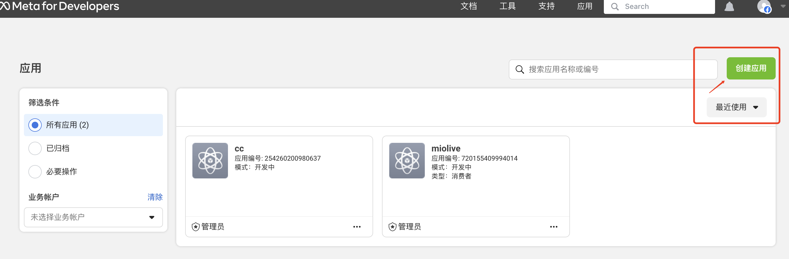
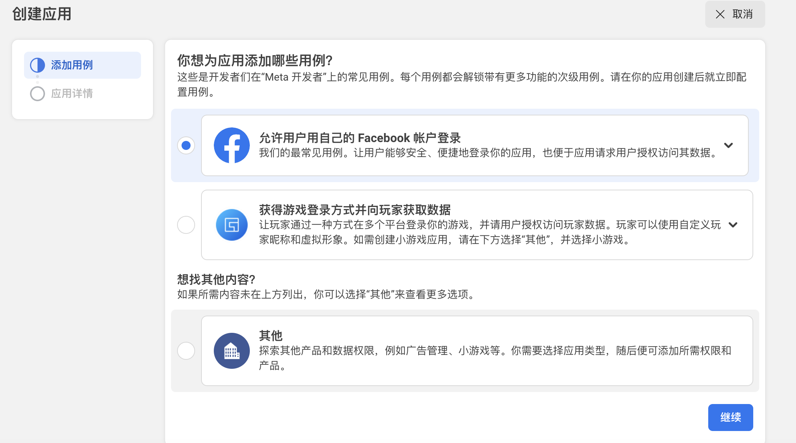
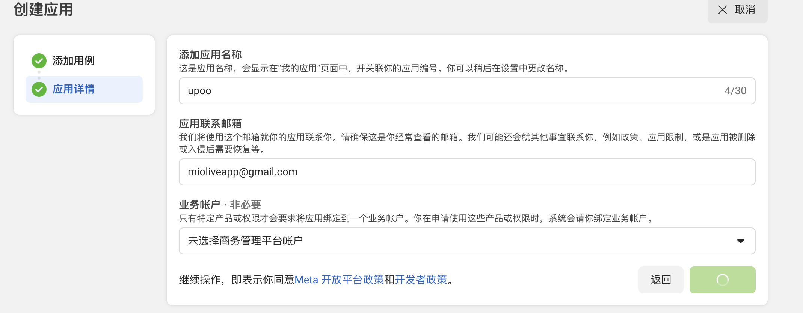
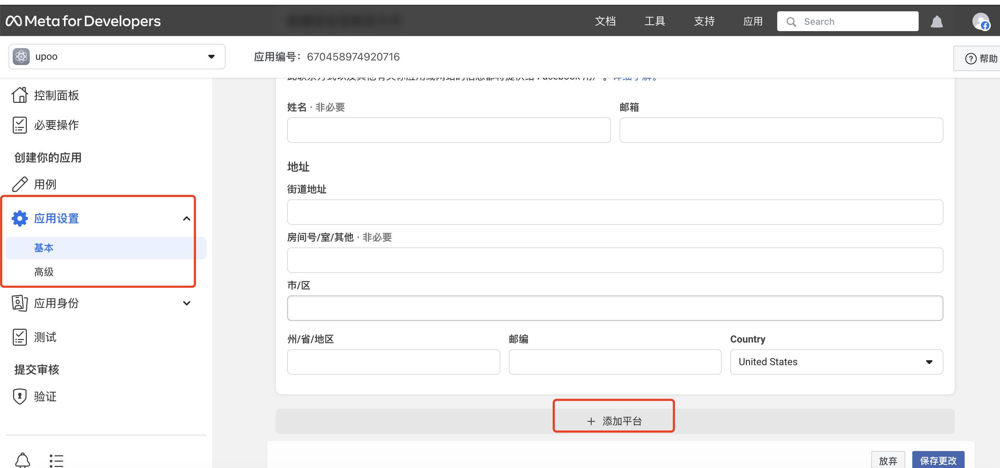
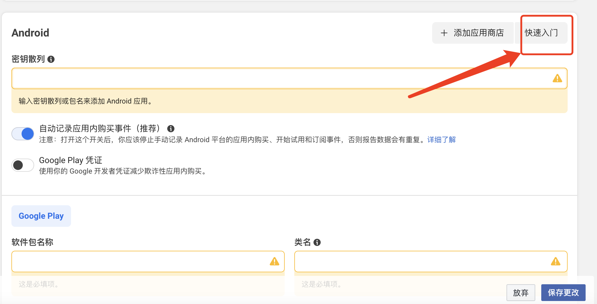

- 账号，非开发者账号
	- facebook平台账号
		- 18333601689@163.com
		- xuwenbin622@gmail.com
		- xuwencard
	- meta开发者账号
		- 18333601689
		-
- ## 创建应用
	- ## 1、[登录开发者账号]([https://www.facebook.com/login/device-based/regular/login/?login_attempt=1&next=https%3A%2F%2Fwww.facebook.com%2Findex.php%3Fnext%3Dhttps%253A%252F%252Fdevelopers.facebook.com%252Fasync%252Fregistration%252Fdialog%252F%253Fsrc%253Ddefault&lwv=100](https://www.facebook.com/login/device-based/regular/login/?login_attempt=1&next=https%3A%2F%2Fwww.facebook.com%2Findex.php%3Fnext%3Dhttps%253A%252F%252Fdevelopers.facebook.com%252Fasync%252Fregistration%252Fdialog%252F%253Fsrc%253Ddefault&lwv=100))
	- ## 2、创建应用
	  collapsed:: true
		- 
		- 
		- 
	- ## 3、添加平台设置基本信息
	  collapsed:: true
		- 
		- 
	- ## 4、进入[快速入门引导](https://developers.facebook.com/quickstarts/670458974920716/?platform=android)
- [官方文档](https://developers.facebook.com/docs/sharing/android)
- [官方Demo](https://github.com/facebook/facebook-android-sdk)
- # 注意
	- 1、测试分享功能时，facebook登录账号需要是开发者平台上的账号