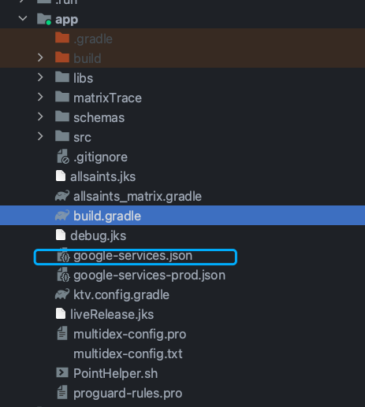

## 1、[github官方demo](https://github.com/firebase/quickstart-android)
- ## 2、[官方文档](https://firebase.google.com/docs/android/setup?hl=zh-cn)  [推送文档](https://firebase.google.com/docs/cloud-messaging/android/client?hl=zh-cn)
- ## 3、[接入参考](https://firebase.google.com/docs/android/setup?hl=zh-cn)
	- [参考文章](https://juejin.cn/post/6992125290688282632#heading-12)
	- ### 配置id的方式
		- ### 1、推送映射单项目
		  collapsed:: true
			- 1、按照文档配置google-services.json，然后配置Google servers（适合单项目）
			  collapsed:: true
				- 0、将google-services.json放到
				  collapsed:: true
					- 
				- 1、根项目的gradle添加依赖
				  collapsed:: true
					- ```xml
					  classpath "com.google.gms:google-services:4.3.14"
					  ```
				- 2、app的gradle应用插件
				  collapsed:: true
					- ```xml
					  plugins {
					      id 'com.google.gms.google-services'
					  }
					  ```
				- 3、服务会自定义匹配解析json文件，注意json里需要包含和当前项目包名一样的映射，否则报错
				- 4、编译时可以拿到解析的默认id
		- ### 2、根据不同地区，建立不同推送项目
			- 1、自己读取json，配置到String里
			- 2、👌🏻注册
	- ### SDK初始化配置好项目的id
	  collapsed:: true
		- ```kotlin
		  object FirebaseInitializer {
		  
		      //欧盟地区
		      private val EU by lazy {
		          if (MMKV.getRootDir().isNullOrEmpty()) {
		              HashSet<String>(
		                  RegionUtil.EU_REGIONS
		              )
		          } else {
		              val data = allsaintsMMKV().getStringSet(Constants.Firebase.KEY_FIREBASE_EU,emptySet())
		              val firebaseVersion = allsaintsMMKV().getInt(Constants.Firebase.KEY_FIREBASE_VERSION,0)
		              if (data.isNullOrEmpty() || firebaseVersion == 0) {
		                  HashSet<String>(
		                      RegionUtil.EU_REGIONS
		                  )
		              } else {
		                  data
		              }
		          }
		      }
		  
		      //东南亚地区
		      private val SEA by lazy {
		          if (MMKV.getRootDir().isNullOrEmpty()) {
		              HashSet<String>(
		                  arrayListOf(
		                      "ID", "MY", "TH", "VN", "PH",  //印度尼西亚，马来西亚，泰国，越南，菲律宾
		                      "BN", "KH", "LA", "SG", "MM",  //文莱，柬埔寨，老挝，新加坡，缅甸
		                      "TL", "PG", "PK", "MX", "JP",  //东帝汶，巴布亚新几内亚，巴基斯坦，墨西哥，日本
		                      "EG", "AE", "OM", "BH", "QA",  //埃及，阿联酋，阿曼，巴林，卡塔尔
		                      "KW", "SA", "IQ", "JO", "MA",  //科威特，沙特阿拉伯，伊拉克，约旦，摩洛哥
		                      "DZ", "APC", "EXPORT"       //阿尔及利亚，亚太通用，外销通用
		                  )
		              )
		          } else {
		              val data = allsaintsMMKV().getStringSet(Constants.Firebase.KEY_FIREBASE_SEA,emptySet())
		              val firebaseVersion = allsaintsMMKV().getInt(Constants.Firebase.KEY_FIREBASE_VERSION,0)
		              if (data.isNullOrEmpty() || firebaseVersion == 0) {
		                  HashSet<String>(
		                      arrayListOf(
		                          "ID", "MY", "TH", "VN", "PH",  //印度尼西亚，马来西亚，泰国，越南，菲律宾
		                          "BN", "KH", "LA", "SG", "MM",  //文莱，柬埔寨，老挝，新加坡，缅甸
		                          "TL", "PG", "PK", "MX", "JP",  //东帝汶，巴布亚新几内亚，巴基斯坦，墨西哥，日本
		                          "EG", "AE", "OM", "BH", "QA",  //埃及，阿联酋，阿曼，巴林，卡塔尔
		                          "KW", "SA", "IQ", "JO", "MA",  //科威特，沙特阿拉伯，伊拉克，约旦，摩洛哥
		                          "DZ", "APC", "EXPORT"       //阿尔及利亚，亚太通用，外销通用
		                      )
		                  )
		              } else {
		                  data
		              }
		          }
		      }
		  
		      //印度地区
		      private val INDIA by lazy {
		          if (MMKV.getRootDir().isNullOrEmpty()) {
		              HashSet<String>(
		                  arrayListOf(
		                      "IN"
		                  )
		              )
		          } else {
		              val data = allsaintsMMKV().getStringSet(Constants.Firebase.KEY_FIREBASE_INDIA,emptySet())
		              val firebaseVersion = allsaintsMMKV().getInt(Constants.Firebase.KEY_FIREBASE_VERSION,0)
		              if (data.isNullOrEmpty() || firebaseVersion == 0) {
		                  HashSet<String>(
		                      arrayListOf(
		                          "IN"
		                      )
		                  )
		              } else {
		                  data
		              }
		          }
		      }
		  
		      fun getGoogleAppId(applicationId: String): Int {
		          val country = RegionUtil.getRegion().second
		          Timber.w("FirebaseInitializer country-------------- :$country")
		          var googleAppId = 0
		          if (EU.contains(country)) {//欧盟地区
		              googleAppId = if (applicationId.endsWith("wsdebug")) {
		                  R.string.google_app_id_eu_bate
		              } else {
		                  R.string.google_app_id_eu_prod
		              }
		          } else if (SEA.contains(country)) {//东南亚地区
		              googleAppId = if (applicationId.endsWith("wsdebug")) {
		                  R.string.google_app_id_sea_bate
		              } else {
		                  R.string.google_app_id_sea_prod
		              }
		          } else if (INDIA.contains(country)) {//印度地区
		              googleAppId = if (applicationId.endsWith("wsdebug")) {
		                  R.string.google_app_id_india_bate
		              } else {
		                  R.string.google_app_id_india_prod
		              }
		          } else {//其他地区
		              googleAppId = if (applicationId.endsWith("wsdebug")) {
		                  R.string.google_app_id_default_bate
		              } else {
		                  R.string.google_app_id_default_prod
		              }
		          }
		          return googleAppId
		      }
		  
		      fun init(context: Context,
		               buildConfigInjector: BuildConfigInjector,
		               repositoryInjector: RepositoryInjector,
		               authManager: IAuthManager) {
		          if (context !is Application) {
		              throw IllegalStateException("initFirebase 必须传 application 的 context")
		          }
		          Timber.d("Firebase初始化开始")
		          val region = RegionUtil.getRegion().second
		          var projectId = ""
		          var applicationId = ""
		          var apiKey = ""
		          if (EU.contains(region)) {//欧盟地区
		              if (buildConfigInjector.APPLICATION_ID.endsWith("wsdebug")) {
		                  projectId = context.getString(R.string.project_id_eu_bate)
		                  applicationId = context.getString(R.string.google_app_id_eu_bate)
		                  apiKey = context.getString(R.string.api_key_eu_bate)
		              } else {
		                  projectId = context.getString(R.string.project_id_eu_prod)
		                  applicationId = context.getString(R.string.google_app_id_eu_prod)
		                  apiKey = context.getString(R.string.api_key_eu_prod)
		              }
		          } else if (SEA.contains(region)) {//东南亚地区
		              if (buildConfigInjector.APPLICATION_ID.endsWith("wsdebug")) {
		                  projectId = context.getString(R.string.project_id_sea_bate)
		                  applicationId = context.getString(R.string.google_app_id_sea_bate)
		                  apiKey = context.getString(R.string.api_key_sea_bate)
		              } else {
		                  projectId = context.getString(R.string.project_id_sea_prod)
		                  applicationId = context.getString(R.string.google_app_id_sea_prod)
		                  apiKey = context.getString(R.string.api_key_sea_prod)
		              }
		          } else if (INDIA.contains(region)) {//印度地区
		              if (buildConfigInjector.APPLICATION_ID.endsWith("wsdebug")) {
		                  projectId = context.getString(R.string.project_id_india_bate)
		                  applicationId = context.getString(R.string.google_app_id_india_bate)
		                  apiKey = context.getString(R.string.api_key_india_bate)
		              } else {
		                  projectId = context.getString(R.string.project_id_india_prod)
		                  applicationId = context.getString(R.string.google_app_id_india_prod)
		                  apiKey = context.getString(R.string.api_key_india_prod)
		              }
		          } else {//其他地区
		              if (buildConfigInjector.APPLICATION_ID.endsWith("wsdebug")) {
		                  projectId = context.getString(R.string.project_id_default_bate)
		                  applicationId = context.getString(R.string.google_app_id_default_bate)
		                  apiKey = context.getString(R.string.api_key_india_default_bate)
		              } else {
		                  projectId = context.getString(R.string.project_id_default_prod)
		                  applicationId = context.getString(R.string.google_app_id_default_prod)
		                  apiKey = context.getString(R.string.api_key_india_default_prod)
		              }
		          }
		          Timber.w("FirebaseInitializer region--->$region projectId--->$projectId  applicationId--->$applicationId  apiKey--->$apiKey")
		          FirebaseLogger.onNewSession()
		          val option = FirebaseOptions.Builder()
		              .setProjectId(projectId)
		              .setApplicationId(applicationId)
		              .setApiKey(apiKey)
		              .build()
		          FirebaseApp.initializeApp(context, option)
		          Firebase.app.setAutomaticResourceManagementEnabled(true)
		          Firebase.crashlytics.setCrashlyticsCollectionEnabled(true)
		          Firebase.crashlytics.setUserId(authManager.uid)
		          Firebase.analytics.setAnalyticsCollectionEnabled(true)
		          //push 推送
		          Firebase.messaging.isAutoInitEnabled = true
		          //push 推送获取push token
		          Firebase.messaging.token.addOnCompleteListener(OnCompleteListener { task ->
		              if (!task.isSuccessful) {
		                  AllSaintsLog.e("MyFirebaseMsgService", AllSaintsLog.USR,
		                      "firebase Fetching FCM registration token failed : ${task.exception?.stackTraceToString()}")
		                  return@OnCompleteListener
		              }
		              // Get new FCM registration token
		              val token = task.result
		              AllSaintsLog.d("MyFirebaseMsgService", AllSaintsLog.USR, "firebase token $token")
		              if (authManager.firebasePushToken.isNotNullOrEmpty()){
		                  sendRegistrationToServer(token, repositoryInjector, authManager)
		              }
		          })
		          FirebaseMessaging.getInstance().subscribeToTopic("allsaints")
		              .addOnCompleteListener { task ->
		                  if (!task.isSuccessful) {
		                      AllSaintsLog.w("MyFirebaseMsgService", AllSaintsLog.USR, "Allsaints 主题订阅失败")
		                  } else {
		                      AllSaintsLog.w("MyFirebaseMsgService", AllSaintsLog.USR, "Allsaints 主题订阅成功")
		                  }
		              }
		  
		          FirebaseLogger.allowFirebase = true
		          Timber.d("Firebase初始化结束")
		          BaseApplication.ioScope.launch {
		              val oldFirebaseVersion = allsaintsMMKV().getInt(Constants.Firebase.KEY_FIREBASE_VERSION,0)
		              val result = repositoryInjector.getFirebaseConfigInfo(oldFirebaseVersion)
		              Timber.w("FirebaseInitializer getFirebaseConfig--- message-->${result.data}")
		              if (result.isSuccess) {
		                  result.data?.version?.let {
		                      allsaintsMMKV().putInt(Constants.Firebase.KEY_FIREBASE_VERSION,it)
		                      if (it > oldFirebaseVersion) {
		                          allsaintsMMKV().putStringSet(Constants.Firebase.KEY_FIREBASE_EU,HashSet<String>(result.data!!.firebaseEu))
		                          allsaintsMMKV().putStringSet(Constants.Firebase.KEY_FIREBASE_SEA,HashSet<String>(result.data!!.firebaseAsean))
		                          allsaintsMMKV().putStringSet(Constants.Firebase.KEY_FIREBASE_INDIA,HashSet<String>(result.data!!.firebaseIndia))
		                      }
		                      //如果version==0 清空下发内容
		                      if (it == 0) {
		                          clearAPIFirebase()
		                      }
		                  }
		              } else {
		                  allsaintsMMKV().putInt(Constants.Firebase.KEY_FIREBASE_VERSION,0)
		                  clearAPIFirebase()
		                  Timber.d("FirebaseInitializer error: code--> ${result.error?.code} --- message-->${result.error?.message}")
		              }
		          }
		      }
		  
		      private fun clearAPIFirebase() {
		          allsaintsMMKV().putStringSet(Constants.Firebase.KEY_FIREBASE_EU,emptySet())
		          allsaintsMMKV().putStringSet(Constants.Firebase.KEY_FIREBASE_SEA,emptySet())
		          allsaintsMMKV().putStringSet(Constants.Firebase.KEY_FIREBASE_INDIA,emptySet())
		      }
		  
		      private fun sendRegistrationToServer(token: String, repositoryInjector: RepositoryInjector, authManager: IAuthManager) {
		          AllSaintsLog.w("MyFirebaseMsgService", AllSaintsLog.USR, "当前的token:${token}")
		          BaseApplication.scope.launch {
		              if (repositoryInjector.registerPushToken(token, "firebase").isSuccess) {
		                  AllSaintsLog.w("MyFirebaseMsgService", AllSaintsLog.USR, "当前的token:注册api成功")
		                  authManager.firebasePushToken = ""
		              }
		          }
		      }
		  }
		  
		  ```
-