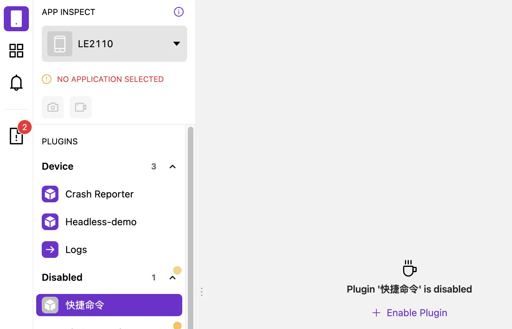
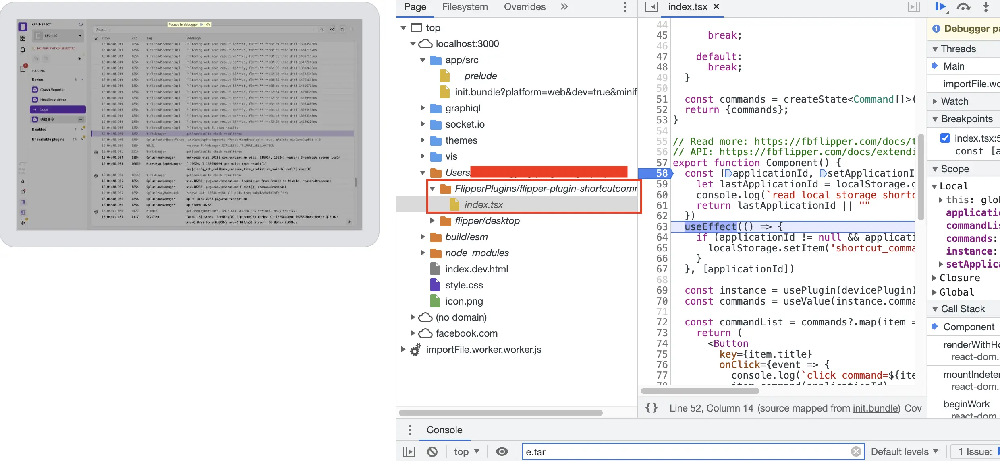

- # 介绍
  collapsed:: true
	- Flipper是一个基于Electron开发的桌面端应用，支持Window/Linux/Mac等多平台，通过桌面插件和其他插件可以扩展其功能。
		- 桌面插件：可以通过公共插件市场、私有插件市场、内置等多种方式安装到Flipper应用中，它又划分为client/device两种类型。
		- 其他插件：支持Android、iOS、React-Native、Browser/Node等各平台，需要在各端应用中嵌入其SDK和插件相关代码。
	- 桌面插件与设备插件之间通过TCP链接传输数据，最后统一由桌面插件展示数据，处理交互，以React-Native插件交互为例，其整体结构如下：
		- 
- # Flipper桌面插件
	- 它指的是在Flipper桌面客户端上安装使用的插件，使用typescript语言编写，一般情况下通过与Flipper其他插件交互获取数据，然后在Flipper桌面客户端上进行展示。
- # Flipper其他插件
  collapsed:: true
	- 它指的是在各端（如android、ios、browser/node、react-native）直接通过代码接入到各自应用的插件。通过这些插件可以直接获取到应用的相关信息，然后发送到Flipper桌面插件，最后在Flipper桌面客户端上进行展示或者其他交互。
- # 开发插件
	- ## 前置条件
	  collapsed:: true
		- node >= 14
		  yarn > 1.5
		  git
		  watchman
		  Mac系统可以使用[Homebrew](https://brew.sh/)统一安装以上程序。
			- ```
			  # 安装homebrew
			  $ ruby -e "$(curl -fsSL https://raw.githubusercontent.com/Homebrew/install/master/install)"
			  
			  $ brew install node
			  $ brew install yarn
			  $ brew install git
			  $ brew install watchman
			  ```
	- ## 下载编译运行Flipper桌面客户端
	  collapsed:: true
		- 开发Flipper插件，强烈建议通过编译运行Flipper源代码的方式进行开发，使用该方式进行开发时，可以使用各种React/Redex Dev Tools以及Chrome Dev Tools/Visual Studio Code等调试开发工具等。
		- ```
		  # 下载源代码
		  $ git clone https://github.com/facebook/flipper.git  
		  
		  # 切换到Flipper桌面客户端源代码目录，然后使用yarn编译运行。
		  $ cd flipper/desktop  
		  $ yarn  
		  $ yarn start
		  
		  # 如果遇到依赖找不到问题，可以强制重新下载依赖
		  $ yarn install --force
		  ```
	- ## 创建Flipper桌面插件
	  collapsed:: true
		- 使用npx flipper-pkg init命令创建Flipper桌面插件。
		- 首次使用会提示是否将FlipperPlugins添加到Flipper的插件目录中，当选择Yes时，就会将目录添加到~/.flipper/config.json文件的pluginPaths配置项中，后续也可以通过编辑文件的方式自己添加插件路径。
		- 注意：
		- 创建插件的目录不能放到flipper源码目录下。
		  添加到pluginPaths的插件，在打包时，会被内置到Flipper客户端中。
		  在Plugin Type步骤可以选择插件类型client/device，当创建插件成功后，可以在package.json文件中看到pluginType（其默认值为client）。
		- client：和应用进行交互的插件。
		  device：和设备直接进行交互的插件。
		  整个命令执行如下所示：
			- ```
			  # 创建插件目录
			  $ mkdir ~/FlipperPlugins  
			  $ cd ~/FlipperPlugins  
			  
			  # 通过命令创建插件
			  $ npx flipper-pkg init
			  ? Plugin Type ("client" if the plugin will work with a mobile app, "device" if the plugin will work with a mobile device): device
			  ? ID (must match native plugin ID, e.g. returned by getId() in Android plugin): ShortcutCommand
			  ? Title (will be shown in the Flipper main sidebar): 快捷命令
			  
			  $ cat ~/.flipper/config.json
			  {
			    "pluginPaths": [
			      "/Users/xxxxx/FlipperPlugins"
			    ],
			    "disabledPlugins": [],
			    "darkMode": "light",
			    "updaterEnabled": true,
			    "launcherEnabled": true
			  }
			  ```
		- 命令执行成功后，可以查看插件的package.json文件，内容大致如下：
		  collapsed:: true
			- ```
			  {
			    "$schema": "https://fbflipper.com/schemas/plugin-package/v2.json", // 插件配置定义文件地址。
			    "name": "flipper-plugin-device-shortcut-command", // 插件名字
			    "id": "ShortcutCommand", // 插件的id，当pluginType为client时，需要搭配其他插件一起使用。
			    "version": "0.0.3",
			    "pluginType": "device",  // 插件类型
			    "supportedDevices": [    // 支持的设备类型，可以支持多种Android/iOS，还可以区分模拟器。
			      {"os":"Android"}
			    ],
			    "main": "dist/bundle.js", // 打包后会生成该文件，所有源代码会编译到单文件中，flipper加载插件后，会执行该文件代码。
			    "flipperBundlerEntry": "src/index.tsx", // 主源代码文件
			    "license": "MIT",
			    "keywords": [
			      "flipper-plugin"
			    ],
			    "icon": "apps",
			    "title": "快捷命令", // 插件标题，在flipper上显示的插件名字。
			    "scripts": {
			      "lint": "flipper-pkg lint",
			      "prepack": "flipper-pkg lint && flipper-pkg bundle",
			      "build": "flipper-pkg bundle",
			      "watch": "flipper-pkg bundle --watch",
			      "test": "jest --no-watchman"
			    },
			    "peerDependencies": {
			      "flipper-plugin": "^0.152.0",
			      "antd": "latest"
			    },
			    "devDependencies": {
			      "@babel/preset-react": "latest",
			      "@babel/preset-typescript": "latest",
			      "@testing-library/react": "latest",
			      "@types/jest": "latest",
			      "@types/react": "latest",
			      "@types/react-dom": "latest",
			      "antd": "latest",
			      "flipper-plugin": "latest",
			      "flipper-pkg": "latest",
			      "jest": "latest",
			      "typescript": "latest"
			    }
			  }
			  ```
		- device和client方法除了pluginType类型不同和导出方法不同外，其他内容基本一致。整个桌面插件开发大概流程就是从plugin/devicePlugin方法返回数据源，然后在Component方法中使用数据源展示对应数据，或者数据进行交互，UI展示可以使用Flipper内置的组件或者直接使用AntDesign。
		- Flipper桌面端的UI控件库就是[AntDesign](https://ant.design/components/overview-cn/)。
	- ## device插件
	  collapsed:: true
		- device插件必须在index.tsx文件中导出devicePlugin和Component两个方法：
		- devicePlugin：该方法通过createState()方法创建可以观察的数据源，然后包装为普通的对象返回。
		  Component：该方法通过react hooks来使用devicePlugin()方法返回的数据源，对UI进行填充。
			- ```
			  // 该方法可以通过client参数获取设备信息，然后返回数据源。
			  export function devicePlugin(client: DevicePluginClient) {
			    const data = createState<string[]>(["abc", "cdf", "def"])
			    return { data }
			  } 
			  
			  // 该方法定义了UI展示样式，其数据源来自于`devicePlugin`方法的返回值。
			  export function Component() {
			    const instance = usePlugin(devicePlugin);
			    const data = useValue(instance.data)
			    
			    return (
			      <Layout.ScrollContainer
			        vertical
			        >
			        /// 略  
			      </Layout.ScrollContainer>
			    )
			  }
			  ```
	- ## client插件
	  collapsed:: true
		- client插件在index.tsx文件中导出plugin和Component两个方法：
		- plugin：该方法通过createState()方法创建可以观察的数据源，然后包装为普通的对象返回。
		  Component：该方法通过react hooks来使用plugin()方法返回的数据源，对UI进行填充。
		  因为client插件需要与嵌入到应用程序中的其他插件进行交互，所以需要保证client插件和其他插件的id一致，当插件连接后，可以使用如下方法进行数据交互：
		- client.send：发送数据到其他插件。
		  client.onMessage：接收来自其他插件发送的数据。
		  通过createState()方法创建的对象，可以使用subscribe、update等方法实现订阅和更新操作。
			- ```
			  // 该方法可以主要通过`client.onMessage()`方法监听(android/ios/etc)插件发送的事件，然后将解析事件更新数据源，然后返回数据源
			  export function plugin(client: PluginClient<Events, Methods>) {
			    const events = createState<Array<ImageEventWithId>>([], {persist: \'events\'});
			    
			    client.onMessage(\'events\', (event) => {
			      events.update((draft) => {
			        draft.unshift({
			          eventId: nextEventId.get(),
			          ...event,
			        });
			      });
			  
			      nextEventId.set(nextEventId.get() + 1);
			    })
			  
			  
			    client.onConnect(async () => {
			      try {
			        const currentLogs = await client.send(\'currentLogs\', {
			          payload: {
			             time: Date.now()
			          }
			        })
			        logs.set(currentLogs)
			      } catch (e) {
			        console.error("Failed to retrieve current logs: ", e)
			      }
			    })
			    
			    return { events }
			  }
			  
			  // 该方法定义了UI展示样式，其数据源来自于`plugin`方法的返回值。
			  export function Component() {
			    const instance = usePlugin(plugin);
			    const events = useValue(instance.events);
			    
			    return (
			      <Layout.ScrollContainer
			        vertical
			        >
			        /// 略  
			      </Layout.ScrollContainer>
			    )
			  }
			  ```
	- ## 启用插件
	  collapsed:: true
		- 切换到Flipper的源代码的desktop目录，然后通过yarn start启动Flipper桌面客户端。
		- ```
		  $ cd flipper/desktop  
		  $ yarn start
		  # 实验性功能：不需要重启Flipper客户端，就可以快速刷新插件页面.
		  $ yarn start --fast-refresh
		  ```
		- 然后在插件列表就可以看到新开发的插件：
		  collapsed:: true
			- 
		- 然后点击+ Enable Plugin按钮，就可以启用插件，插件启用后，点击插件名称，就可以打开插件，此时就能够看到在export function Component()方法返回的UI界面。
	- ## 调试
	  collapsed:: true
		- 运行Flipper之后，可以通过多种方式进行调试，详见官网flipper-debug，下面以Chrome开发者工具介绍：
		- 通过浏览器打开http://localhost:9222，然后点击列表中的Flipper即可，然后选中自己插件的代码就可以调试了，调试页面如下所示：
			- 
	- ## 打包插件
		- 执行如下命令可以打包插件，插件会输出到-o指定的目录，其扩展名为.tgz，然后在FlipperPC客户端上的插件管理中可以直接安装该插件。
		  collapsed:: true
			- ```
			  $ yarn build 或者 yarn prepack
			  $ yarn flipper-pkg pack flipperPluginDir -o  ~/Downloads
			  ```
	- ## 创建其他插件
		- 如上所述，其他插件指的是针对Android、iOS、React-Native、Browser/Node等平台应用开发的插件，其开发流程和各平台的开发流程一致，添加上Flipper提供的依赖，然后按照正常的库进行开发即可。
		- ##Refs
		- [flipper-plugin](https://fbflipper.com/docs/extending/flipper-plugin/)
		  [flipper-node-apis](https://fbflipper.com/docs/extending/node-apis/)
		  [flipper-dev-setup](https://fbflipper.com/docs/extending/dev-setup/)
-