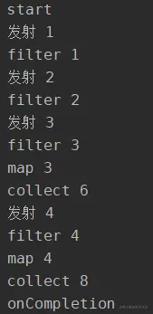
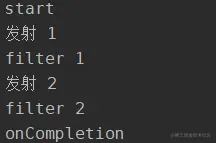

- 开始和完成回调函数
- ## [[onStart开始时回调]]
- ## [[onCompletion结束时回调]]
- ## 示例
  collapsed:: true
	- ```kotlin
	  fun main() = runBlocking {
	      flow{
	          println("发射 1")
	          emit(1)
	          println("发射 2")
	          emit(2)
	          println("发射 3")
	          emit(3)
	          println("发射 4")
	          emit(4)
	          println("发射 5")
	          emit(5)
	      }
	          .filter {
	              println("filter $it")
	              it > 2
	          }
	          .map {
	              println("map $it")
	              it * 2
	          }
	          .take(2)
	          .onStart {
	              println("start")
	          }
	          .onCompletion {
	              println("onCompletion")
	          }
	          .collect{
	              println("collect $it")
	          }
	  }
	  ```
	- 这里逻辑就不说了，其中`onStart`就是`Flow`开始的回调，而`onCompletion`就是`Flow`结束的回调，通过这个我们可以看出`Flow`的运行状态，同时这2个操作符**和位置是无关**的，虽然`onStart`已经放在了发射和几个操作数据的操作符后面，但是在执行时他却是最先执行的，下面是运行结果：
	- 
	- 而**其他操作数据的操作符是和所在的位置有关的**，这个也非常容易理解，比如我们把`take(2)`放到`.filter`前，打印结果如下：
	- 
	- 这里结果就会发生变化，也非常好理解，因为`Flow`是数据流，中间的操作会影响后的。所以这也是为什么感觉`onStart`和`onCompletion`不太像中间操作符就是这个原因。
- ## `onCompletion`回调触发的情况有下面3种情况
	- - `Flow`正常执行完毕；
	- `Flow`当中出现异常；
	- `Flow`被取消。