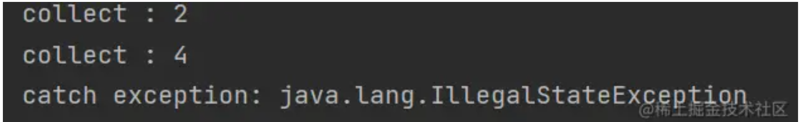

- 在前面我们知道`Flow`就是数据流，它有3个部分组成：上游、中间操作和下游，那么当`Flow`中发生异常时，也可以根据这个标准来进行分类，也就是异常发生的位置。
- ## `catch` 捕获异常(上游或者中间)
  collapsed:: true
	- 当`Flow`的异常发生在上游或者中间时，可以使用`catch`进行捕获异常，注意`catch`这个操作符就是和我们平时使用的`try-catch`意义用来捕获异常，只不过这个是用在`Flow`中的。
	- 同时`catch`操作符的作用和它的位置是强相关的，比如下面代码：
		- ```kotlin
		  fun main() = runBlocking {
		      flow{
		          emit(1)
		          emit(2)
		          throw IllegalStateException()
		          emit(3)
		      }.map { it * 2 }
		          .catch { println("catch exception: $it") }
		          .collect{
		              println("collect : $it")
		          }
		  
		  }
		  ```
	- 这里在上游操作符中抛出一个异常，这里就会被捕获到，同时会终止`Flow`的继续发射和执行，所以打印如下：
		- 
	- 注意这里catch只能捕获发生在它上游的异常，当异常发生时不再继续发生数据和执行数据。
- ## `try-catch` 捕获下游异常
	- 这里说了`catch`是一个中间操作符，可以捕获在它之前的异常，那对于下游操作符的异常呢 比如在`collect`高级函数中发生异常，这里最简单的办法就是直接使用`try-catch`即可，比如下面代码：
	- ```kotlin
	  fun main() = runBlocking {
	      flow{
	          emit(1)
	          emit(2)
	          throw IllegalStateException()
	          emit(3)
	      }.map { it * 2 }
	          .catch { println("catch exception: $it") }
	          .collect{
	              try {
	                  println("collect : $it")
	                  throw IllegalStateException()
	              }catch (e: Exception){
	                  println("Catch : $e")
	              }
	          }
	  }
	  ```
	- 这里直接就在下游操作符中使用普通的`try-catch`进行捕获异常。
	- 关于异常捕获，我们后面有文章单独介绍，这里我们只需要知道`Flow`提供的`catch`中间操作符是和位置有关的，只能捕获它上游的异常，想捕获终止操作符中的异常，还是得老老实实使用`try-catch`。