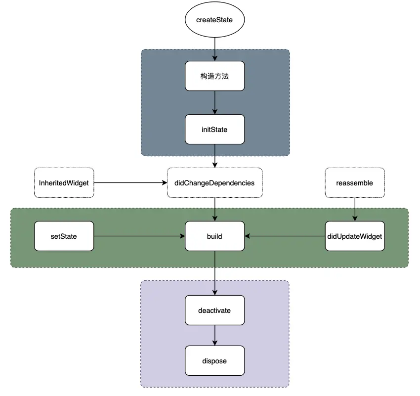
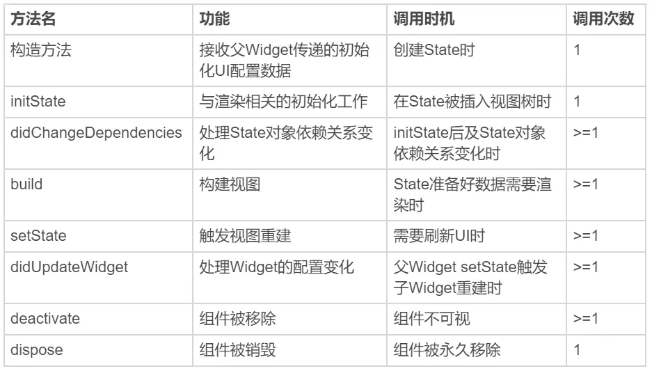

- ## 背景
  collapsed:: true
	- 作为 Android 开发者，我们对 Activity、Service 等系统组件的生命周期非常熟悉，在日常开发中也会利用组件的生命周期特点开发业务逻辑。
	- Flutter 中有“一切皆Widget”的说法，Widget 是 Flutter 功能的抽象描述，是视图的配置信息，也是数据的映射。Android 开发中的 View、Layout、Activity、Application等，对应到 Flutter 中都是 Widget。
	- Flutter 的 Widget 有 StatelessWidget 和 StatefulWidget 两种类型，StatelessWidget 用于处理静态的、无状态变化的视图展示，而 StatefulWidget 应对有交互、需要动态变化视觉效果的场景。
	- StatelessWidget 通过父 Widget 初始化时传入的静态配置就能完全控制其静态展示，而 StatefulWidget 需要借助于 State 对象，在特定阶段来处理用户交互或内部数据的变化，然后更新到 UI 上。这些特定的阶段涵盖了一个 Widget 从初始化到卸载的全过程，即生命周期。Flutter 中的生命周期即指的 StatefulWidget 的生命周期，并通过 State 对象来体现，StatelessWidget 的生命周期只有 build 过程，且只会执行一次。
- ## 生命周期方法
  collapsed:: true
	- Flutter中的生命周期方法主要包括以下内容：
	- createState
	  collapsed:: true
		- 该函数为 StatefulWidget 中创建 State 的方法，当 StatefulWidget 被调用时会立即执行 createState 。
		- ```
		  class MyPage extends StatefulWidget {
		    @override
		    _MyPageState createState() => _MyScreenState();
		  }
		  ```
	- initState
	  collapsed:: true
		- 该函数为 State 初始化调用，因此可以在此期间执行 State 各变量的初始赋值，同时也可以在此期间与服务端交互，获取服务端数据后调用 setState 来设置 State。
		- ```
		  int a;
		  @override
		  void initState() {
		    a = 0;
		    super.initState();
		  }
		  ```
	- didChangeDependencies
	  collapsed:: true
		- 用来专门处理 State 对象依赖关系的变化，这里说的 State 为全局 State ，例如语言或者主题等，会在 initState() 方法调用结束后被调用。
		- ```
		  @override
		  void didChangeDependencies() {
		  super.didChangeDependencies();
		  }
		  ```
	- build
	  collapsed:: true
		- 主要是构建视图，返回需要渲染的 Widget ，由于 build 会被调用多次，因此在该函数中只能做返回 Widget 相关逻辑，避免因为执行多次导致状态异常。
		- ```
		  @override
		  Widget build(BuildContext context, MyButtonState state) {
		    return Container(color:Colors.red);
		  }
		  ```
	- reassemble
	  collapsed:: true
		- 主要是提供开发阶段使用，在 debug 模式下，每次热重载都会调用该函数，因此在 debug 阶段可以在此期间增加一些 debug 代码，来检查代码问题。
	- didUpdateWidget
	  collapsed:: true
		- 该函数主要是在组件重新构建，比如说热重载，父组件发生 build 的情况下，子组件该方法才会被调用，其次该方法调用之后一定会再调用本组件中的 build 方法。
		- ```
		  @override
		  void didUpdateWidget(MyHomePage oldWidget) {
		    super.didUpdateWidget(oldWidget)
		  }
		  ```
	- deactivate
	  collapsed:: true
		- 在组件被移除节点后会被调用，如果该组件被移除节点，然后未被插入到其他节点时，则会继续调用 dispose 永久移除。
		- ```
		  @override
		  void deactivate() {
		    super.deactivate();
		  }
		  ```
	- dispose
	  collapsed:: true
		- 永久移除组件，并释放组件资源。
		- ```
		  @override
		  dispose() {
		    super.dispose();
		  }
		  ```
	-
	-
- ## Widget生命周期流程
  collapsed:: true
	- Widget 的生命周期主要体现在 State 对象的回调方法中，主要执行流程如下图：
	  collapsed:: true
		- {:height 712, :width 747}
	- 上述过程可以分为3个主要阶段：创建 Widget、更新 Widget 和销毁 Widget。
	- 创建
		- State 的初始化流程是从系统调用 StatefulWidget 的 createWidget方 法开始的，在 createWidget 方法中会调用 State 类的构造方法，接着依次执行State类生命周期方法：initState -> didChangeDependencies -> build，然后完成页面渲染。
		- 构造方法是 State 生命周期的起点，Flutter 通过调用 StatefulWidget.createState() 创建一个 State，父 Widget 可以通过构造方法传入一些初始化 UI 的数据。当 State 对象被插入到视图树时会调用 initState 方法，这个方法在 State 对象的生命周期中只会被调用一次，我们可以在这里做一些初始化工作。didChangeDependencies 方法是用来专门处理 State 对象依赖关系变化的，它会在 initState 执行结束后立即被调用。build 方法用于构建UI视图，经过前面的步骤，当前 State 对象已经准备好了，在 build 方法中根据父 Widget 传递的初始化数据以及 State 的当前状态，创建一个 Widget 返回。
	- 更新
		- 当一个Widget收到其父 Widget 的重构请求，或者由于用户的交互触发内部 State 对象改变并调用 setState 方法，或者当前 Widget 被插入到新的视图树中，或者在开发过程中发生热重载，将触发 Widget 的 State 更新，更新的场景比较复杂，每次更新都会调用 build 方法。State 更新主要由3个方法触发：setState、didchangeDependencies 与 didUpdateWidget。
		- 父 Widget 根据 runtimeType 和 Widget.key 确定需要更新的视图树中某个位置的 Widget，当 Widget 的配置发生变化或热重载时，会调用 didUpdateWidget 方法。当 State 内部状态改变时，可以在当前 State 中直接调用 setState 方法更新状态数据，setState 的回调是立即执行的，所以不能是 async 的。当 State 对象的依赖关系发生变化，比如系统语言或应用主题等全局的状态发生改变后，Framework 会通知 State 执行 didChangeDependencies 方法。
	- 销毁
		- State 对象的销毁过程比较简单，包括移除和销毁 Widget 两个场景，系统会分别调用 deactivate 和 dispose 方法。
		- 当组件的可见状态发生变化时，deactivate 函数会被调用，这时 State 会被暂时从视图树中移除。值得注意的是，页面切换时，由于 State 对象在视图树中的位置发生了变化，需要先暂时移除后再重新添加，重新触发组件构建，因此这个函数也会被调用。
		- 当 State 被永久地从视图树中移除时，Flutter 会调用 dispose 函数。而一旦到这个阶段，组件就要被销毁了，所以我们可以在这里进行最终的资源释放、移除监听、清理环境等等。
	- 
- ## App生命周期
	- State 的生命周期定义了视图从加载到构建以及更新和销毁的全过程，根据其回调机制，我们可以在合适的回调方法中根据 Widget 的状态做相应的逻辑响应。在原生 Android 开发中，我们经常会处理 App 从后台进入前台、从前台切到后台，或者是 UI 绘制完成等时机的一些状态逻辑，通过重写 Activity 的生命周期回调方法或注册应用程序的相关通知，监听 App 的生命周期并做相应的处理。在 Flutter 中我们可以监听 WidgetsBindingObserver 的回调方法来实现同样的需求。
	  collapsed:: true
		- ```
		  	abstract class WidgetsBindingObserver {
		    //页面pop
		    Future<bool> didPopRoute() => Future<bool>.value(false);
		    //页面push
		    Future<bool> didPushRoute(String route) => Future<bool>.value(false);
		    //系统窗口相关改变回调，如旋转
		    void didChangeMetrics() { }
		    //文本缩放系数变化
		    void didChangeTextScaleFactor() { }
		    //系统亮度变化
		    void didChangePlatformBrightness() { }
		    //本地化语言变化
		    void didChangeLocales(List<Locale> locale) { }
		    //App生命周期变化
		    void didChangeAppLifecycleState(AppLifecycleState state) { }
		    //内存警告回调
		    void didHaveMemoryPressure() { }
		    //Accessibility相关特性回调
		    void didChangeAccessibilityFeatures() {}
		  }
		  `````
	- 可以看出 WidgetsBindingObserver 类提供了很多回调方法，比如屏幕旋转、屏幕亮度变化、语言变化、内存警告等都可以通过监听这个类实现回调。通过给 WidgetsBinding 的单例对象设置监听器，就可以监听对应的回调方法。
	-
-