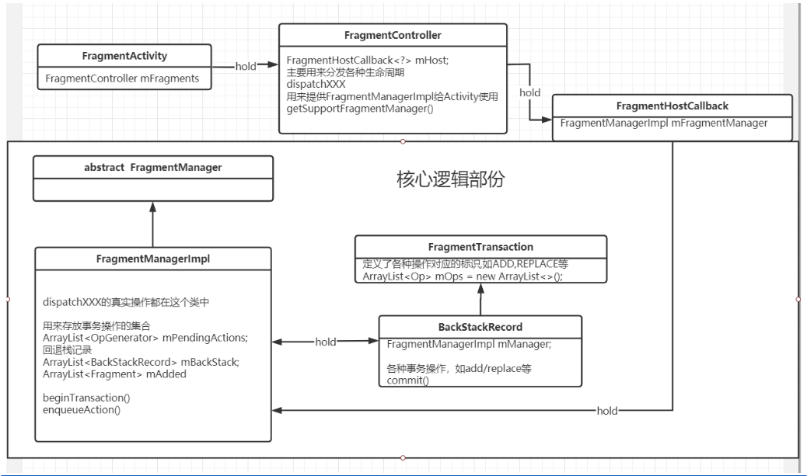

- # 一、Fragment概述
	- 代码
		- ```java
		  public class Fragment implements ComponentCallbacks,OnCreateContextMenuListener {...}
		  ```
	- 可以看到，Fragment 没有继承任何类，只是实现了这两个接口，第二个不太重要，第一个是在内存不足时可以收到回调。没有什么特别信息，我们还是去看看它的主要成员。
- # 二、Fragment整体结构图
	- 
	- ## FragmentActivity
		- ## 持有[[FragmentController]] mFragments
			- ## 持有[[FragmentHostCallback]] 执行核心逻辑的类
				- ## 持有
					- ## [[FragmentManagerImpl]]
						- 1、dispatch生命周期的最终调到这里[[#red]]==**dispatchStateChange**==
						- 2、存放事务操作集合
					- ## [[BackStackRecord]]
						- 各种事务的操作，add/replace
			- ## 作用
				- 分发生命周期：各种dispatch生命周期
				- 给Activity提供FragmentManagerImpl
- # 二、**Fragment ****的主要成员**
  collapsed:: true
	- 标志位
		- ```java
		  static final int INITIALIZING = 0; // Not yet created.
		  static final int CREATED = 1; // Created.
		  static final int ACTIVITY_CREATED = 2; // The activity has finished its creation.
		  static final int STOPPED = 3; // Fully created, not started.
		  static final int STARTED = 4; // Created and started, not resumed.
		  static final int RESUMED = 5; // Created started and resumed.
		  //当前 Fragment 的状态值
		  int mState = INITIALIZING;
		  //...
		  // True if the fragment is in the list of added fragments.
		  boolean mAdded;
		  // If set this fragment is being removed from its activity.
		  boolean mRemoving;
		  // Set to true if this fragment was instantiated from a layout file.
		  boolean mFromLayout;
		  // Set to true when the view has actually been inflated in its layout.
		  boolean mInLayout;
		  // True if this fragment has been restored from previously saved state.
		  boolean mRestored;
		  // Number of active back stack entries this fragment is in.
		  int mBackStackNesting;
		  // Set to true when the app has requested that this fragment be hidden
		  // from the user.
		  boolean mHidden;
		  // Set to true when the app has requested that this fragment be
		  deactivated.
		  boolean mDetached;
		  // If set this fragment would like its instance retained across
		  // configuration changes.
		  boolean mRetainInstance;
		  // If set this fragment is being retained across the current config change.
		  boolean mRetaining;
		  // If set this fragment has menu items to contribute.
		  boolean mHasMenu;
		  // Set to true to allow the fragment's menu to be shown.
		  boolean mMenuVisible = true;
		  // Used to verify that subclasses call through to super class.
		  boolean mCalled;
		  ```
	- 关键
		- ```java
		  // The fragment manager we are associated with. Set as soon as the
		  // fragment is used in a transaction; cleared after it has been removed
		  // from all transactions.
		  FragmentManagerImpl mFragmentManager;
		  //Fragmemt 绑定的对象，一半就是 Activity 和 Fragment
		  FragmentHostCallback mHost;
		  //管理子 Fragment
		  FragmentManagerImpl mChildFragmentManager;
		  // For use when restoring fragment state and descendant fragments are retained
		  // This state is set by FragmentState.instantiate and cleared in onCreate.
		  FragmentManagerNonConfig mChildNonConfig;
		  //如果这个 Fragment 绑定的是另一个 Fragment，就需要设置这个值
		  Fragment mParentFragment;
		  //容器 Fragment 的ID
		  int mFragmentId;
		  //容器 View 的ID
		  int mContainerId;
		  //父布局
		  ViewGroup mContainer;
		  //当前 Fragment 的布局
		  View mView;
		  //真正保存状态的内部布局
		  View mInnerView;
		  ```
	- 看到这里，结合前面的，我们就清晰了一个 Fragment 的创建、添加过程：在 onCreateView() 中返回一个 布局，然后在 FragmentManager 中拿到这个布局，添加到要绑定容器（Activity/Fragment）的 ViewGroup 中，然后设置相应的状态值。
- # 三、[[Fragment生命周期]]
- # 四、简单使用
	- 实现很简单，创建一个的布局，然后在 Activity 里点击时替换 Fragment。
	- ```java
	  FragmentManager mFragmentManager = getSupportFragmentManager();
	  mFragmentManager.beginTransaction()
	      .replace(R.id.fl_content, fragment)
	      .commitAllowingStateLoss();
	  ```
	- 代码很简单，核心就三步：
	- 1. 创建 Fragment
	- 2. 获取 FragmentManager
	- 3. 调用事务，添加、替换
- # 五、[[FragmentManager]]
- # 六、[[Fragment事务]]
- # 七、[[回退栈操作addToBackStack(事务内存管理)]]
- # 八、[[状态保存与恢复]]
- # [[Fragment面试题]]