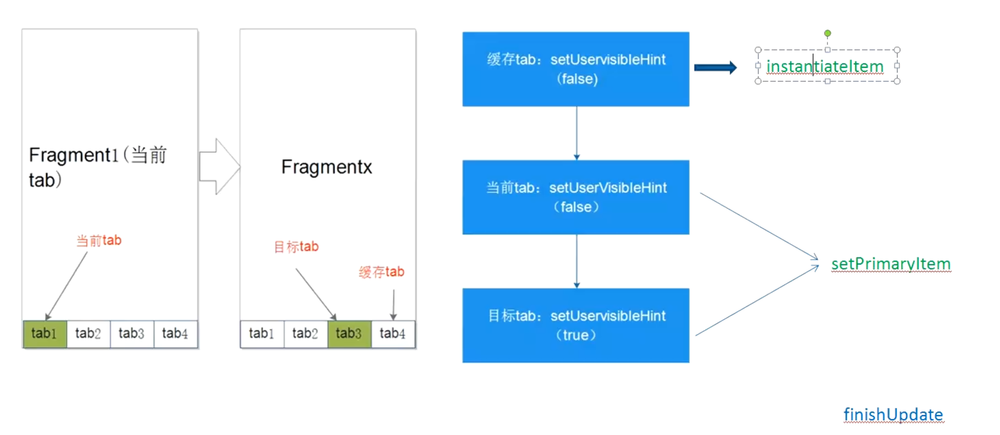

# 五个关键函数
collapsed:: true
	- # 函数1：startUpdate活父类干了，pagerAdapter
	  collapsed:: true
		- ```java
		      public void startUpdate(@NonNull ViewGroup container) {
		          if (container.getId() == -1) {
		              throw new IllegalStateException("ViewPager with adapter " + this + " requires a view id");
		          }
		      }
		  ```
	- # 函数2：instantiateItem,实例化item
		- Fragment交给事务管理器完成，获取Fragment，添加到事务
		- ```java
		  @NonNull
		      public Object instantiateItem(@NonNull ViewGroup container, int position) {
		          if (this.mCurTransaction == null) {
		              this.mCurTransaction = this.mFragmentManager.beginTransaction();
		          }
		  
		          long itemId = this.getItemId(position);
		          String name = makeFragmentName(container.getId(), itemId);
		          Fragment fragment = this.mFragmentManager.findFragmentByTag(name);
		          if (fragment != null) {
		              this.mCurTransaction.attach(fragment);
		          } else {
		              fragment = this.getItem(position);
		              this.mCurTransaction.add(container.getId(), fragment, makeFragmentName(container.getId(), itemId));
		          }
		  
		          if (fragment != this.mCurrentPrimaryItem) {
		              fragment.setMenuVisibility(false);
		              fragment.setUserVisibleHint(false);
		          }
		  
		          return fragment;
		      }
		  ```
	- # 函数3：destroyItem，销毁item
	  collapsed:: true
		- 通过事务Detach
		- ```java
		      public void destroyItem(@NonNull ViewGroup container, int position, @NonNull Object object) {
		          if (this.mCurTransaction == null) {
		              this.mCurTransaction = this.mFragmentManager.beginTransaction();
		          }
		  
		          this.mCurTransaction.detach((Fragment)object);
		      }
		  ```
	- # 函数4：setPrimaryItem设置当前显示的item数据
		- fragment.setUserVisibleHint(true);设置Fragment可见
		- ```java
		      public void setPrimaryItem(@NonNull ViewGroup container, int position, @NonNull Object object) {
		          Fragment fragment = (Fragment)object;
		          // fragment 为要切换的目标页面
		          // mCurrentPrimaryItem 为当前页面
		          // 不相等就设置
		          if (fragment != this.mCurrentPrimaryItem) {
		              // 当前Fragment 设置 setUserVisibleHint false
		              if (this.mCurrentPrimaryItem != null) {
		                  this.mCurrentPrimaryItem.setMenuVisibility(false);
		                  this.mCurrentPrimaryItem.setUserVisibleHint(false);
		              }
		              // 将要切换的设置 true 
		              fragment.setMenuVisibility(true);
		              fragment.setUserVisibleHint(true);
		              this.mCurrentPrimaryItem = fragment;
		          }
		  
		      }
		  
		  ```
	- # 函数5：finishUpdate完成适配，就是事务commit
	  collapsed:: true
		- 提交后Fragment生命周期函数触发
		- ```java
		      public void finishUpdate(@NonNull ViewGroup container) {
		          if (this.mCurTransaction != null) {
		              this.mCurTransaction.commitNowAllowingStateLoss();
		              this.mCurTransaction = null;
		          }
		  
		      }
		  ```
	- # 结论
		- setPrimaryItem。设置的setUserVisibleHint 先执行
		- Fragment生命周期函数后执行
- # setUserVisibleHint函数
	- 前提：假设我设置的缓存setOffscreenPageLimit = 1 就是切换目标页面时，需要缓存左右2和页面
	- 结论：每次切换页面，假设从T1 切换到T3 要执行3次setUserVisibleHint
	  collapsed:: true
		- 
	- 1、T1到T3 要缓存T4，先走Item实例化方法：[[#red]]==**instantiateItem**==，实例化T4.添加到事务后有个判断
	  collapsed:: true
		- ```java
		          if (fragment != this.mCurrentPrimaryItem) {
		              fragment.setMenuVisibility(false);
		              fragment.setUserVisibleHint(false);
		          }
		  ```
		- fragment 为T4,mCurrentPrimaryItem为 当前页面。现在还没切换为T1。不相等
		- [[#red]]==**设置T4的setUserVisibleHint = false**==
	- 2、然后再走设置当前页面的方法setPrimaryItem
	  collapsed:: true
		- 判断当前和要切换的是否是同一个页面，不相等就设置
		- [[#red]]==**设置当前T1的setUserVisibleHint = false**==
		- [[#red]]==**设置目标T3的setUserVisibleHint = true**==
	- ## [[Activity和Fragment生命周期匹配]]