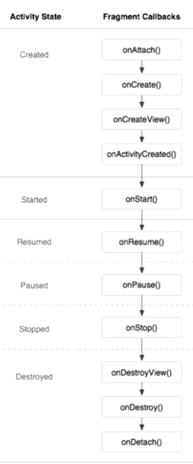

# 概念题
collapsed:: true
	- ## 1. 请简述Fragment的意义？#Card
		- 1.5 ==**Fragment可以增强UI布局的灵活性**==，实现动态的改变UI布局；增删Fragment
		- [[#red]]==**一个Activity可以有多个Fragment**==，一个Fragment也可以被多个Activity重复使用；
	- ## 2. 将一个Fragment添加到Activity布局的方式有几种？#Card
		- 2.1 xml中通过fragment标签加入（静态加入）
		- 2.2 通过代码动态的加入（动态加入）
	- ## 4.怎么为Fragment绑定UI布局？
	  collapsed:: true
		- 复写onCreateView方法
		  inflate方法有三个参数
		  
		  参数1：需要绑定的Layout的资源Id
		  参数2：绑定Layout布局的父视图
		  参数3：是否将参数1的Layout资源依附于参数2的ViewGroup之上
		  注意了：不管参数3是否为true都依附，系统默认已经将Layout插入至ViewGroup上如果为true，将添加一层冗余的视图
	- ## 5.怎么去管理Fragment？#Card
		- 通过getFragmentManager()方法获取FragmentManager实例
		- 1、manager.findFragmentById()或者findFragmentByTag()方法来[[#red]]==**获取一个Fragment**==
		- 2、调用popBackStack方法将Fragment从后退站中弹出
		- 3、调用addOnBackChangedListener()方法注册监听器，用于监听后退站的变化
	- ## 6.执行Fragment的事务，事务有什么特点？#Card
		- 1、[[#red]]==**每个事务都表示执行一组变化**==，这些变化包括add()、remove()、replace（）、addToBackStack()、setCustomAnimations、setTransition
		- 2、事务要生效必须调用commit,[[#red]]==**commit并不会立即执行，只能等待UI主线程空闲时才能执行**==
		- 3、也可以调用==**executePendingTransactions立即生效提交事务**==，commit在调用时机是Activity状态保存之前进行，也就是说如果在离开Activity是进行提交事务的操作，系统就会抛出异常
	- ## 10. Activity和Fragment 的 onActivityForResult 回调？#Card
		- ### 1、Fragment里面调用==**startActivityForResult**==
			- Activity和Fragment里面的onActivityForResult都会回调，[[#red]]==**只不过Fragment里面回调的requestCode是正确的**==
		- ### 2、Fragment里面调用==**getActivity().startActivityForResult**==的时候
			- 只在Activity里面回调onActivityForResult
		- ### 3、当Fragment存在多层嵌套的情况，内层的Fragment调用startActivityForResult的时候
			- onActivityForResult方法不回调，此时需要创建一个BaseActivity复写它的onActivityResult方法
		- 代码
		  collapsed:: true
			- ```java
			  
			  public class BaseFragmentActiviy extends FragmentActivity {
			   private static final String TAG = "BaseActivity";
			   
			   @Override
			   protected void onActivityResult(int requestCode, int resultCode, Intent data) {
			    FragmentManager fm = getSupportFragmentManager();
			    int index = requestCode >> 16;
			    if (index != 0) {
			     index--;
			     if (fm.getFragments() == null || index < 0
			       || index >= fm.getFragments().size()) {
			       Log.w(TAG, "Activity result fragment index out of range: 0x" + Integer.toHexString(requestCode));
			      return;
			     }
			     Fragment frag = fm.getFragments().get(index);
			     if (frag == null) {
			      Log.w(TAG, "Activity result no fragment exists for index: 0x"
			        + Integer.toHexString(requestCode));
			     } else {
			      handleResult(frag, requestCode, resultCode, data);
			     }
			     return;
			    }
			   
			   }
			  ```
		- 代码
		  collapsed:: true
			- ```java
			   /**
			    * 递归调用，对所有子Fragement生效
			    * 
			    * @param frag
			    * @param requestCode
			    * @param resultCode
			    * @param data
			    */
			   private void handleResult(Fragment frag, int requestCode, int resultCode,
			     Intent data) {
			    frag.onActivityResult(requestCode & 0xffff, resultCode, data);
			    List<Fragment> frags = frag.getChildFragmentManager().getFragments();
			    if (frags != null) {
			     for (Fragment f : frags) {
			      if (f != null)
			       handleResult(f, requestCode, resultCode, data);
			     }
			    }
			   }
			  
			  10.3.2 启动Activity的时候一定要用根Fragment
			  /**
			    * 得到根Fragment
			    * 
			    * @return
			    */
			   private Fragment getRootFragment() {
			    Fragment fragment = getParentFragment();
			    while (fragment.getParentFragment() != null) {
			     fragment = fragment.getParentFragment();
			    }
			    return fragment;
			   
			   }
			   
			   /**
			    * 启动Activity
			    */
			   private void onClickTextViewRemindAdvancetime() {
			    Intent intent = new Intent();
			    intent.setClass(getActivity(), YourActivity.class);
			    intent.putExtra("TAG","TEST"); 
			    getRootFragment().startActivityForResult(intent, 1001);
			   }
			  ```
			  ```
			  ```
	- ## 11. Fragment的View重复添加导致的崩溃问题？
	  collapsed:: true
		- 如果把该view添加到父view那么也会引起重复添加而导致崩溃
		- ```java
		  @Override
		  public View onCreateView(LayoutInflater inflater, ViewGroup container,
		  Bundle savedInstanceState) {
		  if (view == null) {
		      view = inflater.inflate(R.layout.dd_fragment_year, container, false);
		  }
		  
		  ViewGroup viewGroup = (ViewGroup) view.getParent();  
		  if (viewGroup != null){
		      viewGroup.removeView(view);
		  } 
		  return view;
		  }
		  ```
	- ## 14、Fragment、FragmentManager、FragmentTransaction关系#Card
		- ## Fragment
			- 其实是对 View 的封装，它持有 view, containerView, fragmentManager,childFragmentManager 等信息
		- ## FragmentManager
			- 是一个抽象类，它定义了对==**一个 Activity/Fragment 中 添加进来的 Fragment 列表**==、Fragment 回退栈的操作、管理方法
			- 还定义了[[#red]]==**获取事务对象的方法**==
			- 具体实现在 FragmentManagerImpl 中
		- ## FragmentTransaction：定义了事务操作的方法
			- add() hide() show() remove() replace()等方法，还有四种提交方法
			- 具体实现是在 [[#red]]==**BackStackRecord**== 中
	- ## 15、Fragment 如何实现布局的添加替换
		- 通过获得当前 Activity/Fragment 的 FragmentManager/ChildFragmentManager，进而拿到事务的实现类 BackStackRecord，它将目标 Fragment 构造成 Ops（包装Fragment 和状态信息），然后提交给FragmentManager 处理。
		- 如果是异步提交，就通过 Handler 发送 Runnable 任务，FragmentManager 拿到任务后，先处理 Ops状态，然后调用 moveToState() 方法根据状态调用 Fragment 对应的生命周期方法，从而达到Fragment 的添加、布局的替换隐藏等。
		- 下面这张图从下往上看就是一个 Fragment 创建经历的方法：
			- 
	- ## 16、嵌套Fragment的原理
	  collapsed:: true
		- 也比较简单，Fragment 内部有一个 childFragmentManager，通过它管理子 Fragment。
		- 在添加子 Fragment 时，把子 Fragment 的布局 add 到父 Fragment 即可
- # 常见问题
  collapsed:: true
	- ## 3. 简述Fragment生命周期，常用的回调方法有几个？#Card
	  collapsed:: true
		- 
		- [[Activity和Fragment生命周期匹配]]
		-
		- onActtch:初始化Fragment 事件回调接口
		- onCreate：初始化参数
		- onCreateView：为Fragment绑定布局
		- onViewCreated：进行控件实例化操作
		- onPause：在用户离开Fragment是所进行的一些数据持久化操作
		  当Activity的onCreate方法被回调时会导致fragment方法的onAttach()、onCreate()、onCreateView()、onActivityCreate() 被连续回调
	- ## 12. Fragment的getActivity方法返回null的原因：#Card
	  collapsed:: true
		- ## getActivity = null原因
			- 如果**==系统内存不足、或者切换横竖屏、或者app长时间在后台运行，Activity都可能会被系统回收==**，但是[[#red]]==**Fragment并不会随着Activity的回收而被回收，从而导致Fragment丢失对应的Activity。**==
			- ## 详细
			- >假设我们继承于FragmentActivity的类为MainActivity，其中用到的Fragment为FragmentA。
			- 1、某种原因系统回收MainActivity——FragmentA被保存状态未被回收
			- 2、再次点击app进入——首先加载的是未被回收的FragmentA的页面——由于MainActivity被回收，系统会重启MainActivity，
			- 3、FragmentA也会被再次加载——页面出现混乱，因为一层未回收的FragmentA覆盖在其上面——（假如FragmentA使用到了getActivity()方法）会报NullPointerException：
		- [[#red]]==**方案1：**==在使用Fragment的Activity中==**重写onSaveInstanceState方法**==，将super.onSaveInstanceState(outState)注释掉，==**让其不再保存Fragment的状态**==，达到其随着MainActivity一起被回收的效果。
		- ==**方案2：**==在再次启动Activity的时候，在[[#red]]==**onCreate方法中将之前保存过的fragment状态清除**==,代码示例如下：
			- ```csharp
			  if(savedInstanceState!= null）{
			    String FRAGMENTS_TAG = "android:support:fragments"; 
			    savedInstanceState.remove(FRAGMENTS_TAG);
			  }
			  ```
		- [[#red]]==**方案3：**==避免使用getActivity方法得到activity，如果确实需要使用上下文，可以写一个类MyApplication继承Application,并且写一个方法getContext(),返回一个Context 对象。代码示例如下：
			- ```java
			  public class MyApplication extends Application {
			    private static Context context;
			   @Override
			    public void onCreate() {
			        super.onCreate();
			         context = this;
			  ｝
			    public static Context getContext() {
			        return context;
			     }
			  ｝
			  ```
- # 事务相关
	- ## [[事务相关方法解释]]
	- ## 2、[[add 和 replace 的区别？]]
	- ## 9.如何实现多个Fragment之间的灵活切换？
	  collapsed:: true
		- ```csharp
		  public void switchContent(Fragment from, Fragment to) {
		    FragmentTransaction transaction = getSupportFragmentManager().beginTransaction();
		    if (!to.isAdded()) {
		        transaction.hide(from).add(R.id.frame_content, to).commit();
		    } else {
		        transaction.hide(from).show(to).commit();
		   }
		  }
		  ```
	- ## 18、[[事务操作Fragment主流程？]]
	- ## 17、hide,show 和 add，remove 区别？#card
		- hide和show 不会执行 Fragment相应的生命周期
	- ## 18、[[事务的四种提交方式]]
	- ### [[Fragment中add、attach、detach、remove、hide、show、replace等方法的区别与使用]]
- # Fragment和Jetpack相关的#Card
	- Jetpack一般都是单Activity，多Fragment的场景。因为Fragment切换，不需要AMS和底层交互
	- ## 1、Fragment之间怎么传值？
		- 那么可以Activity创建ViewModel,多个Fragment共享。
	- ## 2、Navigation 插件传值
- # [[Fragment的懒加载]]
- # 19 [Fragment相关 面试题](https://blog.csdn.net/xuwb123xuwb/article/details/116199192)