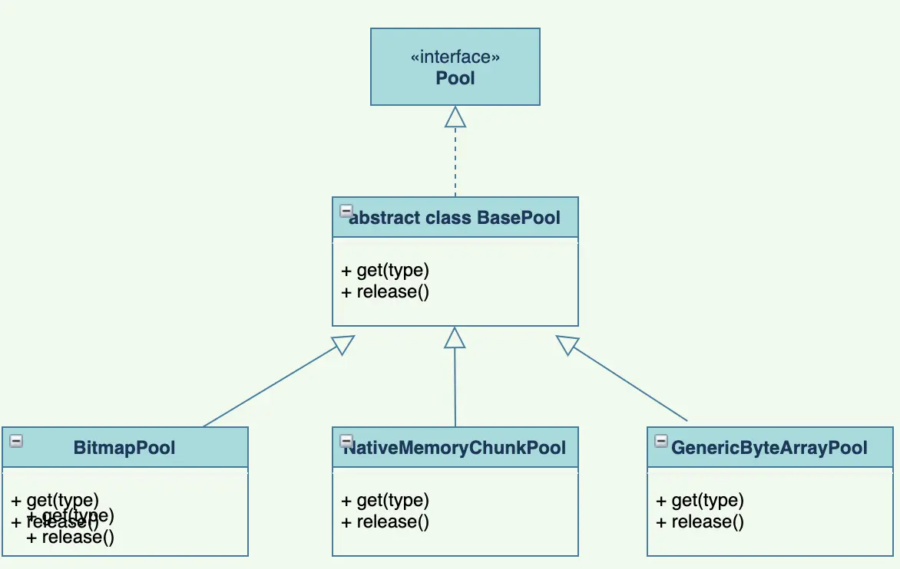
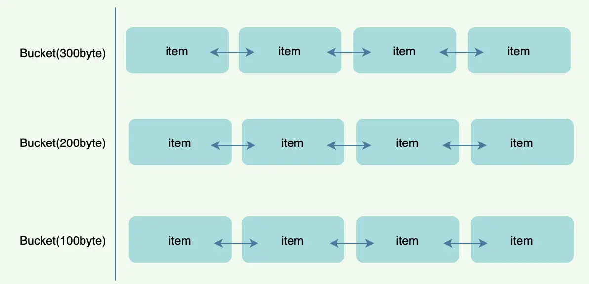

- 图
  collapsed:: true
	- 
- ## 一、对象池关键点
  collapsed:: true
	- 1、返回一个等于或大于对象大小的空间，如果对象池有直接返回，没有则创建后再返回。懒加载方式
	- 2、对象池订阅了MemoryTrimmableRegistry，可以监听低内存事件，释放一部分或全部对象池对象
	- 3、内存大小三种不同概念
	  collapsed:: true
		- 逻辑大小紧紧是值的大小，例如，对于字节数组，大小就是长度。对于位图来说，大小就是像素的数量。
		- 桶形尺寸通常代表一组离散的逻辑尺寸-这样每个桶形尺寸可以容纳一个逻辑尺寸范围。例如，对于字节数组，使用桶大小的2的乘方可以让这些字节数组支持许多逻辑大小。
		- size -in-bytes就是以字节为单位的值的大小。
	- 4、复用对象池和使用完需释放对象到对象池，必须成对出现
	  对象池大小需有上限
- ## 二、Fresco对象池具体实现
  collapsed:: true
	- 关键点
	  collapsed:: true
		- 1对 象池的结构
		  final SparseArray<Bucket<V>> mBuckets;每个Bucket是一个双向链表
		- 2对象池根据配置的多个具体空间大小值实例化多个桶，每个桶初始自由链表个数为0
		- 3从对象池get空间时，对象池没有则new大小空间对象
		- 4释放对象后，将该对象放入对象池
	- 图
	  collapsed:: true
		- 
	- Bucket
		- Bucket通过队列(LinkedList)维护了一组空闲且相同大小的值称为自由链表，通过BasePool.get(Object)请求时会找到一个合适的Bucket，如果自由链表不为空则返回一个值并从自由链表删除
		  collapsed:: true
			- ```
			    public V get() {
			      V value = mFreeList.poll();
			      if (value != null) {
			        //bucket还维护了当前“正在使用”的项(来自这个bucket)的数量,
			  	// 桶的“长度”是桶中当前正在使用的值的数量(mInUseLength)，加上自由列表的大小
			        mInUseLength++;
			      }
			      return value;
			    }
			  ```
		- 当一个值通过调用BasePool.release(Object)被释放到存储池中时，存储池会找到合适的存储池，并将该值返回给存储池的自由列表
		  collapsed:: true
			- ```
			   public void release(V value) {
			      Preconditions.checkNotNull(value);
			      ...
			        if (mInUseLength > 0) {
			          mInUseLength--;
			          mFreeList.add(value);
			        } else {
			          FLog.e(TAG, "Tried to release value %s from an empty bucket!", value);
			        }
			      }
			    }
			  ```
		- 实例化并填充mBuckets
		  collapsed:: true
			- ```
			   private void fillBuckets(SparseIntArray bucketSizes) {
			      mBuckets.clear();
			      for (int i = 0; i < bucketSizes.size(); ++i) {
			  	// 桶的每个元素空间的大小
			        final int bucketSize = bucketSizes.keyAt(i);
			  	// 每个桶自由链表长度
			        final int maxLength = bucketSizes.valueAt(i);
			        mBuckets.put(
			            bucketSize,
			  	// 一个桶内的所有元素空间都是一样大
			            new Bucket<V>(
			                getSizeInBytes(bucketSize), maxLength, 0, mPoolParams.fixBucketsReinitialization));
			      }
			    }
			  ```
		-
- ## 三、获取对象池对象
  collapsed:: true
	- 关键点
		- 1一个软上限，达到这个上限需要调整对象池大小，将超过软上限的空间去掉，直到低于软上限空间
		- 2硬上限，超过直接抛异常
	- 从池中获取一个新的“值”(如果可用)。在必要时分配一个新值。如果我们需要执行分配，—如果池大小超过max-size软上限，那么我们尝试修剪池的空闲部分。-如果池大小超过max-size硬上限(在调整后)，那么我们抛出一个BasePool.PoolSizeViolationException
		- ```
		  public V get(int size) {
		  	 // 首先确保没有超过软上限
		      ensurePoolSizeInvariant();
		  
		      int bucketedSize = getBucketedSize(size);
		      int sizeInBytes = -1;
		  
		      synchronized (this) {
		  	// 取出一个Bucket，如果对象池（没有则new一个Bucket并放入对象池，需要准许new新对象的条件），所以对象池的大小可能会超过设置的最大临界值
		        Bucket<V> bucket = getBucket(bucketedSize);
		  
		        if (bucket != null) {
		          // find an existing value that we can reuse
		          V value = bucket.get();
		          if (value != null) {
		            Preconditions.checkState(mInUseValues.add(value));
		  
		            // It is possible that we got a 'larger' value than we asked for.
		            // lets recompute size in bytes here
		            bucketedSize = getBucketedSizeForValue(value);
		            sizeInBytes = getSizeInBytes(bucketedSize);
		            mUsed.increment(sizeInBytes);
		            mFree.decrement(sizeInBytes);
		            mPoolStatsTracker.onValueReuse(sizeInBytes);
		            logStats();
		            if (FLog.isLoggable(FLog.VERBOSE)) {
		              FLog.v(
		                  TAG,
		                  "get (reuse) (object, size) = (%x, %s)",
		                  System.identityHashCode(value),
		                  bucketedSize);
		            }
		            return value;
		          }
		          // fall through
		        }
		        // check to see if we can allocate a value of the given size without exceeding the hard cap
		        sizeInBytes = getSizeInBytes(bucketedSize);
		  	// 判断是否可以分配当前大小的空间，如果超过了硬上限则抛异常.
		  	// 走到这里证明对象池没有对应大小的缓存，所以需要直接分配一块内存，所以先判断是否满足分配要求，根据设置的硬上限和软上限
		        if (!canAllocate(sizeInBytes)) {
		          throw new PoolSizeViolationException(
		              mPoolParams.maxSizeHardCap,
		              mUsed.mNumBytes,
		              mFree.mNumBytes,
		              sizeInBytes);
		        }
		  
		        // Optimistically assume that allocation succeeds - if it fails, we need to undo those changes
		        mUsed.increment(sizeInBytes);
		        if (bucket != null) {
		          bucket.incrementInUseCount();
		        }
		      }
		  
		      V value = null;
		      try {
		        // allocate the value outside the synchronized block, because it can be pretty expensive
		        // we could have done the allocation inside the synchronized block,
		        // but that would have blocked out other operations on the pool
		        value = alloc(bucketedSize);
		      } catch (Throwable e) {
		        // Assumption we made previously is not valid - allocation failed. We need to fix internal
		        // counters.
		        synchronized (this) {
		          mUsed.decrement(sizeInBytes);
		          Bucket<V> bucket = getBucket(bucketedSize);
		          if (bucket != null) {
		            bucket.decrementInUseCount();
		          }
		        }
		        Throwables.propagateIfPossible(e);
		      }
		  
		      // NOTE: We checked for hard caps earlier, and then did the alloc above. Now we need to
		      // update state - but it is possible that a concurrent thread did a similar operation - with
		      // the result being that we're now over the hard cap.
		      // We are willing to live with that situation - especially since the trim call below should
		      // be able to trim back memory usage.
		      synchronized(this) {
		        Preconditions.checkState(mInUseValues.add(value));
		        // If we're over the pool's max size, try to trim the pool appropriately
		        trimToSoftCap();
		        mPoolStatsTracker.onAlloc(sizeInBytes);
		        logStats();
		        if (FLog.isLoggable(FLog.VERBOSE)) {
		          FLog.v(
		              TAG,
		              "get (alloc) (object, size) = (%x, %s)",
		              System.identityHashCode(value),
		              bucketedSize);
		        }
		      }
		  
		      return value;
		    }
		  
		  ```
- ## 四、释放对象到对象池
	- 关键点
	  只有对象池设置了对应空间大小的key（比如key是330个字节），这个对象才能放到对象池。所以如果对象是直接从对象池取的那可以放回对象池，如果不是则丢弃。当然这种情况如果想要放到对象池则Fresco提供了对应的开关设置
		- ```
		  ```
-