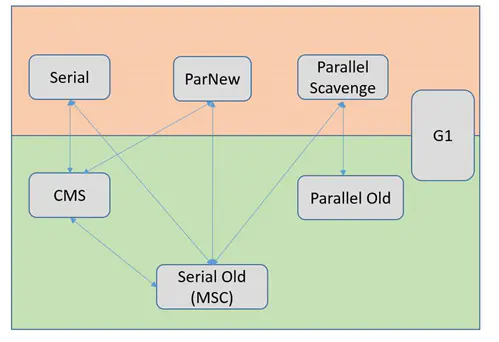
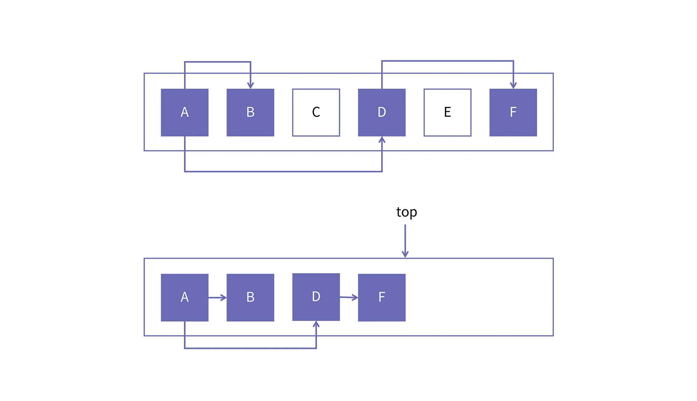
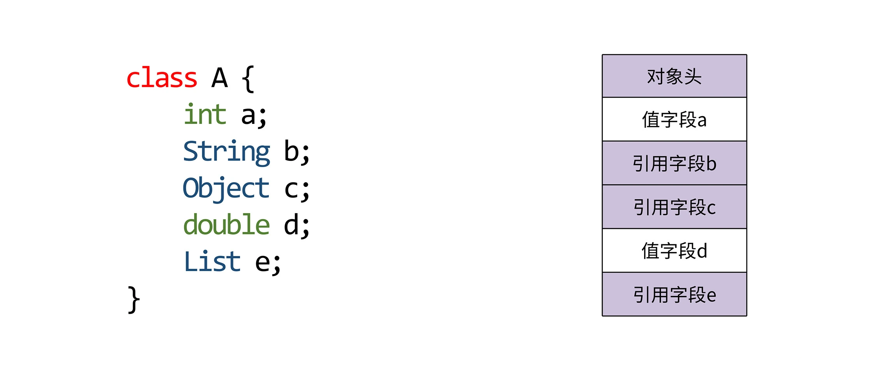
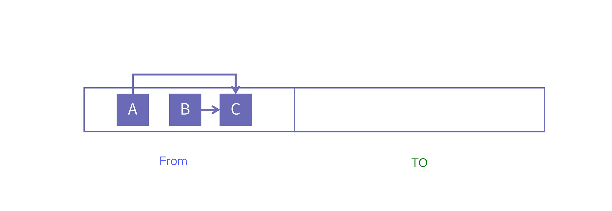

## 一、为什么需要GC
Java 程序员都知道对象初始化的重要性，我们要使用一个对象，必须先为其分配内存空间进行初始化，而使用完了对象后，我们很少关注要如何处理那些对象，可能会在明确对象不再使用的地方将对象设置为 null。而系统内存空间是有限的，操作系统允许一个应用程序占用的最大内存也是有限制的，当程序员“不羁放纵爱自由”地创建了很多对象后，JVM 垃圾回收器默默地在后台维护和清理了不需要的对象占用的内存空间。

垃圾回收器是一种动态存储分配器，它自动释放程序不再需要的已分配的内存块，这些块称为“垃圾”，也就是不再被引用的对象。自动回收垃圾的过程则称为垃圾回收（Garbage Collection），简称 GC。在一个支持垃圾收集的语言中，程序显式地申请内存，但从不需要显式地释放它们，垃圾收集器会定期识别垃圾块，并将垃圾块放回空闲链表中。GC 技术帮助程序员实现自动管理内存，程序员可以将注意力集中在业务逻辑，从繁重的内存管理中解放出来，而像 C 语言的 malloc 是一个不带 GC 功能的分配器，程序员显式调用 malloc 分配内存后需要显式调用 free 来释放它，否则会出现内存泄露、悬空指针等内存问题。
## 二、GC的算法分类
### 引用计数法
每个对象都有一个引用计数器，当对象被引用一次则计数器加1，当对象引用失效一次则计数器减1，对于引用数为0的对象意味着是垃圾对象，可以被GC回收。
### 可达性算法
从GC roots开始搜索，整个连通图中的对象都是活对象，对于GC Roots无法到达的对象便成了垃圾回收的对象，随时可被GC回收。
- ### 分代收集理论
  * 当前商业虚拟机的垃圾收集器，大多数都遵循了“分代收集”(Generational Collection)的理论进行设计，分代收集名为理论，实质是一套符合大多数程序运行实际情况的经验法则，它建立在两个分代假说之上：
    1. 弱分代假说(Weak Generational Hypothesis):绝大多数对象都是朝生夕灭的
    2. 强分代假说(Strong Generational Hypothesis):熬过越多次垃圾收集过程的对象就越难以消亡。
    3. 根据以上两条分代假说可推理出：**跨代引用假说** 跨代引用相对于同代引用来说仅占极少数
  * 对应的可以在Java堆划分出不同的区域，垃圾收集器每次只回收其中某一个或者某些部分的区域 ——因而就有了“Minor GC”，“Major GC”，“Full GC”这样的回收类型的划分;也就能够针对不同的区域安排与里面存储对象存亡特征相匹配的垃圾收集算法——因此发展出了“标记-复制算法”“标记-清除算法”，“标记-整理算法”等针对性的垃圾收集算法；
  ```
  Minor GC/Young GC：针对新生代的垃圾收集
  Major GC/Old GC：针对老年代的垃圾收集
  MixedGC：针对于新生代与部分老年代的垃圾收集
  Full GC：针对于整个Java堆和方法区(MetaSpace元空间) 的垃圾收集
  ```
   
## 三、经典 GC 算法详解
### 1、copy算法
* 1963年Marvin Minsky提出：这个算法的基本思想是把某个空间里的活跃对象复制到其他空间，把原来的空间全部清空，这就相当于是把活跃的对象从一个空间搬到新的空间。因为这种复制具有方向性，所以我们把原空间称为From空间（分配空间），把新的目标空间称为 To 空间（幸存者空间）
* 最基础copy算法可以将堆平分两份，但太浪费了，GC年轻代默认按照8:1:1分配；
- #### 对象分配
  * 碰撞指针分配对象：对象之间没有任何空隙，不会产生内存碎片；
  
  
- #### 对象回收
  * 可达性分析算法需要找到GCroot，能作为GCront的对象有：
    1. 虚拟机栈中的引用的对象
    2. 类静态属性引用的对象
    3. 常量引用的对象
    4. 本地方法栈中的JNI（native方法）引用的对象
  * 可达性基本思想：由以上对象引用链构成一张图，如果从根出发，开始对图进行遍历，能够遍历到就是活跃对象，否则为垃圾对象；
  * 如何将对象之间引用关系抽象成图呢？我们看JVM中java对象在内存中构成：[Oop-Klass模型](https://juejin.cn/post/6844904054561193992)
  
   
  
  * 根据klass快速获取哪些位置存放为引用字段，若为引用，且引用不为null,就表示当前对象引用了其他对象。这样从根引用出发就可以构建一张图；
  * 一般对图遍历有两种算法： **深度优先遍历（DFS）** 和 **广度优先遍历（BFS）**
- #### DFS在Copy中实现
  
  1. 比如有如下引用关系A,B,C都是活跃对象，我们如何进行深度优先遍历Copy呢？
  
   
  
  2. 遍历过程中，A拷贝到To space,然后C又拷贝过去，此时空间引用时将是这样的！
  
  
  3. 若当拷贝B后再将C拷贝一份，则To中又两个C了，如何解决呢？
    * 使用forwarding指针：在每个对象头部引入一个新的field,即forwarding，正常状态下，其值为null,如果一个对象被拷贝，就把它的新地址设到From空间对象的forwarding指针中；
  
#### BFS与DFS在copy算法中对比
* 举例对比方能解释明晰：
```
class A {
  public B b1;
  public B b2;
  public A() {
      b1 = new B();
      b2 = new B();
  }
}
class B {
  public C c1;
  public C c2;
  public B() {
      c1 = new C();
      c2 = new C();
  }
}
class C {
}
```

1. 对于以上对象，在From空间布局如下所示：


2. 我们开始从A用DFS遍历，拷贝至TO空间


3. 对A的属性扩展，先访问属性b1引用的对象，即把b1指向对象拷贝至TO空间


4. 接着我们拷贝c1所引用的C对象,这部完成以后开始退栈（DFS依靠栈，BFS依靠队列实现）


5. 依次退栈，直到完成copy后布局如下：

* 经过以上步骤，不知你发现什么没有： 对比起始于结束箭头，会发现变简约好多啊，箭头代表了引用关系，说明具有引用关系的对象在新空间中距离更近了！这有啥用呢？
#### DFS总结
* **优点：** 编程中如果访问一个对象，马上就会访问它的属性，而又因为CPU缓存机制，在读取某个对象时，又很大概率会把它后面的对象一起读进来。而经过DFS遍历后，拥有引用关系极大可能会在同一个缓存中，即读 A 对象的时候，把它后面的 B 和 C 对象都能加载进缓存，那么，a.b1.c1 这种写法就可以立即命中缓存；
* **缺点：** 需要维护一个额外的辅助数据结构栈；
#### BFS总结
* 你可以对应的使用BFS遍历上方举例，它的优缺点刚好与深度优先搜索相反；
* 优点：无需额外空间，其所需的队列，巧妙地隐藏在了 To 空间中；
* 缺点：有引用关系的对象之间的距离就会比较远，这将不利于业务线程运行期的缓存命中；

* 深度优先搜索的非递归写法需要占用额外的空间，但有利于提高业务线程运行期的缓存命中率。而广度优先搜索则与其相反，它不利于运行期的缓存命中，但算法的执行效率更高。所以 JDK6 以前的 JVM 使用了广度优先的非递归遍历，而在 JDK8 以后，已经把广度优先算法改为深度优先了，尽管这样做需要额外引用一个独立的栈。
### 2、CMS算法
* CMS（Concurrent Mark Sweep）是一款里程碑式的垃圾收集器，为什么这么说呢？
* 在它之前，GC线程和用户线程是无法同时工作的，即使是Parallel Scavenge，也不过是GC时开启多个线程并行回收而已，GC的整个过程依然要暂停用户线程，即Stop The World。这带来的后果就是Java程序运行一段时间就会卡顿一会，降低应用的响应速度，这对于运行在服务端的程序是不能被接收的。
* CMS过程图大家都很熟悉，但是对于他如何实现并发你真的了解吗？


#### 三色标记
* Serial、ParNew等垃圾收集器会简单粗暴的等所有线程进行安全点后STW；而CMS、G1等垃圾收集器采取了并发标记的策略；
* 在并发标记的过程中，对象间的引用关系也一直在发生改变：如原本与GCRoots存在间接引用的节点在并发标记过程中断连了，而这会产生并发的问题，如何解决？使用三色标记算法进行分析;
* 三色标记，即通过不同的颜色标记处于不同标记状态的对象

#### 漏标
* 对于一个本来不应该被回收的对象，却被标记成白色；
```
public class ThreeColorRemark {

  private static A a ;
  public static void main(String[] args) {
      creatClassA();
      //并发标记
      a.d = a.b.d ;
      a.b.d = null ;
  }
  private static void creatClassA() {
      a = new A();
      return; //安全点
  }
}
class A{
  B b = new B();
  D d = null;
}
class B{
  C c = new C();
  D d = new D();
}
class C{}
class D{}
```


* 对于以上黑色指向了未被标记的白色，将会导致白色对象不会再被扫描到而漏标，运行时会导致空指针；CMS时如何避免呢？

#### 增量更新
* 通过破坏第一条规则实现：依靠写屏障

#### 写屏障write barrier
* 给某个对象的成员变量赋值前后加入一些处理，类似于AOP. [C++源码](http://hg.openjdk.java.net/jdk8/jdk8/hotspot/file/87ee5ee27509/src/share/vm/oops/oop.inline.hpp)

```
/**
 * @param field ：某对象的属性 a.b.d
 * @param new_value :新值 如null
 */
void oop_field_store(oop* field , oop new_value){
  pre_write_barrier(field);  //写屏障 --- 写前屏障（G1使用）
  *field = new_value ; //赋值操作
  post_write_barrier(field , value); //写屏障---写后屏障（CMS使用）
}

//c++ 源码
template <class T> inline void oop_store(volatile T* p, oop v) {
update_barrier_set_pre((T*)p, v);   // cast away volatile  写前屏障
// Used by release_obj_field_put, so use release_store_ptr.
oopDesc::release_encode_store_heap_oop(p, v);
// When using CMS we must mark the card corresponding to p as dirty
// with release sematics to prevent that CMS sees the dirty card but
// not the new value v at p due to reordering of the two
// stores. Note that CMS has a concurrent precleaning phase, where
// it reads the card table while the Java threads are running.
update_barrier_set((void*)p, v, true /* release */);    // cast away type 写后屏障
}

inline void update_barrier_set(void* p, oop v, bool release = false) {
assert(oopDesc::bs() != NULL, "Uninitialized bs in oop!");
oopDesc::bs()->write_ref_field(p, v, release);
}

template <class T> inline void update_barrier_set_pre(T* p, oop v) {
oopDesc::bs()->write_ref_field_pre(p, v);
}
```
#### 写屏障实现增量更新
* 当对象A的成员变量的引用发生变化时，比如新增引用（a.d = D）,利用写后屏障将A新的成员变量引用对象D记录下来（先赋值，在收集引用）
```
//CMS 增量更新使用
void post_write_barrier(oop* field , oop new_value){
  remark_set.add(new_value); //记录新引用的对象
}
```
#### 写屏障实现SATB
* 当对象B的成员变量的引用发生变化时，比如新增引用（b.d = null）,利用写前屏障将B旧的成员变量引用对象D记录下来（先收集引用，后赋值）
```
//G1 SATB 使用
void pre_write_barrier(oop* field){
  oop old_value = *field; //获取旧值
  remark_set.add(old_value); //记录原来引用的对象
}
```
* 有兴趣同学可以查看[Hotspot实现类](https://android.googlesource.com/platform/libcore/+/871832c718f9e5c91134f9b935360cae17075278/hotspot/src/share/vm/gc/g1/g1SATBCardTableModRefBS.cpp)： 存放到子Thread的内存队列中，避免对当前写操作产生影响；
```
void G1SATBCardTableModRefBS::enqueue(oop pre_val) {
// Nulls should have been already filtered.
assert(pre_val->is_oop(true), "Error");

if (!JavaThread::satb_mark_queue_set().is_active()) return;
Thread* thr = Thread::current();
if (thr->is_Java_thread()) {
  JavaThread* jt = (JavaThread*)thr;
  jt->satb_mark_queue().enqueue(pre_val);  //JavaThread中satb队列中入队原来旧值
} else {
  MutexLockerEx x(Shared_SATB_Q_lock, Mutex::_no_safepoint_check_flag);
  JavaThread::satb_mark_queue_set().shared_satb_queue()->enqueue(pre_val);
}
}
```
#### 跨代引用问题
* 对于跨代引用，比如minor GC/younger GC 遇到老年代引用年轻代对象，如果每次都扫描老年代效率太低了，如何提效呢？
##### 记录集
* 在新生代中可以开辟一块空间，引入记录集（Remember Set）的数据结构（记录从非收集区到收集区的指针集合），由于以上分析跨代引用相对比较少，因此记录集的数据有限，不会特别大；
* 分类：
1. 字长精度：每个记录精确到一个机器字长(就是处理器的寻址位数，如常见的32位或64位，这个 精度决定了机器访问物理内存地址的指针长度)，该字包含跨代指针。

2. 对象精度:每个记录精确到对象，该对象里有字段含跨代指针。

3. 卡精度:每个记录精确到一块内存区域，该内存区域有对象含有跨代指针。

* HotSpot JVM，使用了卡标记（Card Marking）技术来解决老年代到新生代的引用问题。具体是，使用卡表（Card Table）和写屏障（Write Barrier）来进行标记并加快对GC Roots的扫描
##### 卡表Card table
* 记忆集是一种抽象的数据结构，卡表是其实现形式，对于上方字长，对象等会导致随着对象的增多，记录集会变得很大，同时也不易维护；如何优化呢？使用压缩；

* 如何维护卡表呢？通过**写屏障**： 当对象的属性进行写操作时，跨代引用就有可能出现。所以，我们在这个时候可以检查是否存在跨代引用；
* 判断条件分成两种：
1. 当前老年代属性赋值时引用了年轻代对象
2. 原本在年轻代对象minor GC后晋升至老年代，此时遍历从这个对象出发的所有引用判断是否有年轻代对象
* 若满足以上两个条件之一，就将当前card table中对应的byte标记为1即dirty脏；但是对性能有两个影响
  1. 无条件写屏障带来的性能开销：虚拟机会为所有的赋值操作生成相应的指令，每次只要对引用进行了赋值操作，就会判断是否需要更新卡表，从而产生额外的开销，不过这个开销与MinorGC时扫描整个老年代的代价要低的多；
  2. 高并发下虚共享带来的性能开销，伪共享； CPU缓存行一般为64字节，对应卡页为64*512bytes = 32kb，不同线程对对象引用的更新操作，恰好位于同一个32KB区域内，则将会带来同步性能问题
* 优化：先检查当前卡表标记，只有当该卡表项未被标记过才将其标记为dirty

### 3、G1算法
*1. 既然已经有了几个强大的GC，为什么还要发布G1 GC？*

随着应用程序的业务逻辑越来越庞大、复杂，用户访问也越来越多，没有 GC 就不能保证应用程序正常运行，而经常 STW 的 GC 方案又跟不上实际的应用需求，所以需要不断尝试对 GC 进行优化。G1 GC 的目标就是为了适应现在不断扩大的内存和不断增加的处理器数量，进一步降低 GC 暂停时间，同时兼顾良好的吞吐量。

*2. G1 GC 是什么？*

官网上对G1 GC 的描述如下：
```
The Garbage-First (G1) collector is a server-style garbage collector, targeted for multi-processor machines with large memories. It meets garbage collection (GC) pause time goals with a high probability, while achieving high throughput. The G1 garbage collector is fully supported in Oracle JDK 7 update 4 and later releases. The G1 collector is designed for applications that:

* Can operate concurrently with applications threads like the CMS collector.
* Compact free space without lengthy GC induced pause times.
* Need more predictable GC pause durations.
* Do not want to sacrifice a lot of throughput performance.
* Do not require a much larger Java heap.
```
G1是一种服务器端的垃圾收集器，应用在多处理器和大容量内存环境中，在实现高吞吐量的同时，尽可能的满足垃圾收集对暂停时间的要求。它是专门针对以下应用场景而设计的: 
* 像CMS收集器一样，能与应用程序线程并发执行
* 整理空闲空间更快 
* 需要GC停顿时间更好预测
* 不希望牺牲大量的吞吐性能
* 不需要更大的Java Heap

*3. G1 的支持版本是什么？*

在JDK1.7版本中正式启用 G1，移除了 Experimental 的标识，JDK 9以后 G1 是默认的垃圾回收器，取代了 CMS 回收器以及 Parallel + Parallel 0ld 组合。G1 被Oracle官方称为“全功能的垃圾收集器”。

*4. G1 中的重要概念和原理有哪些？*

在 G1 的实现中引入了一些新的概念和算法，来实现 GC 的高吞吐量、低内存碎片、可预测的停顿时间等目标。
#### Region
传统的 GC 将内存空间划分为新生代、老年代和永久代（JDK 8 中去除了永久代，引入了元空间），各代的内存地址是连续的。


G1 也是分代的垃圾回收算法，不过 G1 的老年代和年轻代的存储地址是不连续的，每一代都使用了n个不连续的大小相同的Region，每个Region占有一块连续的虚拟内存地址。这就是 G1 引入的分区的概念，Region 的类型有 Eden、Survivor、Old、Humongous 四种，而且每个 Region 都可以单独进行管理。


其中 Humongous 是用来存放大对象的，如果一个对象的大小大于一个 Region 的 50%（默认值），那么我们就认为这个对象是一个大对象。为了防止大对象的频繁拷贝，我们可以将大对象直接放到 Humongous 中。

H-obj有如下几个特征：
* H-obj直接分配到了老年代，防止了大对象的反复拷贝移动
* H-obj在全局并发标记阶段的cleanup 和 full GC阶段回收
* 在分配H-obj之前先检查是否超过 initiating heap occupancy percent和the marking threshold, 如果超过的话，就启动global concurrent marking，为的是提早回收，防止 evacuation failures 和 full GC。

一个Region的大小可以通过参数-XX:G1HeapRegionSize设定，取值范围从1M到32M，且是2的指数。如果不设定，那么G1会根据Heap大小自动决定。
#### SATB
SATB 的英文全称是 Snapshot-At-The-Beginning，其字面意思是 GC 开始时活着的对象的一个快照。根据前面介绍的三色标记算法，发生白对象漏标有两个前提条件：
1. Mutator赋予一个黑对象该白对象的引用
2. Mutator删除了所有从灰对象到该白对象的直接或者间接引用

对于第一个条件，在并发标记阶段，如果该白对象是new出来的，并没有被灰对象持有，那么它会不会被漏标呢？


每个Region中有两个标记位图：next和 prev，next 是本次标记的标 记位图，而 prev 是上次标记的标记位图，保存了上次标记的结果。上图中的 bottom 表示 Region 内众多对象的末尾，top 表示开头。另外有两个top-at-mark-start（TAMS）指针，分别为prevTAMS和nextTAMS。nextTAMS 保存了本次标记开始时的 top，而 prevTAMS 保存了上次标记开始时的 top。在并发标记阶段新创建的对象会在 top 之后的区域分配空间，它将直接被标记为黑色，这是一种隐式的标记。所以并发标记阶段新生成的对象不会被漏标。

而对于在GC时已经存在的白对象，如果它是活着的，它必然会被另一个对象引用，即条件二中的灰对象。如果灰对象到白对象的直接引用或者间接引用被替换了，或者删除了，那个白对象就会被漏标，从而导致被回收掉，这是非常严重的错误。

在 CMS GC 算法中解决白对象漏标问题采用了写屏障技术，当 B 对象对 C 对象的引用消失时，C 对象将会被标记为灰色。这个动作的效率是比较低的，如果都放在写屏障中做，会极大地影响程序性能，因为写屏障的逻辑是由业务线程执行的。

为了解决写屏障的性能问题，G1 将“C 对象标记为灰色”这件事情往后推迟了。业务线程只需要把 C 对象记录到一个本地队列中就可以了。每个业务线程都有一个这样的线程本地队列，它的名字是 SATB 队列。SATB 专用写屏障的伪代码如下所示：
```
1: def satb_write_barrier(field, newobj): 
2:      if $gc_phase == GC_CONCURRENT_MARK: 
3:          oldobj = *field 
4:          if oldobj != Null: 
5:              enqueue($current_thread.stab_local_queue, oldobj) 
6:
7:          *field = newobj
```
参数 field 表示被写入对象的域，参数 newobj 表示被写入域的值。第 2 行的 GC_CONCURRENT_MARK 用来表示并发标记阶段的标志位（flag）。第 4 行会检查当前是否处于并发标记阶段且被写入之前 field 域的值是不是 Null。如果检查通过，则在第 5 行将 oldobj 添加到 $current_thread.stab_local_queue 中。然后，在第 7 行进行 实际的写入操作。这个算法没有对 oldobj 进行任何标记处理。

上述SATB 写屏障的实现考虑了多线程环境的执行，第 5 行 $current_thread.stab_local_queue 是 mutator 各自持有的 线程本地队列，而非全局的队列，因此在执行 enqueue() 时不用担心 线程之间会发生资源竞争。 如下图每个线程有自己的本地 SATB 队列，当本地队列满了之后，就把它交给 SATB 队列集合，然后再领取一个空队列当做线程的本地 SATB 队列。GC 线程则会将 SATB 队列集合中的对象标记为灰色，至于什么时候标记，并不需要业务线程关心。


在并发标记阶段，GC 线程会定期检查 SATB 队列集合的大小。如果发 现其中有队列，则会对队列中的全部对象进行标记和扫描。前面已经讲 过，SATB 专用写屏障并不检查目标对象是否被标记，因此队列中可能存在已经被标记的对象，已经被标记的对象也不会再次被标记和扫描。
#### Collection Set
G1 的垃圾回收模式有两种：分别是 young GC 和 mixed GC。
* young GC：只回收年轻代的 Region
* mixed GC：回收全部的年轻代 Region，并回收部分老年代的 Region。

无论是 young GC 还是 mixed GC，都会回收全部的年轻代，mixed GC 回收的老年代 Region 是需要进行决策的（Humongous 在回收时也是当做老年代的 Region 处理的）。mixed GC 中选取的老年代对象 Region 的集合称之为回收集合（Collection Set，CSet），那么决定老年代 Region 是否被回收的因素具体有哪些呢？

CSet 的选取要素有以下两点：
1. 该 Region 的垃圾占比。垃圾占比越高的 Region，被放入 CSet 的优先级就越高，这就是垃圾优先策略（Garbage First），也是 G1 GC 名称的由来。
2. 建议的暂停时间。建议的暂停时间由 -XX:MaxGCPauseMillis 指定，G1 会根据这个值来选择合适数量的老年代 Region。

MaxGCPauseMillis 默认是 200ms，一般不需要进行调整，如果需要停顿时间更短可以对它进行设置，但是 MaxGCPauseMillis 设置的越小，选取的老年代 Region 就会越少，如果 GC 压力居高不下，就会触发 G1 的 Full GC。
#### Remember Set 和 Card Table
在 CMS GC 中也用到了 Remember Set（RSet） 和 Card Table（卡表）这两种记录集数据结构，它们是用于辅助 GC 的结构，是一种空间换时间的方式。

逻辑上每个 Region 都有一个对应的 RSet，RSet 中记录了其他 Region 中的对象引用了本 Region 的对象的关系，即谁引用了我，这种记录集被称为 point-in 类型，而 Card Table 则记录我引用了谁的对象，被称为 point-out 类型。

卡表是由元素大小为 1B 的数组实现的，卡表里的元素称为卡片。堆中大小适当的一段存储空间会对应卡表中的 1 个元素（卡片）。比如在某个版本 JDK 中，这个大小被定为 512B，当堆的大小是 1GB 时，可以计算出卡表的大小就是 2MB。G1 的 RSet 是在卡表的基础上实现的：每个 Region 会记录下别的 Region 有指向自己的指针，并标记这些指针分别在哪些 Card 的范围内。 这个RSet其实是一个哈希表，Key是别的 Region 的起始地址，Value 是一个集合，里面的元素是卡表的 Index。


上面图中表示了RSet、Card和Region的关系，每个Region被分成了多个Card，在不同Region中的Card会相互引用，Region1 和 Region3 中的 Card 中的对象引用了 Region2 中的 Card 中的对象，蓝色实线表示的就是 point-out 的关系，而在 Region2 的 RSet 中，记录了 Region1 和 Region3 的 Card，即红色虚线表示的关系，这就是point-in。
#### G1 如何维护跨区引用
每个 Region 的专属 RSet 中记录了其他 Region 的对象对本 Region 中对象的引用关系，那么有哪些引用关系需要加入 RSet 中呢？
1. 同一个 Region 中的对象之间的相互引用是不必维护的，因为不存在跨 Region 的问题；
2. 由年轻代 Region 出发到其他 Region 的，无论目标是年轻代还是老年代，这一类引用也都不用维护。因为结合 young GC 和 mixed GC 的策略可以知道，无论是什么回收模式，年轻代的全部 Region 都会被清理，这就意味着一定会对年轻代的所有对象进行遍历；
3. 从 CSet 集合的 Region 出发指向其他 Region 的，也不需要维护，理由和第 2 点是一样的。

因此，RSet 需要维护的引用关系只有两种：
* 非 CSet 老年代 Region 到年轻代 Region 的引用
* 非 CSet 老年代 Region 到 CSet 老年代 Region 的引用

RSet 中记录的也是 Card，根据上面的条件记录到 RSet 中的 Card 称为 Dirty Card。和 SATB 相似，业务线程也不是直接将 dirty card 放到 RSet 中的，而是在业务线程中引入一个叫做 dirty card queue（DCQ）的队列，在写屏障中，业务线程只需要将 dirty card 放入 DCQ 中，而不做非常细致的检查。然后，在 GC 线程中有一类叫 Refine 线程，它们会从 DCQ 中找到这种 dirty card，然后再去做更精细的检查，只有确实不属于上面所描述的三种情况的跨区引用，才真正放到专属 RSet 中去。
#### 停顿预测模型
G1 GC是一个响应时间优先的 GC 算法，它与 CMS 最大的不同是，用户可以设置整个 GC 过程的期望停顿时间，通过参数 *-XX:MaxGCPauseMillis* 指定一个 G1 收集过程目标停顿时间，默认值200ms，它不是硬性条件，只是期望值。那么G1怎么满足用户的期望呢？就需要这个停顿预测模型了。G1根据这个模型统计计算出来的历史数据来预测本次收集需要选择的Region数量，从而尽量满足用户设定的目标停顿时间。停顿预测模型是根据衰减标准偏差实现的：
```C++
//  share/vm/gc_implementation/g1/g1CollectorPolicy.hpp
double get_new_prediction(TruncatedSeq* seq) {
  return MAX2(seq->davg() + sigma() * seq->dsd(),
              seq->davg() * confidence_factor(seq->num()));
}
```
在这个预测计算公式中：davg 表示衰减均值，sigma()返回一个系数，表示信赖度，dsd 表示衰减标准偏差，confidence_factor 表示可信度相关系数。而方法的参数 TruncateSeq，表示一个截断的序列，它只跟踪了序列中的最新的 n 个元素。在G1 GC过程中，每个可测量的步骤花费的时间都会记录到TruncateSeq（继承了AbsSeq）中，用来计算衰减均值、衰减变量，衰减标准偏差等。
## 思考
1. 为何CMS使用增量更新，G1使用SATB?
* 我的理解：SATB相对增量更新效率会高(当然SATB会造成更多的浮动垃圾)，因为不需要在重新标记阶段再次深度扫描被删除引用对象，而CMS对增量引用的根对象会做深度扫描，G1因为很多对象都位于不同的region，CMS就一块老年代区域，重新深度扫描对象的话G1的代价会比CMS高，所以G1选择SATB不深度扫描对象，只是简单标记，等到下一轮GC再深度扫描。
  * 原始快照只是简单把要可能消失的对象标记为黑色对象，这样有可能会产生浮动垃圾，而增量更新会把新增的引用关系都重新扫描一遍，在重新标记阶段不会产生浮动垃圾；
  * 原始快照速度快，增量更新速度慢；
2. 如何衡量一个 GC 算法的好坏，以及如何选择 GC 算法？
### Refers To
[Getting Started with the G1 Garbage Collector](https://www.oracle.com/webfolder/technetwork/tutorials/obe/java/G1GettingStarted/index.html)
<br>[Tips for Tuning the Garbage First Garbage Collector](https://www.infoq.com/articles/tuning-tips-G1-GC/)