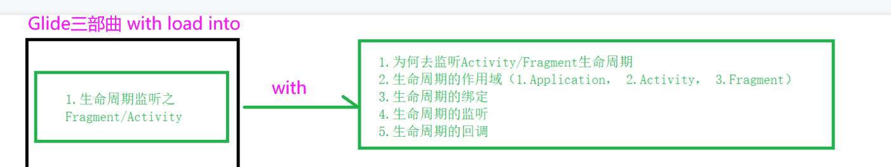
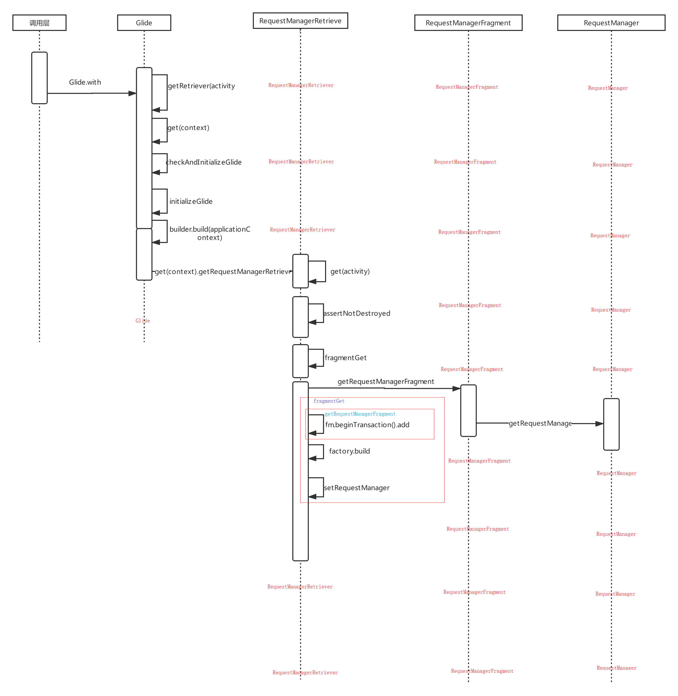
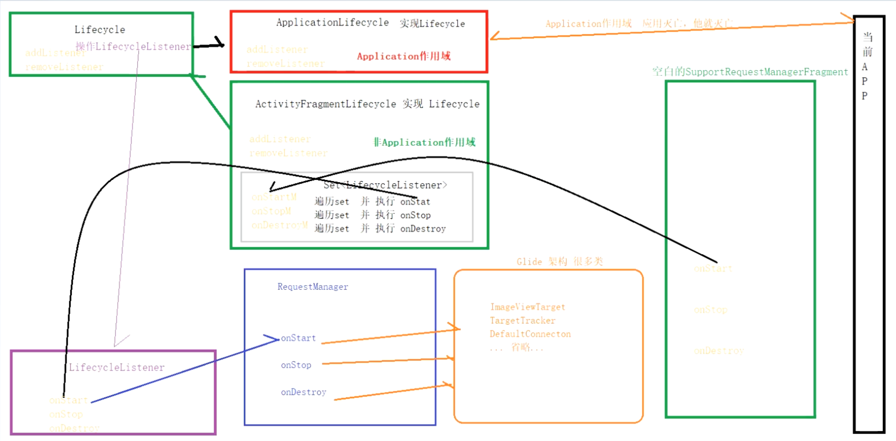

# 文章资料
	- ---20.12.29_1691907930016_0.pdf)
	- 
- # 时序图
  collapsed:: true
	- {:height 777, :width 749}
- # with中主要做的事情
	- 1、监听Activity/Fragment生命周期，网络变化监听，自动取消加载或者重新加载
- # 基本使用
  collapsed:: true
	- ```java
	  Glide.with(this).load("xx").into(ImageView(this))
	  ```
- # [[with函数多个重载->作用域]]
- # 生命周期监听逻辑
  collapsed:: true
	- ## 图
		- 
	- ## RequestManagerRetriever:管理RequestManager的
	- ## SupportRequestManagerFragment：监听生命周期空白Fragment（Androidx包下Fragment）
	  collapsed:: true
		- 持有下边的Lifecycle
			- 生命周期分发给lifecycle.lifecycle持有很多注册的LifecycleListener。其中之一就是RequestManager
	- ## RequestManagerFragment（app下的Fragment）空白Fragment
	- ## LifecycleListener：生命周期回调监听
		- 源码
		  collapsed:: true
			- ```java
			  public interface LifecycleListener {
			  
			    /**
			     * Callback for when {@link android.app.Fragment#onStart()}} or {@link
			     * android.app.Activity#onStart()} is called.
			     */
			    void onStart();
			  
			    /**
			     * Callback for when {@link android.app.Fragment#onStop()}} or {@link
			     * android.app.Activity#onStop()}} is called.
			     */
			    void onStop();
			  
			    /**
			     * Callback for when {@link android.app.Fragment#onDestroy()}} or {@link
			     * android.app.Activity#onDestroy()} is called.
			     */
			    void onDestroy();
			  }
			  
			  ```
		- ## 子类1：RequestManager
	- ## Lifecycle:注册和解注册生命周期监听LifecycleListener，批量管理
		- Lifecycle代码
		  collapsed:: true
			- ```java
			  public interface Lifecycle {
			    /** Adds the given listener to the set of listeners managed by this Lifecycle implementation. */
			    void addListener(@NonNull LifecycleListener listener);
			  
			    /**
			     * Removes the given listener from the set of listeners managed by this Lifecycle implementation,
			     * returning {@code true} if the listener was removed successfully, and {@code false} otherwise.
			     *
			     * <p>This is an optimization only, there is no guarantee that every added listener will
			     * eventually be removed.
			     */
			    void removeListener(@NonNull LifecycleListener listener);
			  }
			  ```
		- ## 子类1：[[ActivityFragmentLifecycle]]
		- ## 子类2：[[ApplicationLifecycle]]
	- ## [[空白Fragment感知生命周期流程]]
- # [[空白Fragment管理逻辑]]