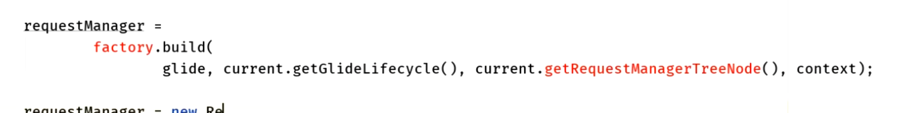

## 1、[[with函数多个重载->作用域]]
- ## 2、用到的设计模式
  collapsed:: true
	- 1、单例
	  collapsed:: true
		- ```java
		    @NonNull
		    public static Glide get(@NonNull Context context) {
		      if (glide == null) {
		        GeneratedAppGlideModule annotationGeneratedModule =
		            getAnnotationGeneratedGlideModules(context.getApplicationContext());
		        synchronized (Glide.class) {
		          if (glide == null) {
		            checkAndInitializeGlide(context, annotationGeneratedModule);
		          }
		        }
		      }
		  
		      return glide;
		    }
		  ```
	- 2、工厂设计模式
	  collapsed:: true
		- 
	- 3、原型设计模式
	  collapsed:: true
		- into函数中 用到RequestObtions的clone
		-
	- 4、建造者模式
- ## 3、怎么确保一个Activity只有一个空白Fragment监听生命周期
	- ## [[怎么确保一个Activity只有一个Fragment]]
- ## 4、[[空白Fragment感知生命周期流程]]
- ## 5、项目中大量的使用了Glide，偶尔会出现内存溢出问题，请说说大概是什么原因？
	- 答：尽量在with的时候，传入有生命周期的作用域(非Application作用域)，尽量避免使用了Application作用域，因为Application作用域不会对页面绑定生命周期机制，就回收不及时释放操作等....
- ## 6、使用Glide为什么要加入网络权限？ <uses-permission android:name="android.permission.INTERNET" />
	- 答：等待队列/运行队列 执行Request ---> 活动缓存 --->内存缓存 ---> jobs.get检测执行的任务有没有执行完成 ---> HttpUrlFetcher.HttpURLConnection
- ## 7、使用Glide时，with函数在子线程中，会有什么问题？
	- 答：子线程，不会去添加 生命周期机制， 主线程才会添加 空白的Fragment 去监听 Activity Fragment 的变化。
- ## 8、使用Glide时，with函数传入Application后，Glide内部会怎么处理？
	- 答：在MainActivity中，MainActivity销毁了，并会让Glide生命周期机制处理回收，
		- 传入Application，会产生Application作用域，只有在整个APP应用都没有的时候，跟随着销毁（上节课 ApplicationLIfecycle add onStart  onDestroy 什么事情都没有做）。
- ## 9、Glide源码里面的缓存，为什么要有 活动缓存 还需要 有内存缓存LRU缓存？
	- [[LRU算法]]：最近最少使用，移除
	- ## 大的概念：下边这2都是缓存在内存上的
		- 1、一级缓存，活动缓存
		- 2、LRU缓存，二级缓存
	- 如果直接只有LRU缓存的话。当前Activity显示几张图片，如果有新加入的图片要缓存，达到了MaxSize。LRU要移除，如果移除的是正在显示的，就会出问题
	- 活动缓存：只记录当前页面展示的缓存，非LRU缓存，持有的弱引用，随便加
	-
- ## 10、[[Glide缓存机制]]