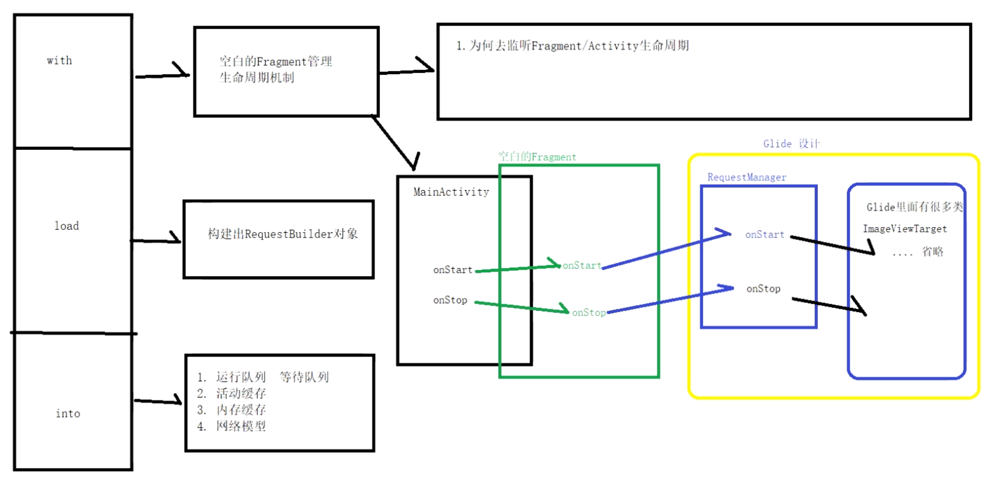
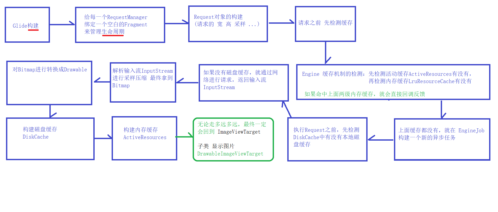

# 使用
	- ```
	  https://blog.csdn.net/guolin_blog/article/details/53759439
	  ```
- # 总览
  collapsed:: true
	- 
	- # 技术点：
		- 1、空白Fragment，监听Activity的生命周期，分发给内部用于管理请求的RequestManager。当加载图片时，用户关掉Activity，会停止加载操作
- # 总线原理
	- # [[Glide-with流程]]->返回的RequestManager
	- # [[Glide-load]]
	- # [[Glide-into]]
- # 流程简化图
  collapsed:: true
	- 
- # [[Glide缓存机制]]
- # 面试
	- # [[Glide-面试]]