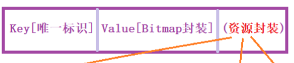

# [[缓存加载流程]]
- # LRU内存缓存和磁盘缓存都采用了[[LRU算法]]
- # 资源封装（K_V形式）
	- 
	- 存储Key(唯一)
	- value形式的（bitmap）
	- 各级缓存都持有这些资源的封装。然后根据key去找对应的资源
- # Glide缓存分类
	- # 一、一级缓存-活动缓存（缓存在内存上的）
		- ## 存放内容：正在使用的图片（实际存的上边资源封装）
		- ## 移除：和空白Fragment生命周期绑定，onDestroy会移除活动缓存加入LRU缓存
		- 1、个数没有上限，就是为了解决LRU缓存有上限的
	- # 二、二级缓存-LRU缓存（缓存在内存上的）
		- ## app杀死才不存在
		- 2、个数是有上限的
		- 引用计数法，决定移除哪个
	- # 三、三级缓存-磁盘缓存（缓存在磁盘上的）
- # 特点
	- 1、当新开一个Activity，从活动缓存取时，如果没找到，再去LRU缓存去找，如果找到，从LRU移到活动缓存，再显示在界面上
	-
- # 9、Glide源码里面的缓存，为什么要有 活动缓存 还需要 有内存LRU缓存？
	- [[LRU算法]]：最近最少使用，移除
	- ## 大的概念：下边这2都是缓存在内存上的
		- 1、一级缓存，活动缓存
		- 2、二级缓存，LRU缓存
	- 如果直接只有LRU缓存的话。当前Activity显示几张图片，如果有新加入的图片要缓存，达到了MaxSize。LRU要移除，如果移除的是正在显示的，就会出问题
	- 活动缓存：只记录当前页面展示的缓存，非LRU缓存，持有的弱引用，随便加