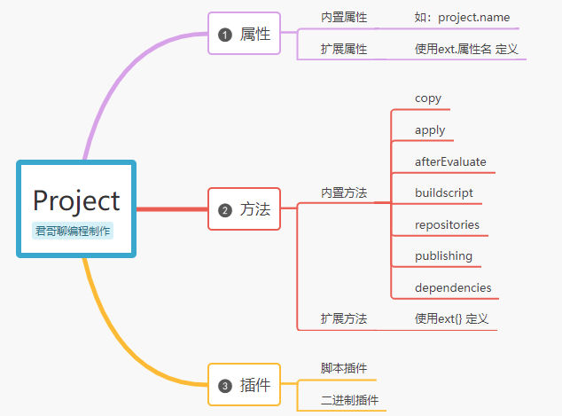
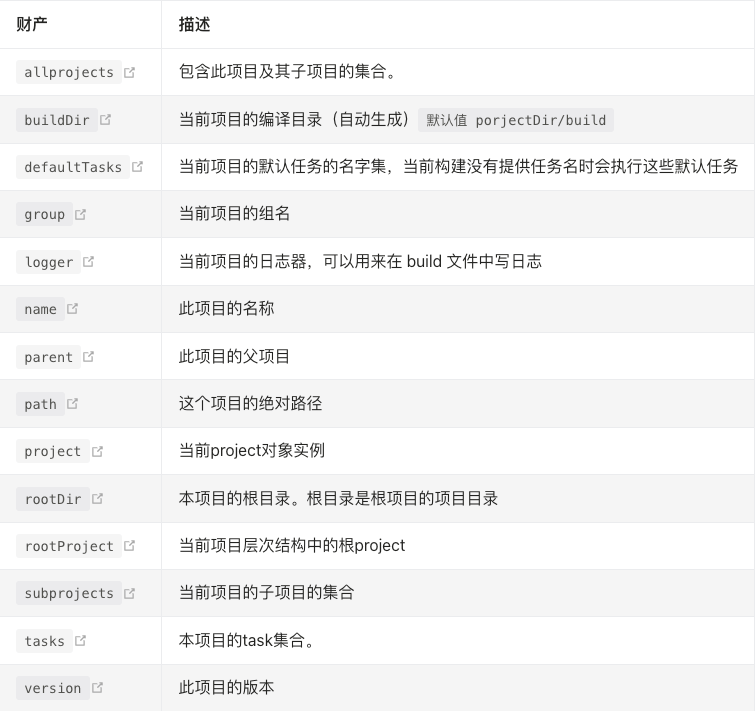
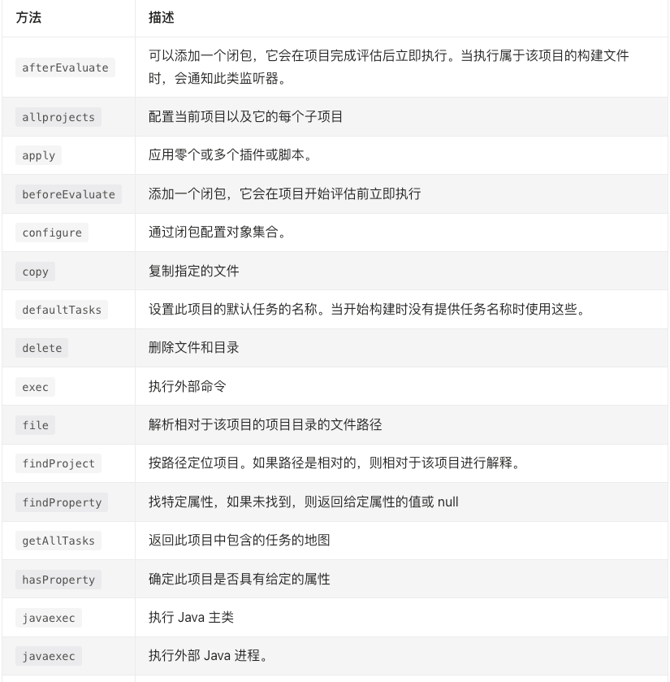
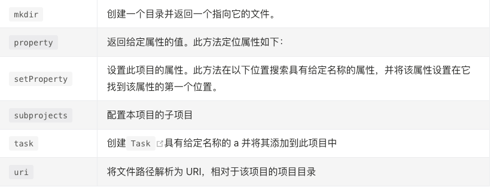
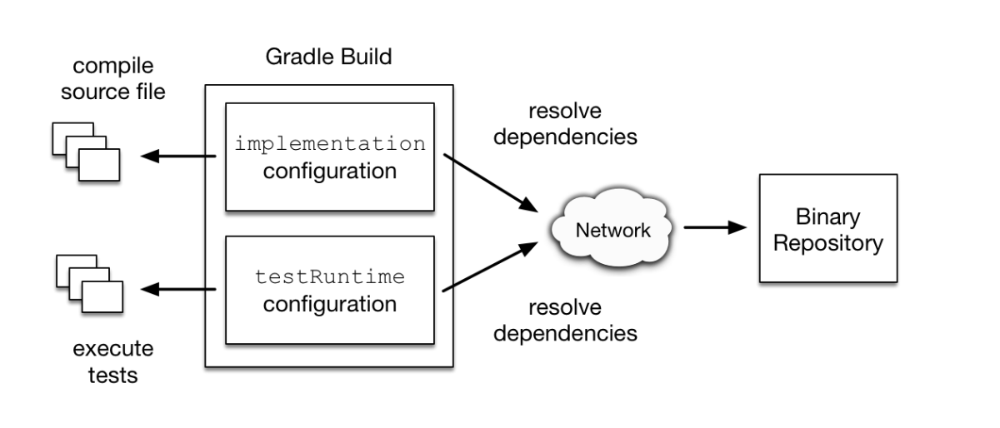

- # 一、简介
	- 在gradle中，每一个build.gradle文件对应一个Project实例，我们在build.gradle中编写的内容，就相当于Project实例的属性或方法。
	- 构建初始化期间，Gradle实例化的步骤如下
	  collapsed:: true
		- 给整个构建创建一个Settings实例，一个Settings实例就是一个settings.gradle文件
		- 针对Settings实例的配置，按配置层次扫描并解析配置在settings.gradle中的project。（其中settings中最为重要的属性是include）
		- 针对每个project对应的build.gradle进行初始，并创建Project实例（这里加载project的顺序是按照前面的配置层次进行，即广度扫描加载，这样可以保证父级模块加载完后，子模块才会被加载）
	- 一个完整的project由以下几个对象组成（实际上只由属性和方法组成）
	  collapsed:: true
		- {:height 477, :width 634}
- # 二、属性使用
  collapsed:: true
	- ## 我们可以在build.gradle文件中任意使用gradle提供的属性或方法，如下：
	  collapsed:: true
		- ```groovy
		  //输出当前项目名称
		  println(project.name)
		  
		  //一般在当前build.gradle中使用时，默认会省略project
		  println(name)
		  
		  //输出project中名字为name的属性
		  println(project.property("name"))
		  
		  //指定默认执行的task，即./gradlew不指定task时会执行该task
		  defaultTasks('yourTask')
		  
		  ```
	- ## 属性定义：
		- ### 1、内置属性可以直接赋值，无需声明
		  collapsed:: true
			- ```groovy
			  group = 'com.it235'
			  version = '1.0.0'
			  
			  ```
		- ### 2、自定义属性可以使用groovy语法，也可以与java语法结合
		  collapsed:: true
			- ```groovy
			  //groovy定义属性
			  def pname = "projectName:" + project.name
			  
			  //java类型接收
			  String pname = "projectName:" + project.name
			  
			  ```
		- ### 3、使用ext名命空间来扩展属性，定义后可以在project、task、subproject中读取和更新
		  collapsed:: true
			- ```groovy
			  ext.prop1 = "it235"
			  ext.prop2 = "君哥聊编程"
			  
			  ```
		- ### 4、使用案例
		  collapsed:: true
			- ```groovy
			  //REPOSITORY_HOME 和 REPOSITORY_URL
			  apply plugin: 'maven'
			  ext {
			    REPOSITORY_HOME = 'http://maven.aliyun.com'
			    REPOSITORY_URL =  REPOSITORY_HOME + "/nexus/content/groups/public"
			  }
			  repositories {
			      // 使用 mavenCentral()时，将远程的仓库替换为自己搭建的仓库
			      maven { 
			          url REPOSITORY_URL 
			      }
			  }
			  
			  uploadArchives {
			      repositories {
			          mavenDeployer {
			              snapshotRepository(url: REPOSITORY_HOME + "/nexus/content/repositories/snapshots/") {
			                  authentication(userName: 'xxx', password: 'xxx')
			              }
			              repository(url: REPOSITORY_HOME + "/nexus/content/repositories/releases/") {
			                  authentication(userName: 'xxx', password: 'xxx')
			              }
			          }
			      }
			  }
			  
			  
			  ```
		- ### 5、属性作用域
			- 读写属性时，Project 会按照下面范围的顺序进行查找的，在某个范围找到属性后就会返回该属性。如果没有找到，会抛出异常。
			- Project 对象自身。这个范围里的属性包含 Project 实现类中定义有 getters 和 setters 方法的所有属性。比如：project.getName() 方法就对应了 name 属性。至于这些属性的可读写性取决于它们是否定义 getters 或者 setters 方法。
			- Project 的ext属性 ( extra ) 。每个 Project 都会维护一个额外属性的映射，它可以包含任意的名称 -> 值对。定义后，此作用域的属性是可读写的。比如：project.ext.prop1 = 'it235' 。
			- 通过插件被添加到 Project 中的扩展属性 ( extensions ) 。每个扩展名都可以作为只读属性使用，其名称与扩展名相同。比如：project.android.compileSdkVersion 。
			- 通过插件添加到 Project 中的约定属性 ( convention ) 。插件可以通过 Project 的 Convention 对象向 Project 中添加属性和方法。此范围的属性的可读可写性取决于约束对象。
			- Project 中 Tasks 。可以使用 Task 的名称作为属性名称来访问task。此范围的属性是只读的。
			- ext的属性和约定属性从项目的父级继承，递归到根项目。此范围的属性是只读的。
		- ### 6、常用的project属性
		  collapsed:: true
			- 
			-
		-
- # 三、方法
	- ## 1、方法作用域
		- Project 对象自身
		- build.gradle 脚本文件
		- 通过插件添加到 Project 中的扩展 ( extensions ) 。每个扩展都可以当做参数是闭包或 Action 的方法。
		- 插件添加到项目中的约定方法 ( convention ) 。插件可以通过项目的 Convention 对象向项目中添加属性和方法。
		- 项目中的 Tasks 。每个 Task 都会添加一个方法，方法名是任务名，参数是单个闭包或者 Action 。该方法使用提供的闭包为相关任务调用 Task.configure( groovy.lang.Closure ) 方法。
	- ## 2、常用的Project方法
		- 
		- {:height 281, :width 716}
		-
		- ### 常用方法示例：
			- 1、buildscript{}：配置当前gradle脚本自身需要使用的构建信息或依赖
			  collapsed:: true
				- 假设要执行一项指令./gradlew buildImage，构建docker镜像，而Gradle官方自身没有，则需要依赖到maven库下载或需要调用第三方插件，虽然这里是调用的task，但是task背后所依赖的插件是需要提前定义在buildscript中的，我们需要在buildscript{}中指定docker的依赖即可。
				- ```groovy
				  apply plugin: 'idea'
				  apply plugin: 'java'
				  apply plugin: "maven"
				  apply plugin: "war"
				  apply plugin: "com.bmuschko.docker-remote-api"
				  apply plugin: "org.springframework.boot"
				  
				  buildscript {
				      repositories {
				          mavenLocal()
				          maven {
				              url "https://maven.aliyun.com/repository/public"
				          }
				  		mavenCentral()
				      }
				      dependencies {
				          classpath "com.bmuschko:gradle-docker-plugin:3.3.4"
				          classpath "org.springframework.boot:spring-boot-gradle-plugin:2.6.5"
				      }
				  }
				  
				  ```
			- 2、configurations{}[implementation、testRuntime等]：配置使用声明的依赖项用于特定目的
				- 我们看个案例，下面的implementation和testRuntime就是Gradle帮我们提供的configuration，configurations{} 记录着项目中各个分组（implementation ，runtime）的依赖信息。
				- ```groovy
				  dependencies {
				      implementation "org.springframework.boot:spring-boot-starter-web"
				      testRuntime "junit:junit:4.13"
				  }
				  
				  ```
				- 
				- 简单一句话概括configurations{}的作用：将本项目需要的相关依赖资源进行分组，A组你可以提供在运行时使用，B组你提供在测试运行时使用，C组编译时使用