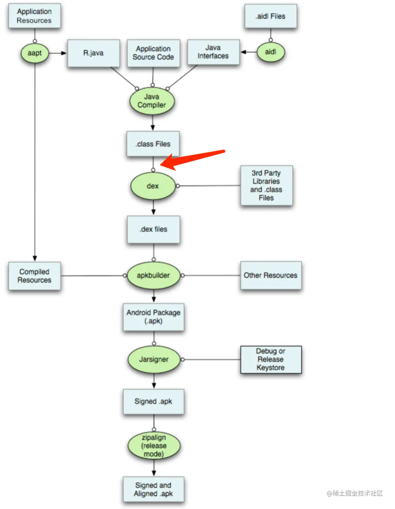
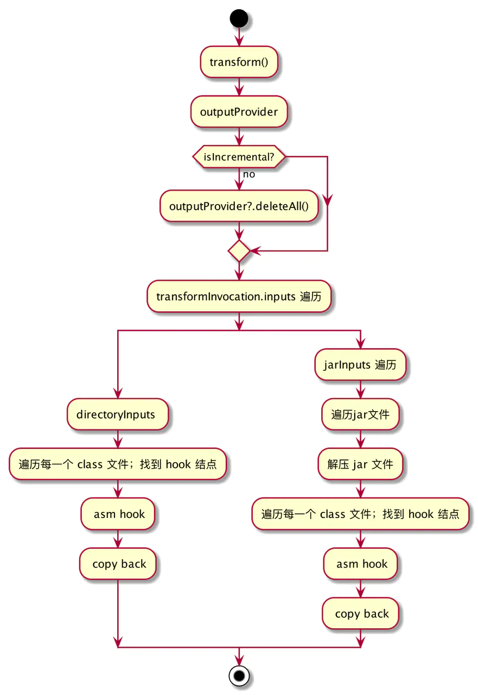

- ## 一、概念
  collapsed:: true
	- 打包流程：
	  collapsed:: true
		- 
	- ### 什么是transform?
		- AGP包含了一个Transform API, 它允许第三方插件在编译后的class文件转换为dex文件之前做处理操作. 而使用Transform API, 我们完全可以不用去关注相关task的生成与执行流程, 我们可以只聚焦在如何对输入的class文件进行处理
	- ### 工作时机 ：
	  collapsed:: true
		- Transform工作在Android构建中由Class → Dex 的节点
	- ### 处理对象：
	  collapsed:: true
		- 处理对象包括Javac编译后的Class文件、Java标准 resource 资源、本地依赖和远程依赖的 JAR/AAR
	- ### Transform Task：
	  collapsed:: true
		- 每个Transform都对应一个Task，Transform 的输入和输出可以理解为对应 Transform Task 的输入输出
	- ### Transform 链：
	  collapsed:: true
		- TaskManager 会将每个TransformTask 串联起来，前一个Transform的输出会作为下一个 Transform 的输入
- ## 二、Transform使用场景
  collapsed:: true
	- 对编译class文件做自定义的处理
	- 读取编译产生的class文件，做一些其他事情，但是不需要修改它。
- ## 三、执行流程：
  collapsed:: true
	- 
- ## 四、难点：
	- transform 的核心难点有以下几个点：
	- 正确、高效的进行文件目录、jar 文件的解压、class 文件 IO 流的处理，保证在这个过程中不丢失文件和错误的写入
	- 高效的找到要插桩的结点，过滤掉无效的 class
	- 支持增量编译
- ## 五、API
	- ### getName()
		- 指明 Transform 的名字，也对应了该 Transform 所代表的 Task 名称
		- 举例：
		  collapsed:: true
			- ```kotlin
			  class UnityLogTransform : Transform() {
			      override fun getName(): String {
			          return "UnityLogTransform"
			      }
			  }
			  ```
	- ### getInputTypes()
		- getInputTypes()方法用于返回Transform所支持的输入文件类型，开发者可以通过返回这些常量中的任意一个来指定Transform的输入文件类型。
		- 取值：
			- 在Android Gradle插件 4.0及以上的版本中，TransformManager.CONTENT_CLASS、TransformManager.CONTENT_JARS等常量已经被废弃，取而代之的是QualifiedContent.DefaultContentType类中的一些常量。例如，
			- QualifiedContent.DefaultContentType.CLASSES表示class文件类型，
			- QualifiedContent.DefaultContentType.RESOURCES表示资源文件类型
	-
-
- 参考：
  collapsed:: true
	- [刚学会Transform，你告诉我就要被移除了](https://juejin.cn/post/7114863832954044446)
-