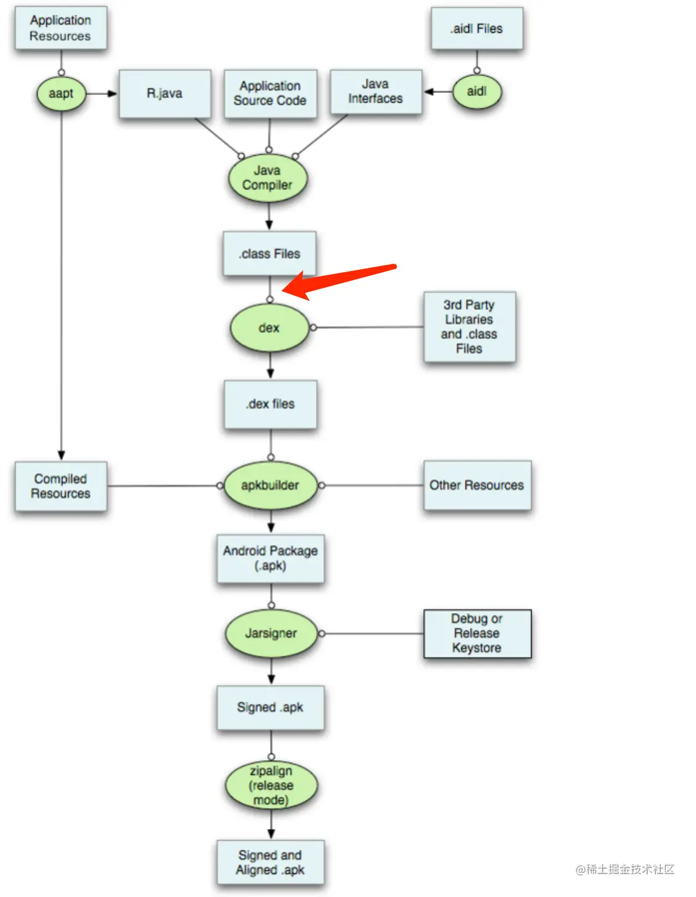

- ## 一、简介
	- 打包流程
	  collapsed:: true
		- {:height 969, :width 746}
	- transform 是什么
		- AGP包含了一个Transform API, 它允许第三方插件在编译后的class文件转换为dex文件之前做处理操作. 而使用Transform API, 我们完全可以不用去关注相关task的生成与执行流程, 我们可以只聚焦在如何对输入的class文件进行处理
		-