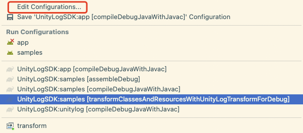
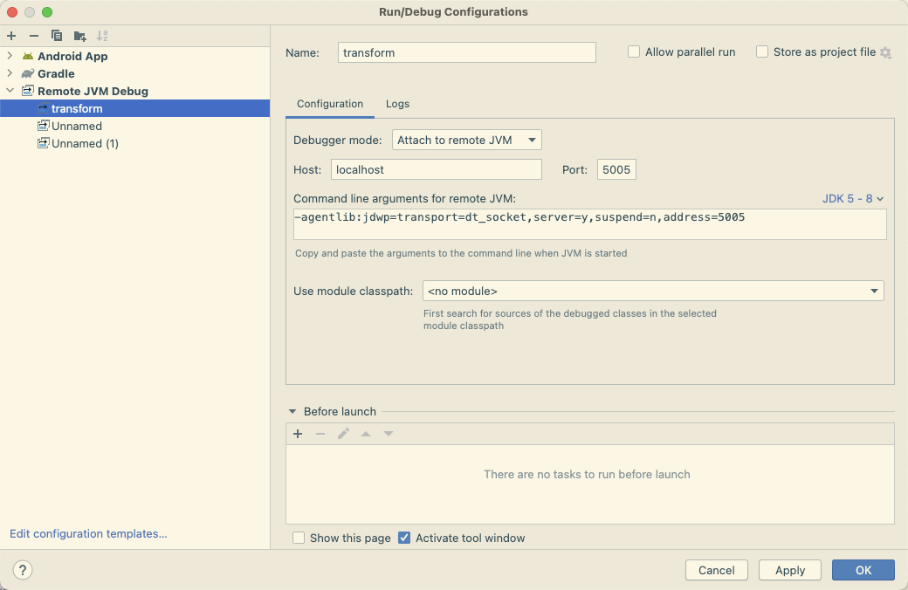
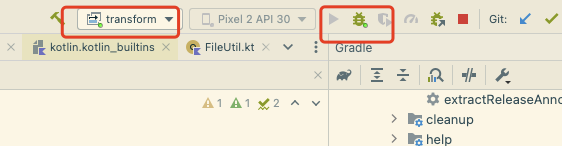

- ## 一、概念
  collapsed:: true
	- 打包流程：
	  collapsed:: true
		- 
	- ### 什么是transform?
		- AGP包含了一个Transform API, 它允许第三方插件在编译后的class文件转换为dex文件之前做处理操作. 而使用Transform API, 我们完全可以不用去关注相关task的生成与执行流程, 我们可以只聚焦在如何对输入的class文件进行处理
	- ### 工作时机 ：
	  collapsed:: true
		- Transform工作在Android构建中由Class → Dex 的节点
	- ### 处理对象：
	  collapsed:: true
		- 处理对象包括Javac编译后的Class文件、Java标准 resource 资源、本地依赖和远程依赖的 JAR/AAR
	- ### Transform Task：
	  collapsed:: true
		- 每个Transform都对应一个Task，Transform 的输入和输出可以理解为对应 Transform Task 的输入输出
	- ### Transform 链：
	  collapsed:: true
		- TaskManager 会将每个TransformTask 串联起来，前一个Transform的输出会作为下一个 Transform 的输入
- ## 二、Transform使用场景
  collapsed:: true
	- 对编译class文件做自定义的处理
	- 读取编译产生的class文件，做一些其他事情，但是不需要修改它。
- ## 三、transform模型：
  collapsed:: true
	- 
- ## 四、执行流程
  collapsed:: true
	- 一个工程内会有多个 Transform，你定义的 Transform 在处理的是上一个 Transform 经过处理的输出，而经过你处理的输出，会由下一个 Transform 进行处理。所有的 transform 任务一般都在 app/build/intermediates/transform/ 这个目录下可以看到。
- ## 五、难点：
  collapsed:: true
	- transform 的核心难点有以下几个点：
	- 正确、高效的进行文件目录、jar 文件的解压、class 文件 IO 流的处理，保证在这个过程中不丢失文件和错误的写入
	- 高效的找到要插桩的结点，过滤掉无效的 class
	- 支持增量编译
- ## 六、API
	- ### getName()
	  collapsed:: true
		- 指明 Transform 的名字，也对应了该 Transform 所代表的 Task 名称,Gradle 在编译的时候，会将这个名称经过一些拼接显示在控制台上
		- 举例：
		  collapsed:: true
			- ```kotlin
			  class UnityLogTransform : Transform() {
			      override fun getName(): String {
			          return "UnityLogTransform"
			      }
			  }
			  ```
	- ### getInputTypes()
	  collapsed:: true
		- getInputTypes()方法用于返回Transform所支持的输入文件类型，开发者可以通过返回这些常量中的任意一个来指定Transform的输入文件类型。
		- 取值：
			- 方式一、使用QualifiedContent.DefaultContentType类中的一些常量
				- 在Android Gradle插件 4.0及以上的版本中，TransformManager.CONTENT_CLASS、TransformManager.CONTENT_JARS等常量已经被废弃，取而代之的是QualifiedContent.DefaultContentType类中的一些常量。例如，
				- QualifiedContent.DefaultContentType.CLASSES表示class文件类型，Java 字节码文件，
				- QualifiedContent.DefaultContentType.RESOURCES表示资源文件类型,java资源，包含 java 文件
				- 举例：
				  collapsed:: true
					- ```kotlin
					      override fun getInputTypes(): MutableSet<QualifiedContent.ContentType> {
					          //QualifiedContent.DefaultContentType.RESOURCES 支持资源输入类型
					          //QualifiedContent.DefaultContentType.CLASSES   支持class类型
					         return mutableSetOf(QualifiedContent.DefaultContentType.CLASSES)
					      }
					  ```
			- 方式二、使用TransformManager 定义好的集合
			  collapsed:: true
				- CONTENT_CLASS：Java 字节码文件，
				- CONTENT_JARS：jar 包
				- CONTENT_RESOURCES：资源，包含 java 文件
				- CONTENT_DEX：dex 文件
				- CONTENT_DEX_WITH_RESOURCES：包含资源的 dex 文件
				- 我们能用的就两种：CONTENT_CLASS 和 CONTENT_JARS
				       * 其余几种仅 AGP 可用
				- 举例：
				  collapsed:: true
					- ```kotlin
					   override fun getInputTypes(): MutableSet<QualifiedContent.ContentType> {
					          return TransformManager.CONTENT_CLASS
					      }
					  ```
	- ### getScopes()
		- 是Transform类中的一个方法，用于返回Transform所处理的文件的范围。它返回一个Set对象，包含了Transform所支持的所有文件范围。
		- 取值：
			- Scope.PROJECT:
				- 表示Transform所处理的是项目本身的文件。
			- Scope.SUB_PROJECTS:
				- 表示Transform所处理的是项目下的所有子项目的文件。
			- Scope.EXTERNAL_LIBRARIES:
				- 表示Transform所处理的是项目依赖的所有外部库的文件。
				- 只检索外部库，包括当前模块和子模块本地依赖和远程依赖的 JAR/AAR
			- Scope.PROVIDED_ONLY:
				- 表示Transform所处理的是项目中provided配置下的依赖库的文件。
				- 本地依赖和远程依赖的 JAR/AAR（provided-only）
			- Scope.TESTED_CODE:
				- 表示Transform所处理的是测试代码的文件。
		- 示例：
			- ```kotlin
			  
			      override fun getScopes(): MutableSet<in QualifiedContent.Scope> {
			          return mutableSetOf(
			              QualifiedContent.Scope.PROJECT, 
			              QualifiedContent.Scope.SUB_PROJECTS,
			              QualifiedContent.Scope.EXTERNAL_LIBRARIES
			          )
			      }
			  ```
	- ### isIncremental()
	  collapsed:: true
		- 表明是否支持增量编译，不是每次的编译都可以增量编译，clean build没有增量的基础，需要检查当前的编译是否增量编译。
		- 不是增量编译，则清空output目录，然后按照前面的方式，逐个class/jar处理
		- 增量编译，则要检查每个文件的Status，Status分为四种，并且对四种文件的操作不尽相同
			- NOTCHANGED 当前文件不需要处理
			- ADDED、CHANGED 正常处理，输出给下一个任务
			- REMOVED 移除outputProvider获取路径对应的文件
			- ```java
			  public enum Status {
			  
			      // 未修改，不需要处理，也不需要复制操作
			      NOTCHANGED,
			      
			      // 新增，正常处理并复制给下一个任务
			      ADDED,
			      
			      // 已修改，正常处理并复制给下一个任务
			      CHANGED,
			  		
			      // 已删除，需同步移除 OutputProvider 指定的目标文件
			      REMOVED;
			  }
			  ```
		- 注意：
		  collapsed:: true
			- 增量编译是指在编译过程中，只编译发生变化的文件，而不重新编译所有文件。在Android Gradle插件中，增量编译可以提高构建效率，尤其是在大型项目中。如果一个Transform支持增量编译，Gradle会在执行Transform之前调用isIncremental()方法来查询它是否支持增量编译。如果支持，则在执行Transform时，只处理发生变化的文件。
			- 在Transform的transform方法中，可以通过TransformInvocation的isIncremental()方法来查询增量编译的状态。如果返回值为true，则表示当前执行的是增量编译，Transform只需要处理发生变化的文件。否则，表示当前执行的是全量编译，Transform需要处理所有文件。
			- 增量编译对于一些复杂的Transform可能并不适用，例如需要同时修改多个文件的Transform，因为如果其中一个文件发生了变化，就需要重新处理所有的文件。此时，可以将isIncremental()方法的返回值设为false，禁用增量编译。
		- 示例：
		  collapsed:: true
			- ```kotlin
			  import com.android.build.api.transform.Transform
			  import com.android.build.api.transform.TransformInvocation
			  import com.android.build.gradle.internal.pipeline.TransformManager
			  import com.android.build.api.transform.QualifiedContent
			  import com.android.build.api.transform.TransformOutputProvider
			  import com.android.build.gradle.internal.scope.VariantScope
			  
			  class MyTransform : Transform() {
			  
			      override fun getName(): String {
			          return "myTransform"
			      }
			  
			      override fun getInputTypes(): Set<QualifiedContent.ContentType> {
			          return setOf(QualifiedContent.DefaultContentType.CLASSES)
			      }
			  
			      override fun getScopes(): MutableSet<in QualifiedContent.Scope> {
			          return mutableSetOf(QualifiedContent.Scope.PROJECT)
			      }
			  
			      override fun transform(transformInvocation: TransformInvocation) {
			          if (transformInvocation.isIncremental) {
			              // 处理增量变更的文件
			              transformIncremental(transformInvocation)
			          } else {
			              // 处理所有文件
			              transformFull(transformInvocation)
			          }
			      }
			  
			      override fun isIncremental(): Boolean {
			          return true
			      }
			  
			      private fun transformFull(transformInvocation: TransformInvocation) {
			          // 处理所有文件
			          // ...
			      }
			  
			      private fun transformIncremental(transformInvocation: TransformInvocation) {
			          // 处理增量变更的文件
			          // ...
			      }
			  }
			  
			  ```
	- ### transform()  进行具体的检索操作，需要自己实现
		- transform是一个空实现，input的内容将会打包成一个 TransformInvocation 对象。
		- transform 方法主要用于对输入的数据做检索操作，它是 Transform 的核心方法，方法的参数是 [[TransformInvocation]]，它是一个接口，提供了所有与输入输出相关的信息：
		-
- ## 七、增量编译
  collapsed:: true
	- 其实关于增量编译的实现，通过查看 AGP 自带的几个 Transform 可以看到其实很简单。
	- 例子：
	  collapsed:: true
		- ```kotlin
		  if (transformInvocation.isIncremental) {
		                      when (jarInput.status ?: Status.NOTCHANGED) {
		                          Status.NOTCHANGED -> {
		                          }
		                          Status.ADDED, Status.CHANGED -> transformJar(
		                              function,
		                              inputJar,
		                              outputJar
		                          )
		                          Status.REMOVED -> FileUtils.delete(outputJar)
		                      }
		                  } else {
		                      transformJar(function, inputJar, outputJar)
		                  }
		  ```
	- 所有的输入都是带状态的，根据这些状态做不同的处理就好了。当然，也可以根据前面提到的 getSecondaryInputs 提供的输入进行处理支持增量编译。
- ## 八、自定义Transform
  collapsed:: true
	- 实现一个 Transform 需要先创建 Gradle 插件，大致流程：自定义 Gradle 插件 -> 自定义 Transform -> 注册 Transform
	- 带增量编译的transform
	  collapsed:: true
		- ```kotlin
		  class UnityLogTransform : Transform() {
		      override fun getName(): String {
		          return "UnityLogTransform"
		      }
		  
		      override fun getInputTypes(): MutableSet<QualifiedContent.ContentType> {
		          return mutableSetOf(
		              QualifiedContent.DefaultContentType.CLASSES,
		              QualifiedContent.DefaultContentType.RESOURCES
		          )
		      }
		  
		      override fun getScopes(): MutableSet<in QualifiedContent.Scope> {
		          return mutableSetOf(
		              QualifiedContent.Scope.PROJECT,
		              QualifiedContent.Scope.SUB_PROJECTS,
		              QualifiedContent.Scope.EXTERNAL_LIBRARIES
		          )
		      }
		  
		      override fun isIncremental(): Boolean {
		          return true
		      }
		  
		      override fun transform(transformInvocation: TransformInvocation?) {
		          super.transform(transformInvocation)
		          println("[OwnerPlugin]:transform start")
		          if (transformInvocation == null) {
		              return
		          }
		          if (transformInvocation.isIncremental) {
		              // 处理增量
		              incrementalTransform(transformInvocation)
		          } else {
		              // 处理全部输入
		              allTransform(transformInvocation)
		          }
		      }
		  
		      /**
		       *  处理增量Transform ： 拿到每个文件status 进行分别处理
		       *  1、处理jar
		       *  2、处理文件夹类型
		       */
		      private fun incrementalTransform(transformInvocation: TransformInvocation) {
		          transformInvocation.inputs.forEach { input ->
		              // 1、处理jar
		              input.jarInputs.forEach { jarInput ->
		                  // 拿到文件
		                  val outputFile = transformInvocation.outputProvider.getContentLocation(
		                      jarInput.file.absolutePath,
		                      jarInput.contentTypes,
		                      jarInput.scopes,
		                      Format.JAR
		                  )
		                  // 增量编译 就是根据文件的status 做不同的处理
		                  when (jarInput.status) {
		                      Status.ADDED, Status.CHANGED -> {
		                          FileUtils.deleteQuietly(outputFile)
		                          // 1.1 transformJar
		                          transformJar(jarInput.file, outputFile)
		                      }
		                      Status.REMOVED -> {
		                          FileUtils.deleteQuietly(outputFile)
		                      }
		                      Status.NOTCHANGED -> {
		  
		                      }
		                  }
		              }
		              // 2、处理文件夹类型
		              input.directoryInputs.forEach { directoryInput ->
		                  val inputDir = directoryInput.file
		                  val outputDir: File = transformInvocation.outputProvider.getContentLocation(
		                      directoryInput.name,
		                      directoryInput.contentTypes,
		                      directoryInput.scopes,
		                      Format.DIRECTORY
		                  )
		  
		                  directoryInput.changedFiles.forEach {
		                      val inputFile = it.key
		                      val outputFile = File(
		                          inputFile.absolutePath.replace(
		                              inputDir.absolutePath,
		                              outputDir.absolutePath
		                          )
		                      )
		                      // 拿到文件 做处理
		                      when (it.value) {
		                          Status.ADDED, Status.CHANGED -> {
		                              FileUtils.deleteQuietly(outputFile)
		                              // 2.1 处理字节码
		                              transformClassFile(inputFile, outputFile)
		                          }
		                          Status.REMOVED -> {
		                              FileUtils.deleteQuietly(outputFile)
		                          }
		                          Status.NOTCHANGED -> {
		  
		                          }
		                      }
		                  }
		              }
		          }
		      }
		  
		      /**
		       *  处理全部transform
		       *  不需要按照状态 分别处理
		       */
		      private fun allTransform(transformInvocation: TransformInvocation) {
		          // 1. 不是增量编译，删除所有旧的输出内容
		          transformInvocation.outputProvider.deleteAll()
		          transformInvocation.inputs.forEach { input ->
		              // 2.jar 包处理
		              input.jarInputs.forEach { jarInput ->
		                  val outputFile = transformInvocation.outputProvider.getContentLocation(
		                      jarInput.file.absolutePath,
		                      jarInput.contentTypes,
		                      jarInput.scopes,
		                      Format.JAR
		                  )
		                  // 2.1 transformJar
		                  transformJar(jarInput.file, outputFile)
		              }
		              // 3. 文件夹处理
		              input.directoryInputs.forEach { directoryInput ->
		                  val outputFile = transformInvocation.outputProvider.getContentLocation(
		                      directoryInput.name,
		                      directoryInput.contentTypes,
		                      directoryInput.scopes,
		                      Format.DIRECTORY
		                  )
		                  // 3.1 文件夹 transform
		                  transformDirectory(directoryInput.file, outputFile)
		              }
		          }
		      }
		  
		  
		      /**
		       *  transformJar -> transformClassBytes 最终处理的字节码
		       */
		      private fun transformJar(input: File, output: File) {
		          FileUtils.copyFile(input, output)
		          FileUtil.traverseJarClass(
		              input, output
		          ) { _, inputBytes -> transformClassBytes(inputBytes) }
		      }
		  
		      /**
		       *  遍历文件夹 找到字节码文件
		       */
		      private fun transformDirectory(input: File, output: File) {
		          FileUtils.forceMkdir(output)
		          val srcDirPath = input.absolutePath
		          val destDirPath = output.absolutePath
		          input.listFiles()?.forEach { subFile ->
		              val destFilePath = subFile.absolutePath.replace(srcDirPath, destDirPath)
		              val destFile = File(destFilePath)
		              if (subFile.isDirectory) {
		                  transformDirectory(subFile, destFile)
		              } else {
		                  // 处理字节码
		                  transformClassFile(subFile, destFile)
		              }
		          }
		      }
		  
		      /**
		       *  处理字节码文件
		       */
		      private fun transformClassFile(inputFile: File, outputFile: File) {
		          try {
		              val fis = FileInputStream(inputFile)
		              val fos = FileOutputStream(outputFile)
		              if (inputFile.name.endsWith(".class") && !name.startsWith("R$") && "R.class" != name && "BuildConfig.class" != name) {
		                  fos.write(transformClassBytes(FileUtil.readFile(fis)))
		              } else {
		                  val buffer = ByteArray(1024)
		                  var length: Int
		                  while (true) {
		                      length = fis.read(buffer)
		                      if (length != -1) {
		                          fos.write(buffer, 0, length)
		                      } else {
		                          break
		                      }
		                  }
		              }
		              fis.close()
		              fos.close()
		          } catch (e: Exception) {
		              e.printStackTrace()
		          }
		      }
		  
		      /**
		       *  transform 处理字节码 的字节数据流   ASM入口
		       */
		      private fun transformClassBytes(classBytes: ByteArray?): ByteArray {
		          if (classBytes == null) {
		              return ByteArray(0)
		          }
		          if (!ClassUtil.isValidClassBytes(classBytes)) {
		              return classBytes
		          }
		          val cr = ClassReader(classBytes)
		          val cw = ClassWriter(ClassWriter.COMPUTE_MAXS)
		  
		          cr.accept(OwnerClassAdapter(Opcodes.ASM7, cw), ClassReader.EXPAND_FRAMES)
		  
		          return cw.toByteArray()
		      }
		  
		  }
		  ```
	- 工具类
	  collapsed:: true
		- 1
		  collapsed:: true
			- ```kotlin
			  package com.wuba.unitylog.util
			  
			  import org.apache.commons.io.IOUtils
			  
			  object ClassUtil {
			      private val MAGIC_CAFEBABE = byteArrayOf(-54, -2, -70, -66)
			      @JvmStatic
			      fun isValidClassBytes(classBytecode: ByteArray): Boolean {
			          return if (classBytecode.size < MAGIC_CAFEBABE.size) {
			              false
			          } else MAGIC_CAFEBABE[0] == classBytecode[0] && MAGIC_CAFEBABE[1] == classBytecode[1] && MAGIC_CAFEBABE[2] == classBytecode[2] && MAGIC_CAFEBABE[3] == classBytecode[3]
			      }
			  
			      fun getClassBytes(clazz: Class<*>): ByteArray {
			          val classPath = "/" + clazz.name.replace('.', '/') + ".class"
			          val classInput = clazz.javaClass.getResourceAsStream(classPath)
			          return IOUtils.toByteArray(classInput)
			      }
			  
			      fun convert(classDescSet: Set<String>): Set<String> {
			          val classNameSet: MutableSet<String> = HashSet(classDescSet.size)
			          for (s in classDescSet) {
			              classNameSet.add(s.replace("/".toRegex(), "."))
			          }
			          return classNameSet
			      }
			  }
			  ```
		- 2
		  collapsed:: true
			- ```kotlin
			  package com.wuba.unitylog.util
			  
			  import com.wuba.unitylog.util.ClassUtil.isValidClassBytes
			  import org.apache.commons.io.IOUtils
			  import org.gradle.internal.util.BiFunction
			  import java.io.*
			  import java.util.function.Consumer
			  import java.util.zip.ZipEntry
			  import java.util.zip.ZipFile
			  import java.util.zip.ZipOutputStream
			  
			  object FileUtil {
			      fun readFile(file: File?): ByteArray {
			          return readFile(FileInputStream(file))
			      }
			  
			      fun readFile(inputStream: InputStream): ByteArray {
			          val bos = ByteArrayOutputStream()
			          val buffer = ByteArray(1024)
			          val fis: FileInputStream? = null
			          return try {
			              var size: Int
			              while (inputStream.read(buffer).also { size = it } != -1) {
			                  bos.write(buffer, 0, size)
			              }
			              bos.toByteArray()
			          } finally {
			              if (fis != null) {
			                  try {
			                      fis.close()
			                  } catch (ignroed: IOException) {
			                  }
			              }
			          }
			      }
			  
			      fun traverseJarClass(
			          inputJar: File,
			          outputJar: File,
			          bytecodeTransform: BiFunction<ByteArray?, String?, ByteArray?>
			      ) {
			          if (outputJar.exists()) {
			              outputJar.delete()
			          }
			          var zipFileInput: ZipFile? = null
			          var zipOutput: ZipOutputStream? = null
			          try {
			              zipFileInput = ZipFile(inputJar)
			              zipOutput = ZipOutputStream(BufferedOutputStream(FileOutputStream(outputJar)))
			              val originEntries = zipFileInput.entries()
			              while (originEntries.hasMoreElements()) {
			                  val originEntry = originEntries.nextElement()
			                  val name = originEntry.name
			                  var bytecode: ByteArray? = ByteArray(originEntry.size.toInt())
			                  IOUtils.readFully(zipFileInput.getInputStream(originEntry), bytecode)
			                  if (name.endsWith(".class") && isValidClassBytes(bytecode!!) &&
			                      !name.startsWith("R$") && "R.class" != name && "BuildConfig.class" != name &&
			                      !name.startsWith("androidx") &&
			                      !name.startsWith("com/google/") &&
			                      !name.startsWith("okhttp3") &&
			                      !name.startsWith("kotlin") &&
			                      !name.startsWith("okio") &&
			                      !name.startsWith("org/intellij") &&
			                      !name.startsWith("org/jetbrains") &&
			                      !name.startsWith("android/support/v4/")&&
			                      !name.contains("R$")
			                  ) {
			                      bytecode = bytecodeTransform.apply(name, bytecode)
			                  }
			                  zipOutput.putNextEntry(ZipEntry(name))
			                  zipOutput.write(bytecode)
			                  zipOutput.closeEntry()
			              }
			          } catch (e: Throwable) {
			              println("[OwnerPlugin] fail processJar jar=$inputJar")
			              throw e
			          } finally {
			              IOUtils.closeQuietly(zipFileInput)
			              IOUtils.closeQuietly(zipOutput)
			          }
			      }
			  
			      fun traverseJarClass(inputJar: File, byteCodeConsumer: Consumer<ByteArray?>) {
			          var zipFileInput: ZipFile? = null
			          try {
			              zipFileInput = ZipFile(inputJar)
			              val originEntries = zipFileInput.entries()
			              while (originEntries.hasMoreElements()) {
			                  val originEntry = originEntries.nextElement()
			                  val name = originEntry.name
			                  val bytecode = ByteArray(originEntry.size.toInt())
			                  IOUtils.readFully(zipFileInput.getInputStream(originEntry), bytecode)
			                  if (name.endsWith(".class") && isValidClassBytes(bytecode)) {
			                      byteCodeConsumer.accept(bytecode)
			                  }
			              }
			          } catch (e: Throwable) {
			              println("[OwnerPlugin] fail processJar jar=$inputJar")
			              throw e
			          } finally {
			              IOUtils.closeQuietly(zipFileInput)
			          }
			      }
			  }
			  ```
- ## 九、Transform调试
  collapsed:: true
	- ### 一、新建 Remote JVM Debug
	  collapsed:: true
		- 
		- 
		- 默认参数即可
		- 
		-
	- ### 二、Debug 插件关联的 Task
	  collapsed:: true
		- ```
		  ./gradlew build -Dorg.gradle.debug=true --no-daemon
		  ```
		- 命令含义：
			- 这里再特别说明一下该节中命令中的 --no-daemon 参数，它涉及到 gradle 守护进程这一概念。要添加这个参数的原因是，如果不添加该参数，在调试过程中发现断点走不到，构建流程就走完了。这个参数的作用是告诉 gradle 不使用守护进程进行构建。
		- 问题处理
		  collapsed:: true
			- 在 AS 终端执行该命令，将会卡在 Starting Daemon。如果执行命令出现如下错误，是因为端口占用的问题。需要杀死占用端口的进程。
				- ```
				  ERROR: transport error 202: bind failed: Address already in use
				  ERROR: JDWP Transport dt_socket failed to initialize, TRANSPORT_INIT(510)
				  JDWP exit error AGENT_ERROR_TRANSPORT_INIT(197): No transports initialized [./open/src/jdk.jdwp.agent/share/native/libjdwp/debugInit.c:732]
				  ```
			- mac 查看端口、杀死进程
			  collapsed:: true
				- ```
				  // 5005为端口
				  lsof -i tcp:5005
				  // 9901 为Pid
				  kill -9 9901
				  ```
	- ### 三、代码上加断点，debug
	  collapsed:: true
		- {:height 154, :width 562}
		- 等待一段时间就可以了
		-
	- ### 四、其他问题
		- 1、Android Studio Remote Debug Unable to open debugger port 5005
			- 在执行 Debug TransformServer 中发生这一异常。出现这个问题的原因，一般是端口被占用，但是发现并没有被占用。这个时候解决方法是将 App module 运行起来，然后再 debug 即可正常。
		- 2、断点不是每一次都能正常走到
			- 需要手动 build -> clean
-
- 参考：
  collapsed:: true
	- [刚学会Transform，你告诉我就要被移除了](https://juejin.cn/post/7114863832954044446)
-