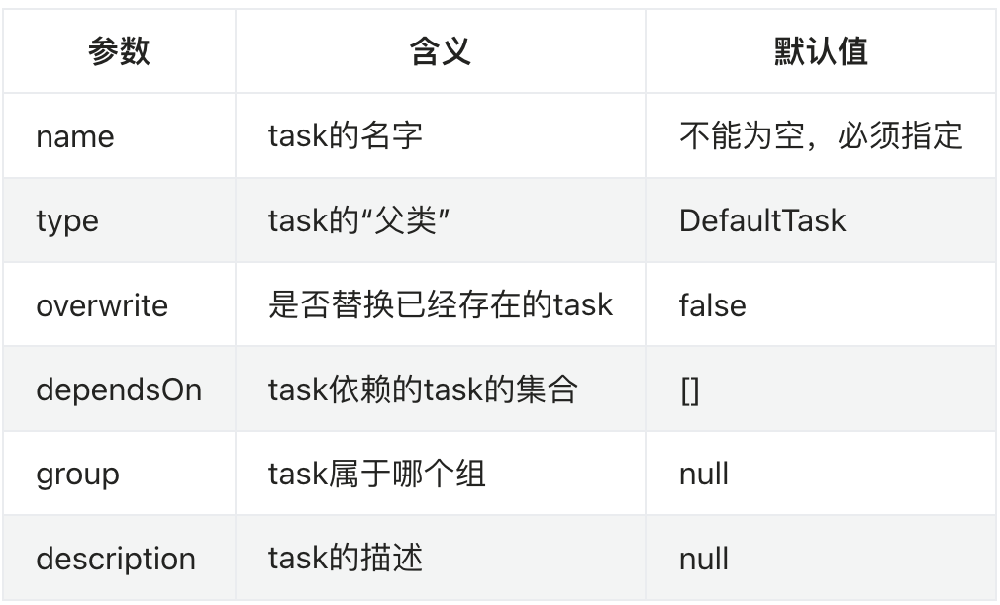
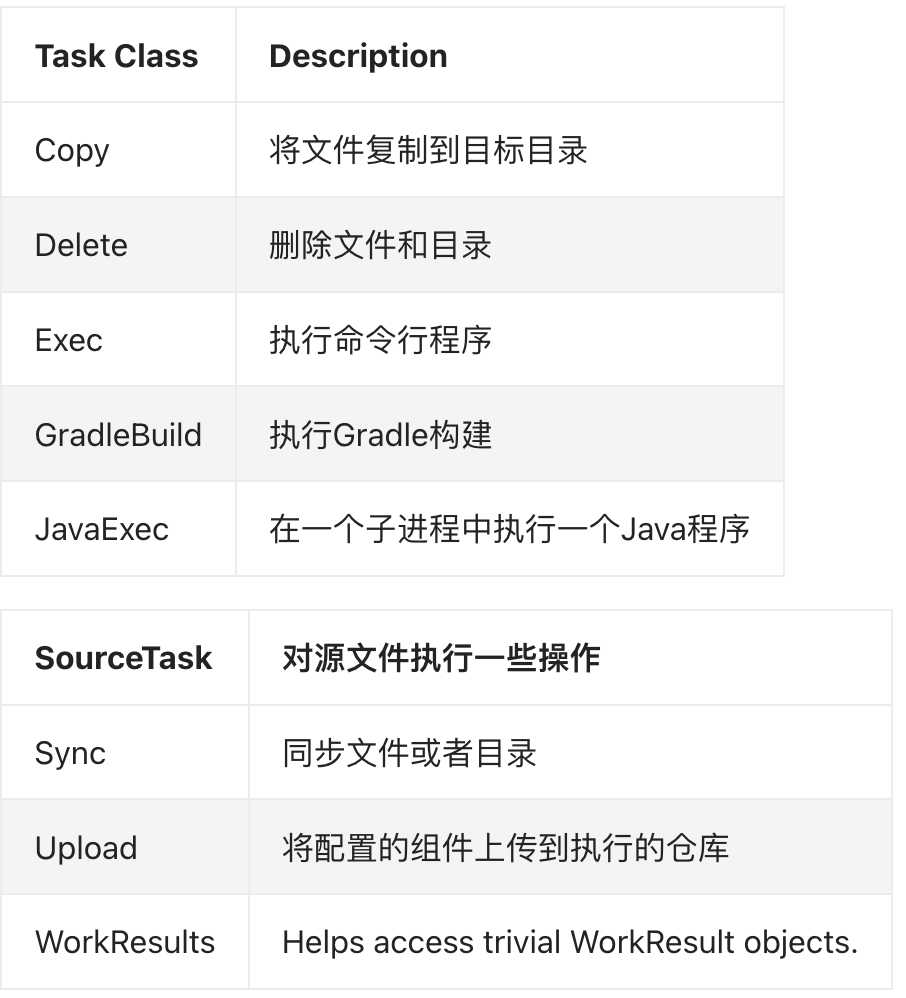

- # 一、简介
	- 任务是gradle的最小执行单元，一个build.gradle是由一系列的task组成
- # 二、定义task
	- ## 2-1、groovy定义task闭包
	  collapsed:: true
		- ```groovy
		  //直接声明
		  task taskOne{
		      println "method1"
		  }
		  
		  //参数定义名称
		  task('taskTwo'){
		      println "method2"
		  }
		  
		  //使用tasks集合属性，引用了TaskContainer的一个实例对象。我们还可以使用Project.getTasks()
		  tasks.create('taskThree'){
		      println "method3"
		  }
		  
		  //使用with
		  tasks.with(){
		      println "methodContainer"
		  }
		  
		  //使用withType声明
		  tasks.withType(Test){
		      print "method5"
		  }
		  //使用register,register执行的是延迟创建。也就是说只有当task被需要使用的时候才会被创建。
		  tasks.register('taskSix'){
		      println "method6"
		  }
		  
		  //这种写法gradle5.0就已经废弃
		  task deprecatedTask << {
		      println "execute deprecatedTask"
		  }
		  
		  
		  ```
	- ## 2-2、代码编写
	  collapsed:: true
		-
- # 三、TaskContainer用来管理一组task集合
  collapsed:: true
	- ```groovy
	  public interface TaskContainer extends TaskCollection<Task>, PolymorphicDomainObjectContainer<Task>{
	      
	  }
	  
	  ```
	-
	- ## 3-1、用于定位task：
	  collapsed:: true
		- findByPath：如果没找到会返回null
			- ```groovy
			  task hello 
			  println tasks.findByPath('hello').path 
			  println tasks.findByPath(':hello').path
			  
			  ```
		- getByPath：getByPath没找到的话会抛出UnknownTaskException
			- ```groovy
			  task hello 
			  println tasks.getByPath('hello').path 
			  println tasks.getByPath(':hello').path
			  
			  ```
	- ## 3-2、直接创建任务—create
	  collapsed:: true
		- ```groovy
		  class CustomTask extends DefaultTask { 
		      final String message final int number  CustomTask(String message, int number) { this.message = message this.number = number } } 
		  
		  
		  ```
	- ## 3-3、延迟创建任务—register
		- register返回了一个TaskProvider，和java多线程中的callable类似，当我们调用Provider.get()获取task值的时候，才会去创建这个task。
	- ## 3-4、替换任务—replace
		- replace的作用就是创建一个新的task，并且替换掉同样名字的老的task。
	- ## 3-5、自定义task中获取指定的task-TaskContainer.findByName
		- ```kotlin
		  open class UnitTestTask : DefaultTask() {
		  
		      @TaskAction
		      fun doAction() {
		         project.tasks.findByName("testDebugUnitTest")
		      }
		  }
		  ```
	-
	-
- # 四、给task配置group和描述
  collapsed:: true
	- group可以将任务分组，在AS右侧工具栏gradle的task列表中能够清晰直观的看到group
	- ```groovy
	  //group可以将任务分组，在右侧的task列表中能够清晰直观的看到group
	  task taskDev1{
	      group "dev"
	      description "项目描述"
	      println "method1"
	  }
	  task('taskDev2'){
	      group "dev"
	      println "method2"
	  }
	  
	  task taskTest{
	      group "test"
	      println "method1"
	  }
	  
	  ```
- # 五、doFirst/doLast体验
  collapsed:: true
	- 一个Task包含若干Action。所以，Task有doFirst和doLast两个函数，用于添加需要最先执行的Action和需要和需要最后执行的Action。Action就是一个闭包。
	- ```groovy
	  //在task闭包体内声明
	  task taskDev1{
	      //doFirst：task执行时，最开始的操作
	      doFirst{
	          println "first exec"
	      }
	      //doLast：task执行时，最后的操作
	      doLast{
	          println "last exec"
	      }
	      group "dev"
	      println "method1"
	  }
	  
	  //也可以这样写
	  task myTask {
	      println "config myTask"
	  }
	  myTask.doFirst {
	      println "before execute myTask"
	  }
	  myTask.doLast {
	      println "after execute myTask"
	  }
	  
	  
	  ```
- # 六、任务详细使用
  collapsed:: true
	- 
	- ## 6-1、带参任务
	  collapsed:: true
		- ``` groovy
		  // 定义一个名字为paramTask的task，属于it235分组，并且依赖myTask1和myTask2两个task。
		  task myTask1{
		  }
		  task myTask2{
		  }
		  
		  project.task('paramTask', group: "it235", description: "我自己的Task", dependsOn: ["myTask1", "myTask2"] ).doLast {
		      println "execute paramTask"
		  }
		  
		  ```
		- 这些参数也可以写在task的闭包体内
		- ```groovy
		  task myTask1{
		  }
		  task myTask2{
		  }
		  task it235Task {
		      group "it235"
		      description "我自己的Task"
		      dependsOn myTask1, myTask2
		      doLast {
		          println "execute it235"
		      }
		  }
		  
		  ```
	- ## 6-2、指定Type
	  collapsed:: true
		- Task创建的时候可以通过 type: SomeType 指定Type，Type其实就是告诉Gradle，这个新建的Task对象会从哪个基类Task派生。比如，Gradle本身提供了一些通用的Task，最常见的有Copy 任务。Copy是Gradle中的一个类。当我们**task myTask(type:Copy)**的时候，创建的Task就是一个Copy Task。Gradle本身还提供了其他如：Delete、Sync等供我们使用。
		- ## 6-2-1、Copy的使用
			- 实现了CopySpec接口，使用CopySpec.from()方法可以指定源文件，CopySpec.into()方法可以指定目标目录。
			- ```groovy
			  task myTask(type: Copy) {
			      configure closure 
			  }
			  
			  ```
			- 拷贝文件例子
			  collapsed:: true
				- ```groovy
				  task copyDocs(type: Copy) {
				      from 'src/main/doc'
				      into 'build/target/doc'
				  }
				  
				  //这是个Ant filter
				  import org.apache.tools.ant.filters.ReplaceTokens
				  
				  //这是一个闭包
				  def dataContent = copySpec {
				      from 'src/data'
				      include '*.data'
				  }
				  
				  task initConfig(type: Copy) {
				      from('src/main/config') {
				          include '**/*.properties'
				          include '**/*.xml'
				          filter(ReplaceTokens, tokens: [version: '2.3.1'])
				      }
				      from('src/main/config') {
				          exclude '**/*.properties', '**/*.xml'
				      }
				      from('src/main/languages') {
				          rename 'EN_US_(.*)', '$1'
				      }
				      into 'build/target/config'
				      exclude '**/*.bak'
				      includeEmptyDirs = false
				      
				      with dataContent
				  }
				  
				  task chVer(type: Copy) {
				      from "src/main/manifest/AndroidManifestCopy.xml"  // 复制src/main/manifest/目录下的AndroidManifest.xml
				      into 'src/main'  // 复制到指定目标目录
				      rename { String fileName -> //在复制时重命名文件
				          fileName = "AndroidManifest.xml" // 重命名
				      }
				  
				  }
				  
				  ```
		- ## 6-2-2、创建ZIP归档文件，默认压缩文件类型为zip。
			- ```groovy
			  task zip(type: Zip) {
			      from 'src/dist'
			      into('libs') 
			  }
			  
			  ```
		- ## 6-2-3、定义
			- 
			- [更多使用](https://www.cnblogs.com/gzdaijie/p/5285160.html)
			- 通过TaskAction指定一个任务
				- ```groovy
				  class GreetingTask extends DefaultTask {
				      @Input
				      String message = 'This is GreetingTask'
				      // @TaskAction 表示该Task要执行的动作,即在调用该Task时，hello()方法将被执行
				      @TaskAction
				      def hello(){
				          println "Hello world. $message"
				      }
				  }
				  // hello使用了默认的message值
				  task hello(type:GreetingTask)
				  //与register相同
				  tasks.register('hello', GreetingTask)
				  
				  
				  // 重新设置了message的值
				  task hello1(type:GreetingTask){
				      message ="I am an java developer"
				  }
				  
				  ```
- # 七、任务的依赖
  collapsed:: true
	- task之间的依赖关系是通过task name来决定的。我们可以在同一个项目中做task之间的依赖：
	- ## 任务名依赖示例：
		- ```groovy
		  task hello { 
		      doLast { println 'Hello www.flydean.com!' } 
		  } 
		  task intro { 
		      dependsOn hello 
		      doLast { println "I'm flydean" } 
		  } 
		  
		  ```
	- ## 跨项目进行task的依赖，如果是跨项目的task依赖的话，需要指定task的路径：
		- ```groovy
		  project('project-a') { 
		      task taskX { 
		          // 指定路径
		          dependsOn ':project-b:taskY' 
		          doLast { println 'taskX' } 
		      } 
		  } 
		  
		  project('project-b') { 
		      task taskY { 
		      	doLast { println 'taskY' } 
		      } 
		  } 
		  
		  ```
- # 八、任务的执行顺序
  collapsed:: true
	- 有时候我们的task之间是有执行顺序的，我们称之为对task的排序ordering。
	- ## ordering和dependency有什么区别。
		- dependency表示的是一种强依赖关系，如果taskA依赖于taskB，那么执行taskA的时候一定要先执行taskB。
		- 而ordering则是一种并不太强列的顺序关系。表示taskA需要在taskB之后执行，但是taskB不执行也可以。
	- ## order分类
		- ### mustRunAfter：taskA.mustRunAfter(taskB)表示必须遵守的顺序关系，
		- ### shouldRunAfter：taskA.shouldRunAfter(taskB)则不是必须的
			- 下面两种情况下可以忽略这样的顺序关系：
				- 第一种情况是如果shouldRunAfter引入了order循环的时候。
				- 第二种情况是如果在并行执行的情况下，task所有的依赖关系都已经满足了，那么也会忽略这个顺序。
		- ### 使用：
			- ```groovy
			  task taskX { 
			      doLast { println 'flydean.com' } 
			  } 
			  task taskY { 
			      doLast { println 'hello' } 
			  } 
			  taskY.mustRunAfter taskX 
			  //taskY.shouldRunAfter taskX 
			  
			  ```
- # 九、条件执行
  collapsed:: true
	- ## onlyIf
		- 有时候我们需要根据build文件中的某些属性来判断是否执行特定的task，我们可以使用onlyIf ：
		- ```groovy
		  task hello { 
		      doLast { println 'www.flydean.com' } 
		  } 
		  hello.onlyIf { !project.hasProperty('skipHello') } 
		  
		  ```
	- ## 抛出异常。task后面的任务将不执行
	  collapsed:: true
		- 或者我们可以抛出StopExecutionException异常，如果遇到这个异常，那么task后面的任务将不会被执行
			- ```groovy
			  task compile { 
			      doLast { println 'We are doing the compile.' } 
			  }
			  
			  compile.doFirst { 
			      if (true) {
			          throw new StopExecutionException()
			      } 
			  } 
			  
			  task myTask { 
			      dependsOn('compile') 
			      doLast { 
			          println 'I am not affected' 
			      }
			  } 
			  
			  ```
	- ## 我们还可以启动和禁用task：
		- ```groovy
		  myTask.enabled = false
		  
		  ```
	- ## 让task超时
	  collapsed:: true
		- 最后我们还可以让task超时，当超时的时候，执行task的线程将会被中断，并且task将会被标记为failed。
		- 如果我们想继续执行，那么可以使用 --continue。
			- 注意， 只有能够响应中断的task，timeout才有用。
		- ```groovy
		  task hangingTask() { 
		      doLast { 
		          Thread.sleep(100000)
		      } 
		      //设定的超时时间，需要导包
		      timeout = Duration.ofMillis(500) 
		  } 
		  
		  ```
- # 十、task rule 规则
	- ## addrule
	  collapsed:: true
		- ```groovy
		  tasks.addRule("Pattern: ping<ID>") { 
		      String taskName -> 
		          if (taskName.startsWith("ping")) { 
		              task(taskName) { 
		                  doLast { println "Pinging: " + (taskName - 'ping') } 
		              } 
		          } 
		  } 
		  
		  ```
		- 上我们定义了一个rule，如果taskName是以ping开头的话，那么将会输出对应的内容。
		- ```groovy
		  > gradle -q pingServer1 Pinging: Server1 
		  
		  ```
		- 我还可以将这些rules作为依赖项引入：
		- ```groovy
		  task groupPing { dependsOn pingServer1, pingServer2 } 
		  
		  ```
	- ## Finalizer tasks:finalize task是一定会被执行的，即使上面的taskX中抛出了异常。
	  collapsed:: true
		- #
		- 和java中的finally一样，task也可以指定对应的finalize task：
		- ```groovy
		  task taskX { 
		      doLast { 
		          println 'taskX' 
		      } 
		  } 
		  task taskY { 
		      doLast { println 'taskY' } 
		  } 
		  taskX.finalizedBy taskY 
		  
		  > gradle -q taskX taskX taskY 
		  
		  ```
-