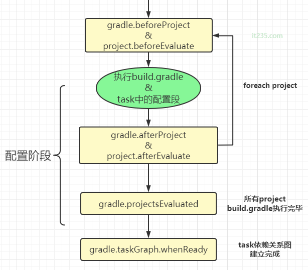
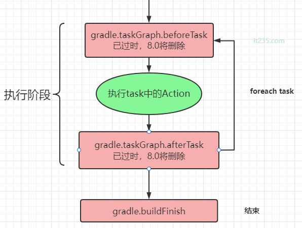

- # 一、简介
	- Gradle的核心是一种基于依赖的编程语言，任务与任务之间有一定的依赖关系，并且每个任务只会执行一次。在构建时，Gradle会把这些任务串联起来形成有向无环图。那Gradle是在什么时候进行串联的呢？这就需要充分了解Gradle在各个阶段做了什么事情了，从一开始到结束的这一连串动作我们称为生命周期。
- # 1、初始化阶段：解析setting.gradle文件
  collapsed:: true
	- gradle支持单项目和多项目构建，在该阶段，gradle会解析setting.gradle文件，确定哪些项目需要参与构建，并且为这些项目创建一个Project实例
	- 
	- ```groovy
	  //settings.gradle
	  gradle.beforeSettings {
	      //Gradle.buildStarted()在6.0中弃用，7.0中彻底删除，采用beforeSettings替代
	      println '在settings加载之前执行，但是这个函数又放在了settings中，所以不会执行'
	  }
	  gradle.settingsEvaluated {
	      println 'settings脚本执行完成之后调用'
	  }
	  //每个module的build.gradle执行之前都会调用，闭包会传入当前的project对象作为参数
	  gradle.projectsLoaded {
	      println "所有的project对象加载完成"
	  }
	  
	  //上述的写法也可以采用如下方式书写
	  gradle.addBuildListener(new BuildListener() {
	      @Override
	      void beforeSettings(Settings settings) {
	          super.beforeSettings(settings)
	      }
	      
	      @Override
	      void settingsEvaluated(Settings settings) {}
	  
	      @Override
	      void projectsLoaded(Gradle gradle) {}
	  })
	  
	  ```
- # 2、配置阶段：解析各个project下的build.gradle文件
	- 当完成初始化阶段后，就会进入配置阶段，配置阶段解析所有project中的build.gradle文件获取所有的task，形成有向无环图后执行依赖关系，并且所有project中的build script部分和task的配置段会在这一阶段调用注意并不是执行具体的task代码）。
	- 
	- ```groovy
	  //settings.gradle
	  //每个module的build.gradle执行之前都会调用，闭包会传入当前的project对象作为参数
	  //注意：如果在build.gradle中书写project.beforeProject闭包并不会执行（子模块的情况另说），参照gradle.beforeSettings函数
	  gradle.beforeProject{ project ->
	      println 'beforeProject $project'
	  }
	  gradle.afterProject{ project ->
	      println 'afterProject $project'
	  }
	  
	  //所有module的build.gradle脚本执行完成之后，表示build.gradle执行完成
	  gradle.projectsEvaluated {
	      println 'projectsEvaluated'
	  }
	  
	  // task有向无环图构建完成，配置阶段完成，TaskExecutionGraph对象作为对象传入闭包
	  gradle.taskGraph.whenReady { graph ->
	      println 'whenReady'
	  }
	  // 同gradle.taskGraph.whenReady
	  gradle.addListener(new TaskExecutionGraphListener() {
	      @Override
	      void graphPopulated(TaskExecutionGraph taskExecutionGraph) {
	          println "TaskExecutionGraphListener.graphPopulated"
	      }
	  })
	  
	  
	  
	  
	  
	  
	  
	  //project.beforeEvaluate的执行时机
	  public class DemoPlugin implements Plugin<Project> {
	      @Override
	      public void apply(Project project) {
	          project.beforeEvaluate {
	              println("beforeEvaluate")
	          }
	      }
	  }
	  //如果这个DemoPlugin是被写在`build.gradle`文件里，像这样`apply plugin: 'demoPlugin'`，`beforeEvaluate()`方法不会执行，而如果是在rootPlugin里，调用subProject的`apply plugin 'demoPlugin'`，则`beforeEvaluate()`会被执行。原因是`beforeEvaluate()`这个方法是在解析`build.gradle`文件之前执行，在`build.gradle`中才注册`beforeEvaluate()`监听方法，已经晚了。
	  
	  基于此，我们想在解析`build.gradle`之前，改变`build.gradle`文件的内容，可以在
	  beforeEvaluate() 这个方法里修改`build.gradle`。
	  
	  ```
- # 3、执行阶段：执行具体的的task及其依赖task
	- 当完成任务依赖图后, Gradle 就做好了一切准备，然后进入执行阶段。按照有向无环图中task列表的顺序，执行所有被指定的task
	- 
	-