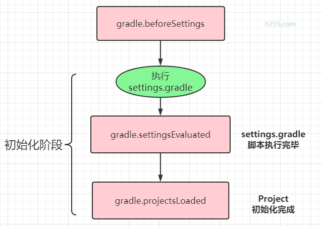

- # 一、简介
	- Gradle的核心是一种基于依赖的编程语言，任务与任务之间有一定的依赖关系，并且每个任务只会执行一次。在构建时，Gradle会把这些任务串联起来形成有向无环图。那Gradle是在什么时候进行串联的呢？这就需要充分了解Gradle在各个阶段做了什么事情了，从一开始到结束的这一连串动作我们称为生命周期。
- # 1、初始化阶段：解析setting.gradle文件
  collapsed:: true
	- gradle支持单项目和多项目构建，在该阶段，gradle会解析setting.gradle文件，确定哪些项目需要参与构建，并且为这些项目创建一个Project实例
	- 
	- ```groovy
	  //settings.gradle
	  gradle.beforeSettings {
	      //Gradle.buildStarted()在6.0中弃用，7.0中彻底删除，采用beforeSettings替代
	      println '在settings加载之前执行，但是这个函数又放在了settings中，所以不会执行'
	  }
	  gradle.settingsEvaluated {
	      println 'settings脚本执行完成之后调用'
	  }
	  //每个module的build.gradle执行之前都会调用，闭包会传入当前的project对象作为参数
	  gradle.projectsLoaded {
	      println "所有的project对象加载完成"
	  }
	  
	  //上述的写法也可以采用如下方式书写
	  gradle.addBuildListener(new BuildListener() {
	      @Override
	      void beforeSettings(Settings settings) {
	          super.beforeSettings(settings)
	      }
	      
	      @Override
	      void settingsEvaluated(Settings settings) {}
	  
	      @Override
	      void projectsLoaded(Gradle gradle) {}
	  })
	  
	  ```
- # 2、配置阶段：解析各个project下的build.gradle文件
	- 当完成初始化阶段后，就会进入配置阶段，配置阶段解析所有project中的build.gradle文件获取所有的task，形成有向无环图后执行依赖关系，并且所有project中的build script部分和task的配置段会在这一阶段调用注意并不是执行具体的task代码）。
- # 3、执行阶段：执行具体的的task及其依赖task
  collapsed:: true
	- 当完成任务依赖图后, Gradle 就做好了一切准备，然后进入执行阶段。按照有向无环图中task列表的顺序，执行所有被指定的task
-