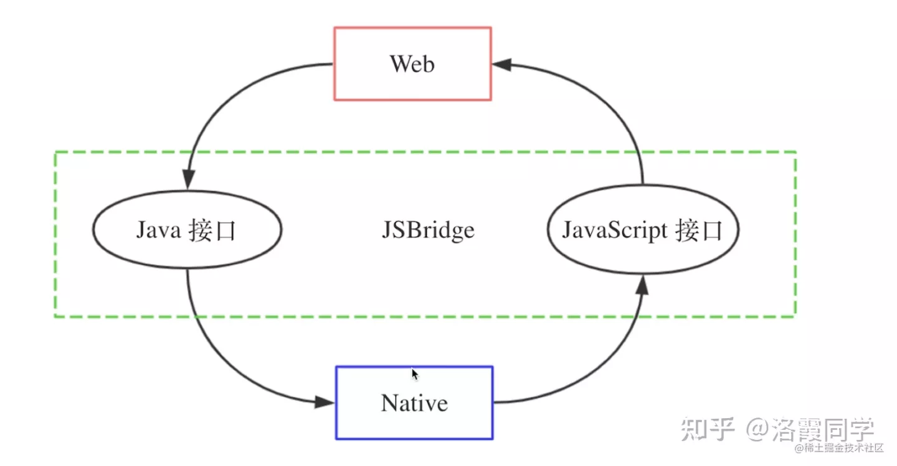
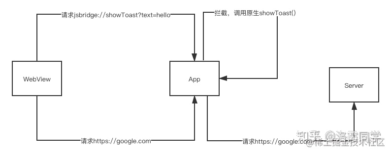

- ## 一、工作
  background-color:: #793e3e
  collapsed:: true
	- 1、注册配置及action-58ClientHybridLib
		- SampleConfig
			- actions中注册 action key 和 ctrl类
	- 2、初始化配置及action-WubaHybridSDK
		- MigrationCompact.init 注册action
		- HybridCtrlInjector注册action
- ## JSBridge
  background-color:: #793e3e
  collapsed:: true
	- ### 简介
	  collapsed:: true
		- JavaScript是运行在单独的JS Context中（Webview容器、JSCore等），与原生有运行环境的隔离，所以需要有一种机制实现Native端和Web端的双向通信，这就是JSBridge：以JavaScript引擎或Webview容器作为媒介，通过协定协议进行通信，实现Native端和Web端双向通信的一种机制。
		- 通过JSBridge，Web端可以调用Native端的Java接口，同样Native端也可以通过JSBridge调用Web端的JavaScript接口，实现彼此的双向调用
		- 
	- ### 原理：实现JSBridge主要是两点：
		- 将Native端原生接口封装成JavaScript接口
		  将Web端JavaScript接口封装成原生接口
- ## 二、Android 与 JS交互传值
  background-color:: #793e3e
  collapsed:: true
	- ### Android 4.4之前只能用loadUrl来实现，并且无法执行回调：
	  background-color:: #533e7d
	  collapsed:: true
		- ```java
		  Android:
		  webView.loadUrl("javascript:callJs('"0000"')");//需要JS function callJs函数
		  webView.loadUrl("http://172....&type=aaaa");//直接传递,无需JS function 
		  
		  JS:
		  function callJs(data){}
		  
		  ```
	- ### Android 4.4之后提供了evaluateJavascript来执行JS代码，并且可以获取返回值执行回调：
	  background-color:: #533e7d
	  collapsed:: true
		- ```java
		  String jsCode = String.format("window.showWebDialog('%s')", text);
		  webView.evaluateJavascript(jsCode, new ValueCallback<String>() {
		    @Override
		    public void onReceiveValue(String value) {
		  
		    }
		  });
		  ```
	- ### 注意事项：
	  background-color:: #533e7d
	  collapsed:: true
		- ```java
		   			/**
		               * http://blog.csdn.net/yysunny/article/details/54895712
		               * android4.4以及以上的webview都需要用evaluateJavascript() 调用javascript的方法。
		               *  用loadUrl会自动进行一次urldecode，再将结果传递给javascript。
		               *  出现json数据解析失败问题
		               */
		              if (Build.VERSION.SDK_INT >= Build.VERSION_CODES.KITKAT) {
		                  if(url.startsWith("javascript")) {
		                      mWebView.evaluateJavascript(url, null);
		                      mPageLoadCallBack.onWebPageActionCallback(url);
		                  } else {
		                      mWebView.loadUrl(url);
		                  }
		              } else {
		                  mWebView.loadUrl(url);
		              }
		  ```
- ## 三、JS与Android交互
  background-color:: #793e3e
	- ### 方式一：向Webview中注入JS API   addJavascriptInterface
	  collapsed:: true
		- ```java
		  JS:
		  function{
		  window.aile.callAndroid("0000000");
		  }
		  
		  Android:
		  // 注册模块
		  webView.addJavascriptInterface(this, "aile");
		  
		  /**
		   *  定义js接口方法
		   */
		  @JavascriptInterface
		  public void callAndroid(String src) {}
		  
		  ```
	- ### 方式二：拦截Webview请求的URL Schema-shouldOverrideUrlLoading
	  collapsed:: true
		- 方案：
		  collapsed:: true
			- URL Schema是类URL的一种请求格式，格式如下：
				- ```
				  <protocol>://<host>/<path>?<qeury>#fragment
				  ```
			- 我们可以自定义JSBridge通信的URL Schema，比如：jsbridge://showToast?text=hello
			- Native加载WebView之后，Web发送的所有请求都会经过WebView组件，所以Native可以重写WebView里的方法，从来拦截Web发起的请求，我们对请求的格式进行判断：
			- 如果符合我们自定义的URL Schema，对URL进行解析，拿到相关操作、操作，进而调用原生Native的方法
			  如果不符合我们自定义的URL Schema，我们直接转发，请求真正的服务
			- 
		- 安卓实现：提供了shouldOverrideUrlLoading方法拦截
		- 优缺点：兼容性很好，但是由于是基于URL的方式，长度受到限制而且不太直观，数据格式有限制，而且建立请求有时间耗时。
- ## 参考：
	- [混合开发总结](https://blog.csdn.net/ware00/article/details/110805684)
-
-