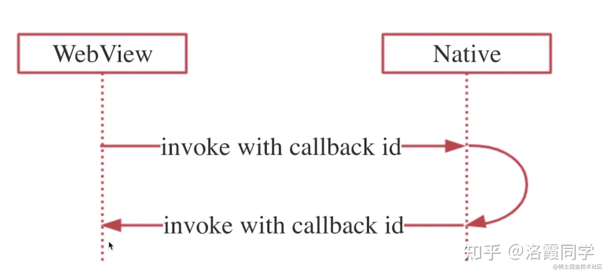

- ## 一、工作
  background-color:: #793e3e
  collapsed:: true
	- 1、注册配置及action-58ClientHybridLib
		- SampleConfig
			- actions中注册 action key 和 ctrl类
	- 2、初始化配置及action-WubaHybridSDK
		- MigrationCompact.init 注册action
		- HybridCtrlInjector注册action
- ## JSBridge
  background-color:: #793e3e
  collapsed:: true
	- ### 简介
	  collapsed:: true
		- JavaScript是运行在单独的JS Context中（Webview容器、JSCore等），与原生有运行环境的隔离，所以需要有一种机制实现Native端和Web端的双向通信，这就是JSBridge：以JavaScript引擎或Webview容器作为媒介，通过协定协议进行通信，实现Native端和Web端双向通信的一种机制。
		- 通过JSBridge，Web端可以调用Native端的Java接口，同样Native端也可以通过JSBridge调用Web端的JavaScript接口，实现彼此的双向调用
		- 
	- ### 原理：实现JSBridge主要是两点：
		- 将Native端原生接口封装成JavaScript接口
		  将Web端JavaScript接口封装成原生接口
- ## 二、Android 与 JS交互传值
  background-color:: #793e3e
  collapsed:: true
	- ### Android 4.4之前只能用loadUrl来实现，并且无法执行回调：
	  background-color:: #533e7d
	  collapsed:: true
		- ```java
		  Android:
		  webView.loadUrl("javascript:callJs('"0000"')");//需要JS function callJs函数
		  webView.loadUrl("http://172....&type=aaaa");//直接传递,无需JS function 
		  
		  JS:
		  function callJs(data){}
		  
		  ```
	- ### Android 4.4之后提供了evaluateJavascript来执行JS代码，并且可以获取返回值执行回调：
	  background-color:: #533e7d
	  collapsed:: true
		- ```java
		  String jsCode = String.format("window.showWebDialog('%s')", text);
		  webView.evaluateJavascript(jsCode, new ValueCallback<String>() {
		    @Override
		    public void onReceiveValue(String value) {
		  
		    }
		  });
		  ```
	- ### 注意事项：
	  background-color:: #533e7d
	  collapsed:: true
		- ```java
		   			/**
		               * http://blog.csdn.net/yysunny/article/details/54895712
		               * android4.4以及以上的webview都需要用evaluateJavascript() 调用javascript的方法。
		               *  用loadUrl会自动进行一次urldecode，再将结果传递给javascript。
		               *  出现json数据解析失败问题
		               */
		              if (Build.VERSION.SDK_INT >= Build.VERSION_CODES.KITKAT) {
		                  if(url.startsWith("javascript")) {
		                      mWebView.evaluateJavascript(url, null);
		                      mPageLoadCallBack.onWebPageActionCallback(url);
		                  } else {
		                      mWebView.loadUrl(url);
		                  }
		              } else {
		                  mWebView.loadUrl(url);
		              }
		  ```
- ## 三、JS与Android交互
  background-color:: #793e3e
  collapsed:: true
	- ### 方式一：向Webview中注入JS API   addJavascriptInterface
		- 方案：
		  collapsed:: true
			- 这个方法会通过webView提供的接口，App将Native的相关接口注入到JS的Context（window）的对象中，一般来说这个对象内的方法名与Native相关方法名是相同的，Web端就可以直接在全局window下使用这个暴露的全局JS对象，进而调用原生端的方法。
			- 这个过程会更加简单直观，不过有兼容性问题，大多数情况下都会使用这种方式
		- Android实现例子1：
		  collapsed:: true
			- ```java
			  JS:
			  function{
			  window.aile.callAndroid("0000000");
			  }
			  
			  Android:
			  // 注册模块
			  webView.addJavascriptInterface(this, "aile");
			  
			  /**
			   *  定义js接口方法
			   */
			  @JavascriptInterface
			  public void callAndroid(String src) {}
			  
			  ```
		- Android实现例子2：
			- ```java
			  // 注入全局JS对象
			  webView.addJavascriptInterface(new NativeBridge(this), "NativeBridge");
			  
			  class NativeBridge {
			    private Context ctx;
			    NativeBridge(Context ctx) {
			      this.ctx = ctx;
			    }
			  
			    // 增加JS调用接口
			    @JavascriptInterface
			    public void showNativeDialog(String text) {
			      new AlertDialog.Builder(ctx).setMessage(text).create().show();
			    }
			  }
			  
			  // 在Web端直接调用这个方法即可：
			  window.NativeBridge.showNativeDialog('hello');
			  ```
	- ### 方式二：拦截Webview请求的URL Schema-shouldOverrideUrlLoading
	  collapsed:: true
		- 方案：
		  collapsed:: true
			- URL Schema是类URL的一种请求格式，格式如下：
				- ```
				  <protocol>://<host>/<path>?<qeury>#fragment
				  ```
			- 我们可以自定义JSBridge通信的URL Schema，比如：jsbridge://showToast?text=hello
			- Native加载WebView之后，Web发送的所有请求都会经过WebView组件，所以Native可以重写WebView里的方法，从来拦截Web发起的请求，我们对请求的格式进行判断：
			- 如果符合我们自定义的URL Schema，对URL进行解析，拿到相关操作、操作，进而调用原生Native的方法
			  如果不符合我们自定义的URL Schema，我们直接转发，请求真正的服务
			- 
		- 安卓实现：提供了shouldOverrideUrlLoading方法拦截
		- 优缺点：兼容性很好，但是由于是基于URL的方式，长度受到限制而且不太直观，数据格式有限制，而且建立请求有时间耗时。
- ## 四、带回调的调用 js回调
  background-color:: #793e3e
  collapsed:: true
	- 上面已经说到了Native、Web间双向通信的两种方法，但站在一端而言还是一个单向通信的过程 ，比如站在Web的角度：Web调用Native的方法，Native直接相关操作但无法将结果返回给Web，但实际使用中会经常需要将操作的结果返回，也就是JS回调。
	- 解决方案：可以看到实际上还是通过两次单项通信实现的。
	  collapsed:: true
		- 其实基于之前的单向通信就可以实现，我们在一端调用的时候在参数中加一个callbackId标记对应的回调，对端接收到调用请求后，进行实际操作，如果带有callbackId，对端再进行一次调用，将结果、callbackId回传回来，这端根据callbackId匹配相应的回调，将结果传入执行就可以了
		- {:height 334, :width 716}
	- 举例：以Android，在Web端实现带有回调的JSB调用为例：
	  collapsed:: true
		- ```java
		  // Web端代码：
		  <body>
		    <div>
		      <button id="showBtn">获取Native输入，以Web弹窗展现</button>
		    </div>
		  </body>
		  <script>
		    let id = 1;
		    // 根据id保存callback
		    const callbackMap = {};
		    // 使用JSSDK封装调用与Native通信的事件，避免过多的污染全局环境
		    window.JSSDK = {
		      // 获取Native端输入框value，带有回调
		      getNativeEditTextValue(callback) {
		        const callbackId = id++;
		        callbackMap[callbackId] = callback;
		        // 调用JSB方法，并将callbackId传入
		        window.NativeBridge.getNativeEditTextValue(callbackId);
		      },
		      // 接收Native端传来的callbackId
		      receiveMessage(callbackId, value) {
		        if (callbackMap[callbackId]) {
		          // 根据ID匹配callback，并执行
		          callbackMap[callbackId](value);
		        }
		      }
		    };
		  
		      const showBtn = document.querySelector('#showBtn');
		    // 绑定按钮事件
		    showBtn.addEventListener('click', e => {
		      // 通过JSSDK调用，将回调函数传入
		      window.JSSDK.getNativeEditTextValue(value => window.alert('Natvie输入值：' + value));
		    });
		  </script>
		  // Android端代码
		  webView.addJavascriptInterface(new NativeBridge(this), "NativeBridge");
		  
		  class NativeBridge {
		    private Context ctx;
		    NativeBridge(Context ctx) {
		      this.ctx = ctx;
		    }
		  
		    // 获取Native端输入值
		    @JavascriptInterface
		    public void getNativeEditTextValue(int callbackId) {
		      MainActivity mainActivity = (MainActivity)ctx;
		      // 获取Native端输入框的value
		      String value = mainActivity.editText.getText().toString();
		      // 需要注入在Web执行的JS代码
		      String jsCode = String.format("window.JSSDK.receiveMessage(%s, '%s')", callbackId, value);
		      // 在UI线程中执行
		      mainActivity.runOnUiThread(new Runnable() {
		        @Override
		        public void run() {
		          mainActivity.webView.evaluateJavascript(jsCode, null);
		        }
		      });
		    }
		  }
		  ```
	- 以上代码简单实现了一个demo，在Web端点击按钮，会获取Native端输入框的值，并将值以Web端弹窗展现，这样就实现了Web->Native带有回调的JSB调用，同理Native->Web也是同样的逻辑，不同的只是将callback保存在Native端罢
- ## 五、开源的JSBridge
	- DSBridge，主要通过注入API的形式，[DSBridge for Android](https://github.com/wendux/DSBridge-Android)、DSBridge for IOS
	  JsBridge，主要通过拦截URL Schema，JsBridge
- ## 参考：
	- [混合开发总结](https://blog.csdn.net/ware00/article/details/110805684)
-
-