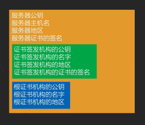
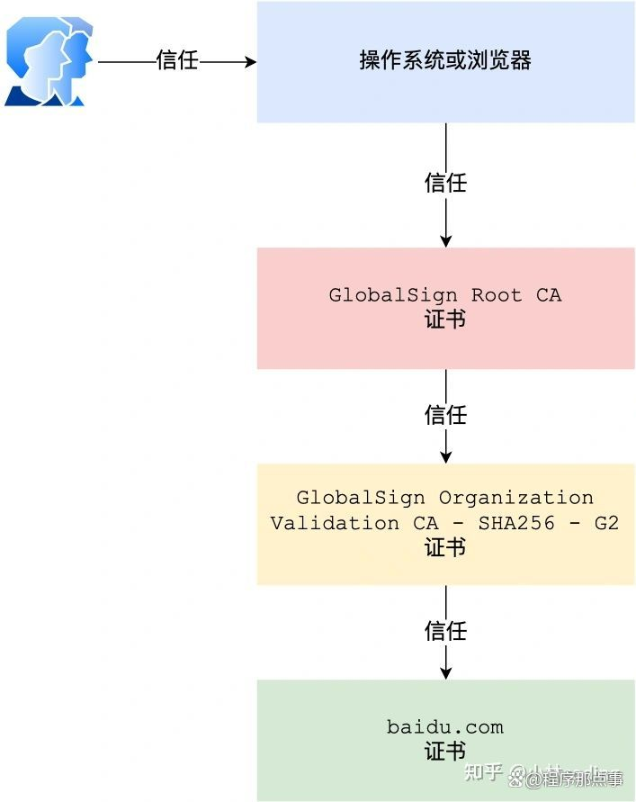

# 大致过程
collapsed:: true
	- 1、客户端请求建立TLS链接
	- 2、服务器知道客户端要加密通信，就把自己的证书发过去
	- 3、客户端验证服务器证书，看是不是真的，
	- 4、验证通过后 客户端对服务器产生信任，和服务器协商对称秘钥【这过程使用非对称加密的，完成链接建立】
	- 5、使用对称秘钥开始通信
- # 详细流程
	- ## 1、客户端给服务器发送一个Client  Hello的1字节的数据
	  collapsed:: true
		- 还有可选的TLS版本
		- 可选的加密套件【对称、非对称加密算法】
		- 客户端的随机数
			- 这个随机数发给服务器同时 自己也保留一份  【第一次打招呼的意思】
		- 
	- ## 2、服务端给客户端  回一个1字节的数据 叫Server Hello
	  collapsed:: true
		- 选定的TLS版本 、加密算法、还有生成的服务器随机数，这个随机数 服务器也保留一份
		- > 此时客户端 服务端都有了 确定的TLS版本，加密套件，和双方随机数
		- 
	- ## 3、服务器将服务器端证书，发送给客户端（目的就是为了传输证书里的用于双端通信的服务器公钥）
	  collapsed:: true
		- 
		- 证书信任链
		  collapsed:: true
			- 
		- > 黄色的为服务器发过来的证书
		  证书里还包括，该证书颁发机构的证书------->绿色
		  根证书------------------------------------->蓝色
		- ## 服务器证书内容包括（黄色的那部分就是 服务器发给我的是他的证书）
			- 1、[[#red]]==**服务器公钥-> 发送证书就是为了传输这个**==
				- 这个是前后端用于非对称加密通信用的。发送一系列证书签名目的也是为了验证这个公钥的合法性
			- 2、还有主机名地区等信息
			- 3、这个[[#red]]==**服务器证书的签名**==（针对整个黄色证书的签名，客户端可以根据配套的签名公钥验证证书合法性）
			- 4、服务器证书的颁发机构的证书->为了拿到服务器证书签名的公钥，去验证服务器证书的合法性，进而决定服务器公钥的合法性
			- 5、根证书->包括根证书机构的公钥-> 为了验证 证书颁发机构证书的合法性
			- 6、根证书的合法性就看手机里有没有这个根证书就可以验证了。（每个手机里都有根证书）
	- ## 4、客户端收到证书，验证里边公钥合法后，对服务器新任，协商出对称秘钥
		- 1、[[#red]]==**通过服务器公钥**==，对新生成一个随机数进行加密 ; key 叫做 [[#red]]==**pre-master secret**==，数据是加密的新的随机数
		- 2、然后双方现在 各自持有[[#red]]==**客户端随机数 服务器随机数**==    客户端新生成被加密后的随机数【[[#red]]==**Pre-master secret**==】    使用这三个随机数  [[#red]]==**生成一个Master  secret**==
		- 3、然后通过这个 [[#red]]==**Master  secret  两端用同样的算法  ， 算出加密通信的对称秘钥  包括 客户端加密秘钥 和 服务器加密秘钥**==
	- ## 5、客户端给服务端发消息：通知对方将使用加密通信了
	- ## 6、客户端给服务器  最后  把之前12345建立连接的信息  用算出的加密算法 加密后 发给服务器
	- ## 7、服务器给客户端发消息：通知对方将使用加密通信
	- ## 8、同样把前边几条信息综合到一起加密后 发出去
	- ## 建立连接完成