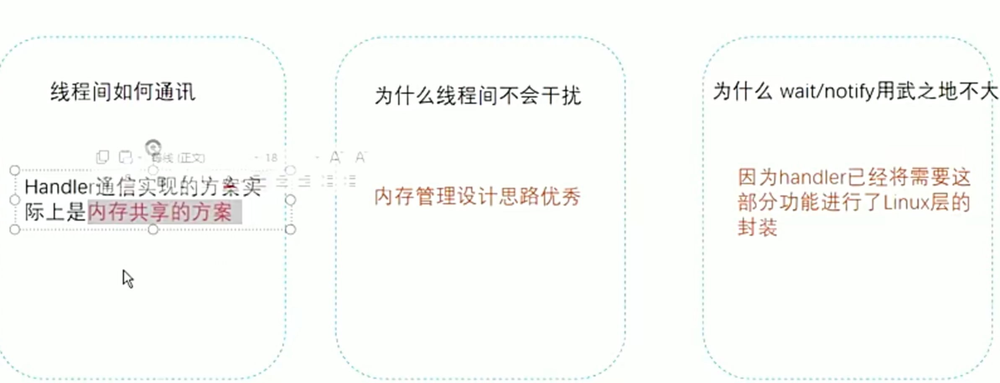

- # 一、前言：Handler进行线程间通信
  collapsed:: true
	- ## Handler通信实现方案实际上是内存共享的方案
		- 在android开发中，经常会在子线程中进行一些操作，当操作完毕后会通过handler发送一些数据给主线程，通知主
		- 线程做相应的操作。 **探索其背后的原理**：子线程 handler 主线程 其实构成了线程模型中的经典问题 生产者-消费者
		- 模型。 生产者-消费者模型：==生产者和消费者在同一时间段内共用同一个存储空间，生产者往存储空间中添加数据，==
		- ==消费者从存储空间中取走数据==。
	- 
	-
	- ##  Handler介绍
	  collapsed:: true
		- 在 Handler 的使用中，通常会在主线程中创建一个 Handler 对象，并在其他线程中通过该 Handler 对象发送消息到主线程进行处理。为了实现这种异步通信，主线程的 Looper 会不断地从消息队列中获取消息，并将其分发给相应的 Handler 进行处理。
		- Handler表面看是一个线程间通信（子线程（bean） ->主线程（显示）），实际是一个管理机制（管理所有的消息）
		- 消息：（android里所有的事物）包括点击，屏幕亮暗，滑动操作等
			- 体现在ActivityThread中（AMS）
- # 二、[[机制构成]]
- # 三、[[Handler发送消息的整个流程]]
- # 四、[[Message怎么实现从子线程到主线程的切换]]
- # 二、源码
  collapsed:: true
	- ## 工作流程
		- Launcher -> Zygote -> JVM -> ActivityThread-> main函数
		- ### ActivityThread：Main入口函数
			- 代码
			  collapsed:: true
				- ```java
				      public static void main(String[] args) {
				          Trace.traceBegin(Trace.TRACE_TAG_ACTIVITY_MANAGER, "ActivityThreadMain");
				  
				          // Install selective syscall interception
				          AndroidOs.install();
				  
				          // CloseGuard defaults to true and can be quite spammy.  We
				          // disable it here, but selectively enable it later (via
				          // StrictMode) on debug builds, but using DropBox, not logs.
				          CloseGuard.setEnabled(false);
				  
				          Environment.initForCurrentUser();
				  
				          // Make sure TrustedCertificateStore looks in the right place for CA certificates
				          final File configDir = Environment.getUserConfigDirectory(UserHandle.myUserId());
				          TrustedCertificateStore.setDefaultUserDirectory(configDir);
				  
				          Process.setArgV0("<pre-initialized>");
				  
				          Looper.prepareMainLooper();
				  
				          // Find the value for {@link #PROC_START_SEQ_IDENT} if provided on the command line.
				          // It will be in the format "seq=114"
				          long startSeq = 0;
				          if (args != null) {
				              for (int i = args.length - 1; i >= 0; --i) {
				                  if (args[i] != null && args[i].startsWith(PROC_START_SEQ_IDENT)) {
				                      startSeq = Long.parseLong(
				                              args[i].substring(PROC_START_SEQ_IDENT.length()));
				                  }
				              }
				          }
				          ActivityThread thread = new ActivityThread();
				          thread.attach(false, startSeq);
				  
				          if (sMainThreadHandler == null) {
				              sMainThreadHandler = thread.getHandler();
				          }
				  
				          if (false) {
				              Looper.myLooper().setMessageLogging(new
				                      LogPrinter(Log.DEBUG, "ActivityThread"));
				          }
				  
				          // End of event ActivityThreadMain.
				          Trace.traceEnd(Trace.TRACE_TAG_ACTIVITY_MANAGER);
				          Looper.loop();
				  
				          throw new RuntimeException("Main thread loop unexpectedly exited");
				      }
				  ```
			- 1、启动了主线程的looper：Looper.prepareMainLooper();
			- 2、==主线程的looper.loop启动死循环，相当于Android所有代码全在这里运行==
- # 三、设计思路
- # 四、设计模式
	- 生产者消费者
		- MessageQueue消息队列
	- 享元设计模式
		- Message消息回收
- # 五、同步消息，异步消息 [[Message]]
- # 六、[[同步消息屏障]]
- # 七、[[Handler().runWithScissors 同步等待]]
- # Handler应用场景
	- # 七、[[HandlerThread]]
	- # 八、[[IntentService]]
	- # 九、[[Fragment生命周期管理]]
	- # 十、[[Glide声明周期管理]]
- # 题外：等待唤醒为什么用native层
	- [Handler中的奇奇怪怪](https://www.mdnice.com/writing/677e19d9e5904340be7304a73c615f59)