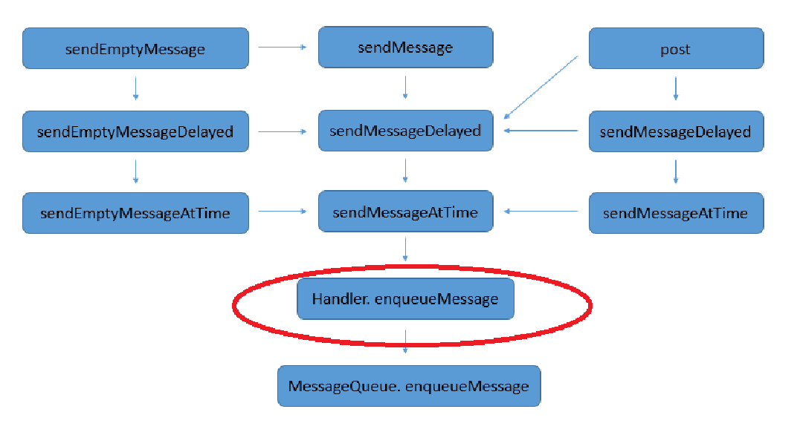

- # 一、发送消息的主要函数
	- {:height 396, :width 718}
	- 无论怎么发送消息，都会执行到MessageQueue.enqueueMessage（）方法中
- # 二、创建Handler
  collapsed:: true
	- 最常见的创建handler
		- ```java
		  Handler handler=new Handler(){
		  	@Override
		  	public void handleMessage(Message msg) {
		  	super.handleMessage(msg);
		  	}
		  };
		  ```
	- 在内部调用 this(null, false);
	- ```java
	  public Handler(Callback callback, boolean async) {
	  	//前面省略
	  	mLooper = Looper.myLooper();//获取Looper，**注意不是创建Looper**！
	  	if (mLooper == null) {
	  		throw new RuntimeException(
	  		"Can't create handler inside thread that has not called Looper.prepare()");
	  	}
	  	mQueue = mLooper.mQueue;//创建消息队列MessageQueue
	  	mCallback = callback; //初始化了回调接口
	  	mAsynchronous = async;
	  }
	  ```
- # 三、handler发送消息
  collapsed:: true
	- ## sendMessage(Message)
		- sendMessage(Message) sendMessage方法通过一系列重载方法的调用，sendMessage调用sendMessageDelayed，继续调用sendMessageAtTime，继续调用enqueueMessage，继续调用messageQueue的enqueueMessage方法，将消息保存在了消息队列中，而最终由Looper取出，交给Handler的dispatchMessage进行处理
	- ## Post(Runnable()) 发送一个runnable对象
	-
- # 四、dispatchMessage分发消息
  collapsed:: true
	- ## 1、msg中有runnable 执行执行
	- ## 2、否则执行handleMessage
	- 我们可以看到在dispatchMessage方法中，message中callback是一个Runnable对象，如果callback不为空，则直接调用callback的run方法，否则判断mCallback是否为空，mCallback在Handler构造方法中初始化，在主线程通直接通过无参的构造方法new出来的为null,所以会直接执行后面的handleMessage()方法。
	- ```java
	  public void dispatchMessage(Message msg) {
	      //callback在message的构造方法中初始化或者使用handler.post(Runnable)时候才不为空
	  	if (msg.callback != null) {
	  		handleCallback(msg);
	  	} else {
	        //mCallback是一个Callback对象，通过无参的构造方法创建出来的handler，该属性为null，此段不执行
	  		if (mCallback != null) {
	  			if (mCallback.handleMessage(msg)) {
	  				return;
	  			}
	  		}
	  		handleMessage(msg);//最终执行handleMessage方法
	  	}
	  }
	  
	  private static void handleCallback(Message message) {
	  	message.callback.run();
	  }
	  ```