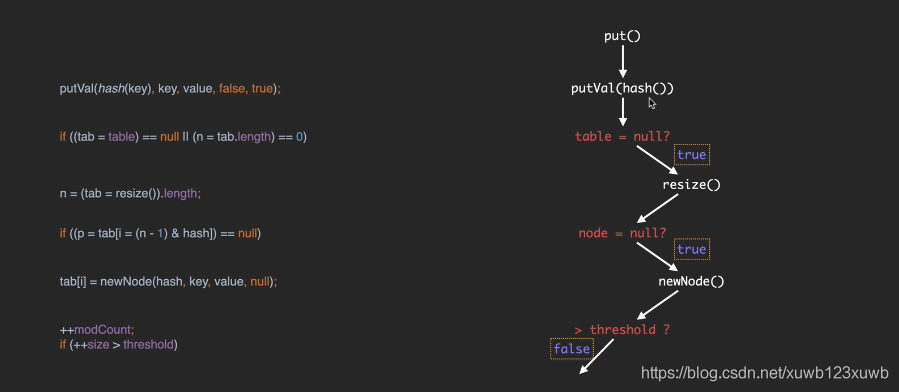

# 第一次 put流程
	- 
	- 第一步 调用put ,先对key进行hash , 然后调用putVal方法，
	- 第二步 这时候 table 数组为null  调用resize()里 对数据初始化的代码，，容积为16 阈值为12
	- 第三部 通过 hash值进行&运算 得到 数组对应的索引 ，持有索引 从数组上获取Node节点，
	- 第四步 因为这是添加的第一个元素，数组上的Node节点 = null  就新建节点  放到 对应数组索引上
	- 第五步 对 ++ modCount 对++ size   这次操作 没有使size 超过阈值 ，，不需要扩容
- # 第二次调用put流程总结：  涉及树化 和 扩容
	- 第一步、根据key进行hash后   和  数组长度进行& 运算  计算出的索引
		- case 1 与之前已有元素索引不同，那么直接在指定索引   添加新元素就行了
		- case 2 索引相同 发生冲突：
			- one ： 如果数组上已有的头节点的key   和  要添加元素的[[#red]]==**key的   hash值一样并且 （key的 ==  和 equals 满足之一）**==
				- 那么会判断【onlyIfAbsent】 [[#red]]==**是否允许覆盖数组上这个key对应的 value**== ，来执行是否覆盖的操作，并把旧的value 返回
			- two:   上边条件不满足的话，判断数组上的这个节点：是树节点  还是链表节点，如果是树节点  ，调用  putTreeVal（）树节点添加元素的操作
			- three  是 链表节点：通过这个头结点遍历链表，
				- 1、未找到与要插入元素相同的key，  那么新建一个节点插入到最后【添加到链表的尾                                                             部】
				  collapsed:: true
					- 添加完后 判断这个链表里的个数 有没有达到转换为树的阈值，[[#red]]==**树的阈值是8**==，达到转换树的阈值  就执行 链表转换成树操作
				- 2、如果从链表里找到与要添加的key是一样的，那么跳出循环，进入判断是否覆盖value的操作
	- 第二步、添加完数据后  size ++ 判断超过阈值 需要   数组扩容
		- ```
		  if (++size > threshold)
		    resize();
		  ```